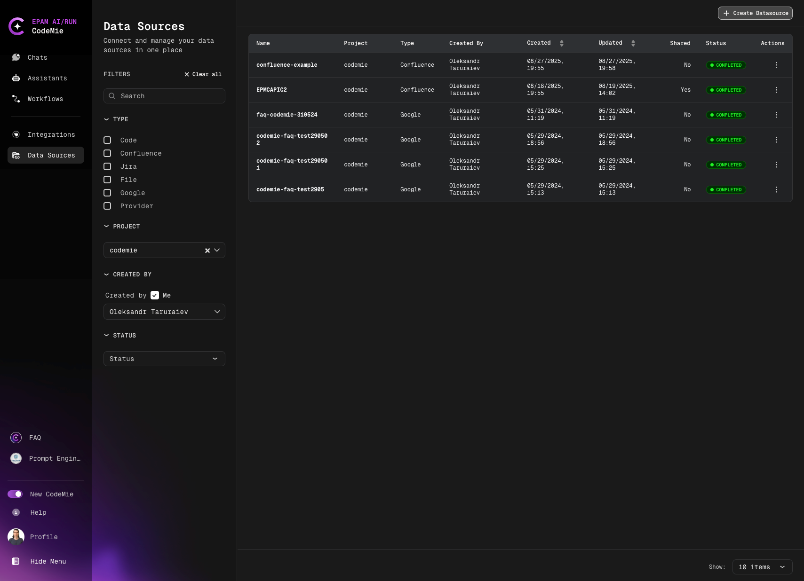

# Indexing Duration

Understanding the time required for indexing different data sources.

When indexing data sources in AI/Run CodeMie, it's important to understand that indexing can be time-consuming, depending on the size and complexity of the data source. This guide helps you understand expected indexing durations and how to optimize the process.

## Expected Indexing Time

Duration can range from a few minutes to **up to 30-60 minutes**, depending on:

- **Data source size**: Larger repositories or datasets take longer to index
- **Data complexity**: Complex file structures and relationships increase processing time
- **File types**: Some file formats require more processing than others
- **Network speed**: For remote data sources, network bandwidth affects indexing speed
- **System resources**: Available CPU and memory impact indexing performance

:::info Platform Performance
Network speed and system resources are managed by AI/Run CodeMie infrastructure. These estimates reflect typical performance under normal load conditions.
:::

## Monitoring Indexing Progress

You can monitor the indexing progress by clicking the **Indexing** tab in the data source details:

The indexing progress view shows:

- Current indexing status
- Percentage of completion
- Estimated time remaining (when available)
- Number of files/items processed
- Any errors or warnings encountered

## Optimizing Indexing Duration

### 1. Specify Relevant File Extensions

To expedite the process, specify relevant file extensions, ensuring only necessary files are indexed.

**Benefits:**

- Reduces total data volume to process
- Focuses indexing on relevant content
- Decreases overall indexing time
- Improves search relevance

**How to specify file extensions:**

- Configure file patterns during data source creation
- Use inclusion/exclusion filters
- Define specific file types for your use case

:::tip Git File Filters
For Git repositories, use file patterns to exclude:

- `!node_modules/`, `!vendor/` - dependency folders
- `!*.min.js` - minified files
- `!dist/`, `!build/` - build artifacts
  This can reduce indexing time by 50% or more.
  :::

### 2. Use Incremental Indexing

For existing repository indexes, you can perform:

- **Incremental reindex**: Only new or changed data (exclusively for Jira/Confluence datasources)
- **Full reindex**: Re-create the index from scratch with the same settings

Access these options in the **Actions** dialog by clicking respective icon buttons with tooltips:

## Indexing Time by Data Source Type

| Data Source Type      | Small                      | Medium                         | Large                        | Key Factors Affecting Duration                                         |
| --------------------- | -------------------------- | ------------------------------ | ---------------------------- | ---------------------------------------------------------------------- |
| **Git Repositories**  | 2-5 min (< 100 files)  | 5-15 min (100-1000 files)  | 15-60 min (1000+ files)  | Number of files, file sizes, repository history depth, code complexity |
| **Confluence Pages**  | 2-5 min (< 50 pages)   | 5-20 min (50-500 pages)    | 20-45 min (500+ pages)   | Number of pages, page content size, attachments, embedded media        |
| **Jira Projects**     | 2-5 min (< 100 issues) | 5-15 min (100-1000 issues) | 15-40 min (1000+ issues) | Number of issues, custom fields, attachments, comments volume          |
| **File Data Sources** | 1-3 min (< 10 files)   | 3-10 min (10-100 files)    | 10-30 min (100+ files)   | Number of files, total file size, file formats, document complexity    |
| **Google Docs**       | 2-5 min (< 20 docs)    | 5-15 min (20-100 docs)     | 15-35 min (100+ docs)    | Document size, embedded content                                        |

:::info Actual Time May Vary
These are estimated ranges based on typical usage. Your actual indexing time depends on content complexity, concurrent system load, and data source configuration.
:::

Now you understand indexing duration expectations and can plan your data source indexing strategy effectively.
