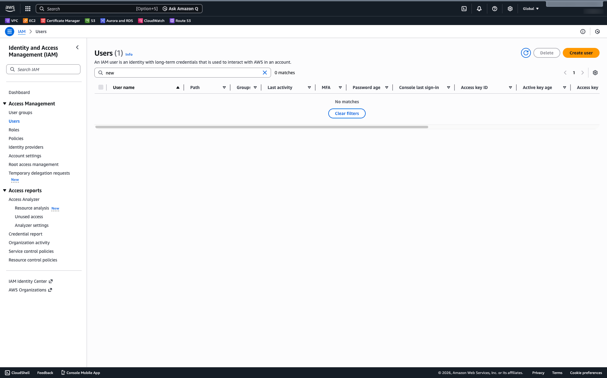
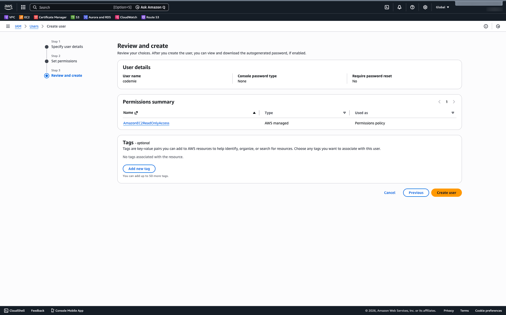
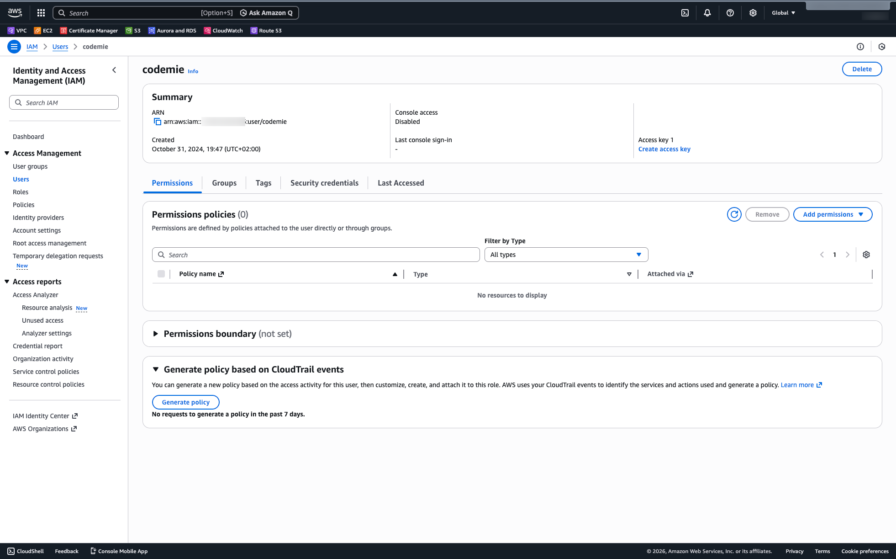
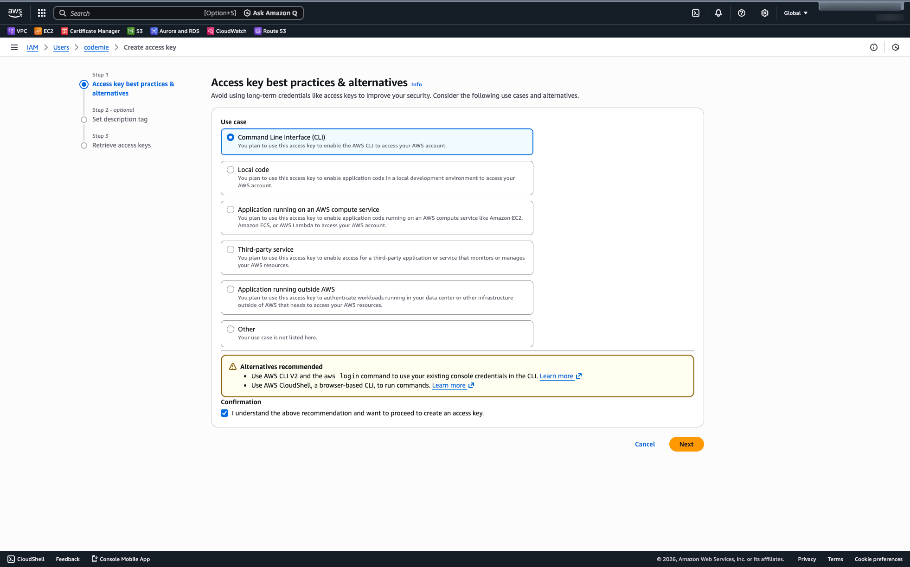
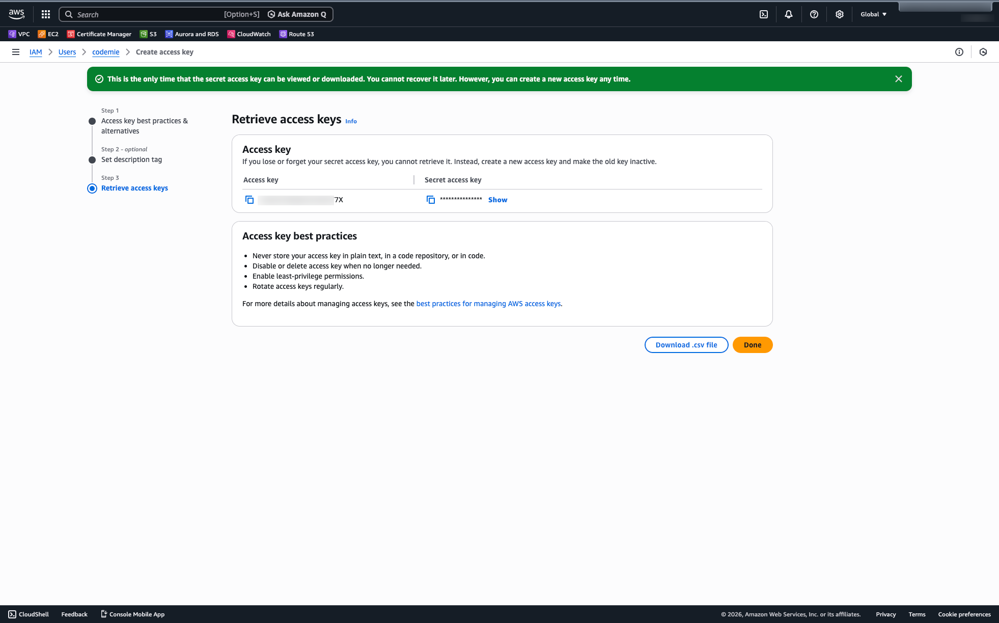
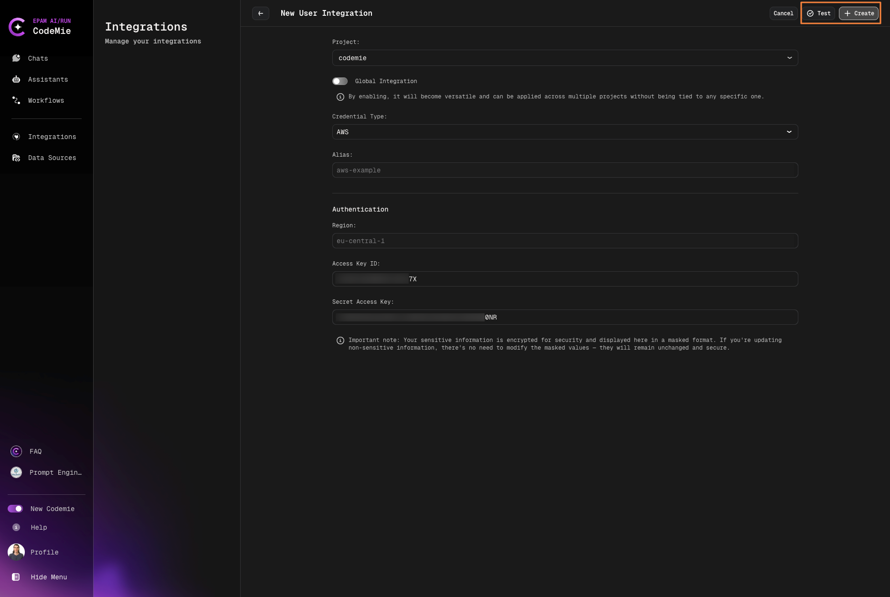
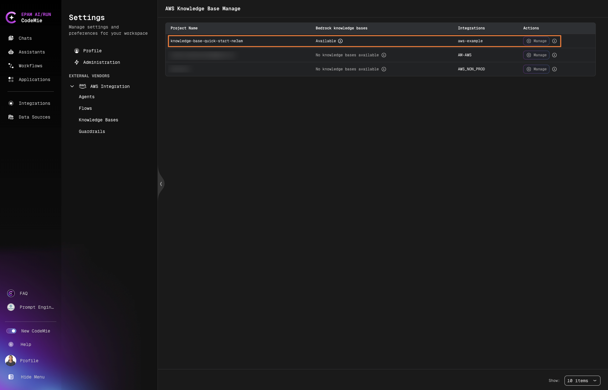
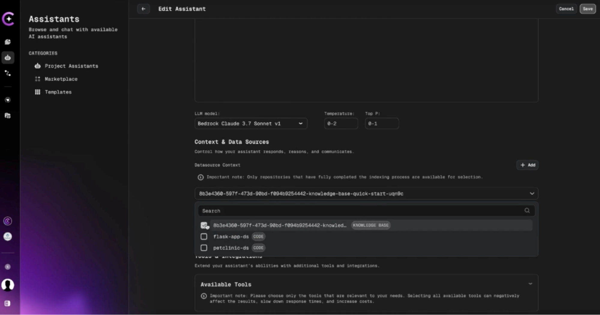

# Add AWS Knowledge Bases as Data Source

Connect and index AWS Knowledge Bases as data sources.

AWS Knowledge Bases is a powerful data source in AI/Run CodeMie, enabling assistants to access information stored in Amazon Bedrock Knowledge Bases. This guide walks you through the process of setting up AWS IAM credentials and adding AWS Knowledge Bases as a data source.

## Prerequisites

:::note Required Integration
This data source requires you to have at least one AWS integration added to AI/Run CodeMie. For more details, please refer to the [Integrations Overview](../../tools_integrations/integrations/) guidelines.
:::

Before adding an AWS Knowledge Bases data source, ensure you have:

- An active AWS account with access to Amazon Bedrock
- AWS Knowledge Base already created in your AWS account
- Permission to create IAM users and access keys
- Understanding of AWS IAM policies and permissions
- AWS Knowledge Base ID ready

:::tip AWS Knowledge Bases Overview
AWS Knowledge Bases (part of Amazon Bedrock) let you index large-scale enterprise data. This integration is ideal for companies already using AWS infrastructure.
:::

## AWS IAM Setup

Before creating an AWS integration in AI/Run CodeMie, you need to set up an IAM user with appropriate permissions in your AWS account.

### Step 1: Create IAM User

#### 1. Log into your AWS account

Navigate to the AWS Management Console and log in with your credentials.

#### 2. Access IAM Service

In the search bar, enter `IAM` to access the Identity and Access Management service.



#### 3. Navigate to Users

Navigate to **Access management** → **Users**. Click **Create user**:



#### 4. Set User Details

**User name**: Provide a descriptive name for the IAM user (e.g., `codemie-kb-user`)

**Best practices for user naming:**

- Use descriptive names indicating the purpose (e.g., `codemie-bedrock-access`)
- Follow your organization's naming conventions
- Include service or application name for easy identification

#### 5. Set Permissions

Click **Next** to proceed to the permissions setup.

#### 6. Attach Policies

Attach the following AWS managed policy:

- **AmazonBedrockFullAccess** - Provides full access to Amazon Bedrock services including Knowledge Bases

:::warning Permission Scope
For production environments, consider creating a custom policy with more restrictive permissions that only allow access to specific Knowledge Bases. The `AmazonBedrockFullAccess` policy grants broad permissions and should be used carefully.
:::

:::danger Production Security
Never use `AmazonBedrockFullAccess` in production. Always create custom IAM policies with least-privilege access to specific Knowledge Base ARNs.
:::

**Alternative: Custom Policy**

For more granular control, create a custom policy with these permissions:

```json
{
  "Version": "2012-10-17",
  "Statement": [
    {
      "Effect": "Allow",
      "Action": [
        "bedrock:GetKnowledgeBase",
        "bedrock:ListKnowledgeBases",
        "bedrock:Retrieve",
        "bedrock:RetrieveAndGenerate"
      ],
      "Resource": "*"
    }
  ]
}
```

:::info Custom Policy Benefits
This custom policy grants only the minimum permissions needed:

- `GetKnowledgeBase`: Read KB metadata
- `ListKnowledgeBases`: Discover available KBs
- `Retrieve`: Query the knowledge base
- `RetrieveAndGenerate`: Generate responses with KB context
  :::

#### 7. Review and Create

Review the user configuration and click **Create user**.

The IAM user has been successfully created.

### Step 2: Create Access Keys

After creating the IAM user, you need to generate access keys for programmatic access.

#### 1. Select the User

From the Users list, click on the newly created user.

#### 2. Create Access Key



Navigate to the **Security credentials** tab and scroll to **Access keys** section.

Click **Create access key**.



:::info
Third-party service is the appropriate option when granting access to external applications like AI/Run CodeMie.
:::

#### 3. Retrieve Access Keys

After selecting the use case, you'll see the access keys page where you can view and download your credentials:



:::warning Security Best Practice
Download your access keys immediately and store them securely. AWS shows them only once. If lost, you must create new access keys.
:::

#### 4. Configure AI/Run CodeMie Integration

1. In the AI/Run CodeMie main menu, click the Integrations button.
2. Select User or Project and click the + Create button.
3. Fill in the required fields and click Create:

- Project Name: Specify project name.
- Credential Type: **AWS**
- Alias: Specify the integration name.
- Region: Specify the AWS Region to work in.
- Access Key ID: Paste the **Access Key** ID data copied from preview step.
- Secret access key: Paste the **Secret Access Key** data copied from preview step.


:::info
You can “Test Integration” connection before creating.
:::


To verify connection click on Profile Icon -> Settings -> EXTERNAL VENDORS -> Knowledge Bases



## Adding AWS Knowledge Base as Data Source

After setting up the AWS integration, you can add AWS Knowledge Bases as data sources:

### Configuration Steps

1. Navigate to **Data Sources** section in AI/Run CodeMie
2. Click **+ Create Datasource**
3. Fill in required fields:
   - **Project**: Select target project
   - **Name**: Provide a descriptive name for the data source
   - **Description**: Add details about the knowledge base content
   - **Datasource Type**: Select **AWS Knowledge Bases**
   - **Knowledge Base ID**: Enter your AWS Knowledge Base ID
   - **Select integration for AWS**: Choose the AWS integration you created earlier
   - **Model used for embeddings**: Select embedding model

4. **Configure Reindex Schedule (Optional)**

   In the **Reindex Type** section, configure automatic reindexing:
   - **Scheduler**: Choose your preferred reindexing schedule
     - **No schedule (manual only)** - Default, requires manual reindexing
     - **Every hour** - For frequently updated knowledge bases
     - **Daily at midnight** - Recommended for most AWS Knowledge Bases
     - **Weekly on Sunday at midnight** - For stable knowledge bases
     - **Monthly on the 1st at midnight** - For rarely updated knowledge bases
     - **Custom cron expression** - Enter custom cron expression (e.g., `0 2 * * *` for daily at 2 AM)

5. Click **+ Create** to create the data source

## Using AWS Knowledge Bases in Assistants

After successfully creating and indexing your AWS Knowledge Base data source, you can connect it to any assistant to provide access to your knowledge base content.

### Adding Data Source to Assistant

1. Navigate to **Assistants** section
2. Click **+ Create Assistant** or edit an existing assistant
3. In the **Data Source Context** section, click the dropdown menu
4. Select your AWS Knowledge Base data source from the list



5. Save the assistant configuration

Now your assistant can access and analyze content from the AWS Knowledge Base, enabling it to:

- Answer questions based on knowledge base content
- Retrieve relevant information from indexed documents
- Provide insights from multiple knowledge sources
- Support complex queries with context-aware responses
- Leverage AWS Bedrock capabilities for enhanced understanding

Your AWS Knowledge Base is now configured and ready to enhance your assistants with enterprise knowledge.
