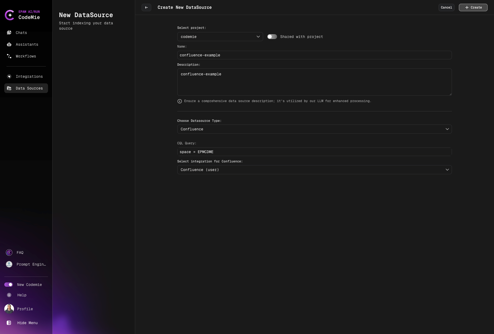

# Add and Index Confluence Pages

Connect and index Confluence pages as data sources.

Confluence pages are powerful knowledge base sources in AI/Run CodeMie, enabling assistants to access documentation, project information, and team knowledge. This guide walks you through the process of adding and indexing Confluence pages.

## Prerequisites

:::note Required Integration
This data source requires you to have at least one Confluence integration added to AI/Run CodeMie. For more details, please refer to the [Integrations Overview](../../integrations/) guidelines.
:::

Before adding a Confluence data source, ensure you have:

- Configured Confluence integration with a personal access token
- Access to the Confluence space you want to index
- Appropriate permissions to read Confluence pages
- Knowledge of CQL (Confluence Query Language) for filtering

:::danger CQL Required
Unlike other data sources, Confluence requires a valid CQL query. The data source will fail without it.
:::

## Adding a Confluence Data Source

To index Confluence pages, fill in the following fields:



### Step-by-Step Process

#### 1. Preparation

Before adding a new Confluence data source, you need to:

1. Generate a personal access token in Confluence
2. Create a corresponding integration via the **Integration** tab


- Navigate to the Integrations section
- Add a new Confluence integration
- Provide your Confluence URL and personal access token
- Save the integration for use in data sources

#### 2. Navigate to Data Sources

Navigate to the **Data Sources** section in AI/Run CodeMie.

#### 3. Create New Data Source

Click the **+ Create Datasource** button and add all required data according to recommendations.

#### 4. Select Source Type

- Select Project: Select the name of the project with which you want to associate that DataSource.
- Name: Alias for file for quick search in datasource list.
- Description: Description for this datasource
- Choose Datasource Type: **Confluence** source type in the add new data source window.
- CQL Query: Add **CQL expressions** to filter the data you want to index. This field is required.
- Select integration for Confluence: Choose integration.

```
space = CODEMIE AND type = page AND ancestor = 1593803553
```

This example filters:

- Pages in the CODEMIE space
- Only page-type content (excludes blogs, comments)
- Under a specific ancestor page ID

**More CQL Examples:**

:::tip CQL Resources
For more information on writing CQL expressions, refer to the [Atlassian CQL documentation](https://confluence.atlassian.com/doc/confluence-search-syntax-158720.html).
:::

:::info Testing CQL
Test your CQL query directly in Confluence search before using it in AI/Run CodeMie. This helps catch syntax errors early.
:::

#### 5. Create the Data Source

Click the **+ Create** button and wait for the process to finish.


**What happens next:**

1. AI/Run CodeMie validates the CQL expression
2. Connection to Confluence is established
3. Indexing process begins automatically
4. Progress can be monitored in the data source list

## Error Handling for Confluence Data Sources

### Common Errors

#### Incorrect CQL Expression

**Symptom**: Error message appears at the top of the Add data source window

**Cause**: The CQL expression syntax is invalid or references non-existent spaces/pages

**Solutions:**

1. Verify CQL syntax is correct
2. Check that space names are spelled correctly
3. Ensure page IDs exist in your Confluence instance
4. Test CQL in Confluence search before using in AI/Run CodeMie
5. Simplify complex expressions to identify the issue

#### Expired Authorization Token

**Symptom**: Authorization error appears during data source creation


**Cause**: The personal access token used in the Confluence integration has expired or been revoked

**Solutions:**

1. Navigate to the Integrations section
2. Locate your Confluence integration
3. Generate a new personal access token in Confluence
4. Update the integration with the new token
5. Retry creating the data source

#### Connection Timeout

**Cause**: Cannot establish connection to Confluence server

**Solutions:**

- Check network connectivity to Confluence
- Verify Confluence URL is correct in integration
- Ensure Confluence server is accessible
- Review firewall settings
- Try again after a few minutes

#### Permission Denied

**Cause**: Insufficient access to Confluence pages

**Solutions:**

- Verify integration has read access to the space
- Check Confluence space permissions
- Ensure personal access token has appropriate scopes
- Request access from Confluence space administrator

Now your Confluence pages are configured as a data source and ready to enhance your assistants with documentation and knowledge base content.
