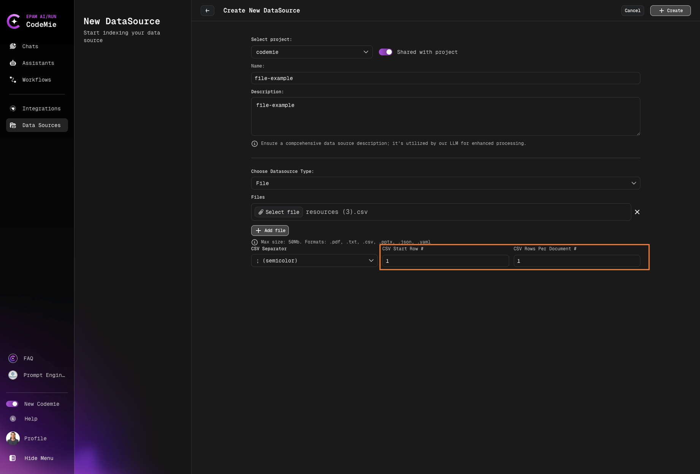
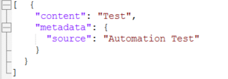
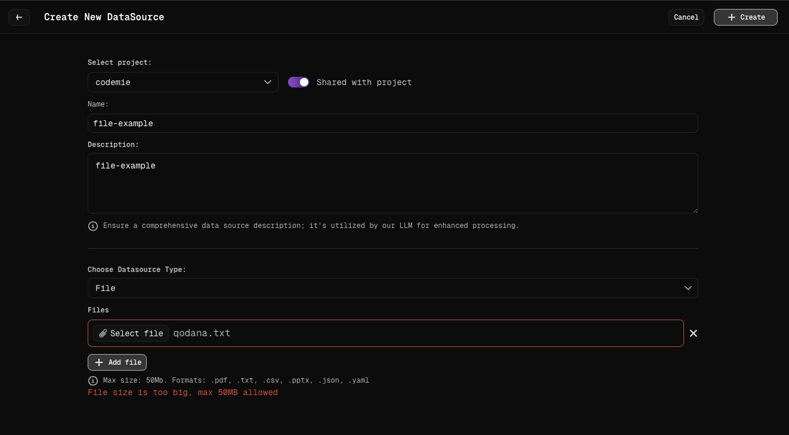

# Add and Index File DataSource

Upload and index files as data sources.

File data sources enable you to upload documents directly to AI/Run CodeMie, making their content accessible to assistants. This guide walks you through the process of adding and indexing various file types.

## Prerequisites

Before adding a File data source, ensure you have:

- Files prepared in supported formats
- Files within the size limit
- Understanding of your file structure for optimal configuration

## Supported File Formats

AI/Run CodeMie supports the following file formats:

| Format         | Extension       | Description                                                |
| -------------- | --------------- | ---------------------------------------------------------- |
| **PDF**        | `.pdf`          | Portable Document Format                                   |
| **Text**       | `.txt`          | Plain text files                                           |
| **CSV**        | `.csv`          | Comma-separated values with advanced configuration options |
| **PowerPoint** | `.pptx`         | Microsoft PowerPoint presentations                         |
| **XML**        | `.xml`          | Extensible Markup Language files                           |
| **JSON**       | `.json`         | JavaScript Object Notation files                           |
| **YAML**       | `.yaml`, `.yml` | YAML Ain't Markup Language files                           |
| **Word**       | `.docx`         | Microsoft Word documents                                   |
| **Excel**      | `.xlsx`         | Microsoft Excel spreadsheets                               |

### File Size Limitations

**Maximum file size**: 50MB per file

:::warning Size Limit
Files larger than 50MB cannot be uploaded. If you need to index larger files, consider splitting them into smaller chunks or using alternative data source types (e.g., Git repositories for code, Confluence for documentation).
:::

:::tip Reducing File Size

- PDF: Remove high-res images, compress with Adobe Acrobat or online tools
- Excel: Delete unused sheets, remove formatting
- PowerPoint: Compress images via "Compress Pictures" in PowerPoint
  :::

## Adding a File Data Source

To add a File as a Data Source with AI/Run CodeMie platform, follow these detailed steps:


### Step-by-Step Process

#### 1. Preparation

Prepare the file(s) that will be used. Make sure the file(s) corresponds to the requirements:

**Requirements checklist:**

- Max size: 50MB per file
- File format is one of the supported types listed above
- File content is relevant to your assistant's purpose
- File is not corrupted or password-protected

#### 2. Navigate to Data Sources

Navigate to the **Data Sources** section in AI/Run CodeMie.

#### 3. Create New Data Source

Click the **+ Create Datasource** button and add all required data according to recommendations.

#### 4. Select File Source Type

Select **File** source type in the add new data source window.

#### 5. Configure File-Specific Fields

- Select Project: Select the name of the project with which you want to associate that DataSource.
- Name: Alias for file for quick search in datasource list.
- Description: Description for this datasource
- Choose Datasource Type: **File**
- Press on **Add File** button and choose the file on your local machine. This field is required.
- Click **+ Create**

:::info Immediate Indexing
File data sources typically index within 1-10 minutes. Larger files take longer.
:::

Now you can select data source from the drop down list in Data Source Context section of your assistant

#### 6. Configure Format-Specific Options

Some file formats have additional configuration options:

##### CSV File Configuration

For `.csv` file format, you have the ability to configure additional options:



**CSV Separator**
Choose the delimiter used in your CSV file:

- **`;` (semicolon)** - Common in European locales
- **`,` (comma)** - Standard CSV separator
- **`\t` (tab)** - Tab-separated values

**CSV Start Row #**
Specify the row number where data begins:

- Use `1` if your CSV has no header row
- Use `2` if your CSV has a header row (most common)
- Use higher numbers if your CSV has multiple header rows or metadata

**CSV Rows Per Document #**
Define how many rows should be grouped together for search:

- **`1`** - Search row by row (fine-grained search)
- **Higher numbers** - Group multiple rows together (e.g., `15` to search all 15 rows as one unit)
- Consider your use case: individual records vs. grouped data

**Example scenarios:**

- Employee directory with 100 rows, search individually → use `1`
- Product catalog with 50 items, search all together → use `50`
- Transaction log with 1000 entries, search by batches of 100 → use `100`

:::warning CSV Configuration Impact
Choosing `1` row per document creates more granular search but increases index size. Choosing higher values (like `50`) creates broader search but may miss specific rows.
:::

##### JSON File Configuration

For `.json` file format, we recommend structuring your data with content and metadata fields:



**Recommended JSON structure:**

```json
{
  "content": "Your main text content here",
  "metadata": {
    "title": "Document Title",
    "author": "Author Name",
    "date": "2024-01-01",
    "tags": ["tag1", "tag2"]
  }
}
```

**Benefits of this structure:**

- Better semantic search results
- Improved metadata filtering
- Enhanced context for AI responses
- Easier content organization

:::tip JSON Best Practices
Always include a `content` field with your main text. Add `metadata` for filtering and categorization. Avoid deeply nested structures (max 3 levels).
:::

**Alternative structures:**

```json
[
  {
    "content": "First document content",
    "metadata": { "type": "documentation" }
  },
  {
    "content": "Second document content",
    "metadata": { "type": "tutorial" }
  }
]
```

#### 7. Create the Data Source

Click the **+ Create** button and wait for the process to finish.

**What happens next:**

1. AI/Run CodeMie validates the file format and size
2. File is uploaded to the platform
3. Indexing process begins automatically
4. Progress can be monitored in the data source list

## Error Handling for File Data Sources

### Common Errors

#### Incorrect File Format

**Symptom**: Error message appears below the file browse area of the Add data source window


**Cause**: The file format is not supported by AI/Run CodeMie

**Solutions:**

1. Convert the file to a supported format
2. Verify the file extension matches the actual file type
3. Check if the file is corrupted
4. Ensure the file extension is spelled correctly

**Common format conversion suggestions:**

- `.doc` → Convert to `.docx` or `.pdf`
- `.xls` → Convert to `.xlsx` or `.csv`
- `.rtf` → Convert to `.docx` or `.txt`
- `.pages` → Export to `.pdf` or `.docx`

#### File Size Too Large

**Symptom**: Error message appears below the file browse area indicating size limit exceeded



**Cause**: File exceeds the 50MB size limit

**Solutions:**

1. **Compress the file**: Use file compression to reduce size
2. **Split the file**: Divide into multiple smaller files
3. **Remove unnecessary content**: Delete images, embedded media, or redundant sections
4. **Use alternative data source**: Consider Git for code repositories, Confluence for large documents
5. **Optimize file format**:
   - For PDFs: Reduce image quality, remove embedded fonts
   - For Excel: Remove unused sheets, compress images
   - For PowerPoint: Compress media, reduce image resolution

#### Upload Failed

**Cause**: Network issues or server problems during upload

**Solutions:**

- Check your internet connection
- Retry the upload
- Try uploading during off-peak hours
- Ensure your browser is up to date
- Try a different browser

#### Corrupted File

**Cause**: File is damaged or incomplete

**Solutions:**

- Try opening the file locally to verify it works
- Re-download or re-create the file
- Check the original source for a valid copy
- Use file repair tools if available

Now your files are configured as data sources and ready to enhance your assistants with document knowledge.
