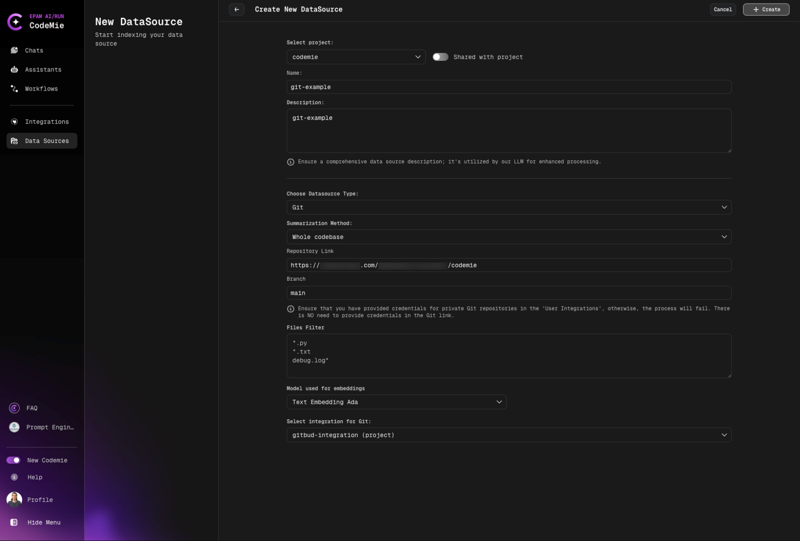
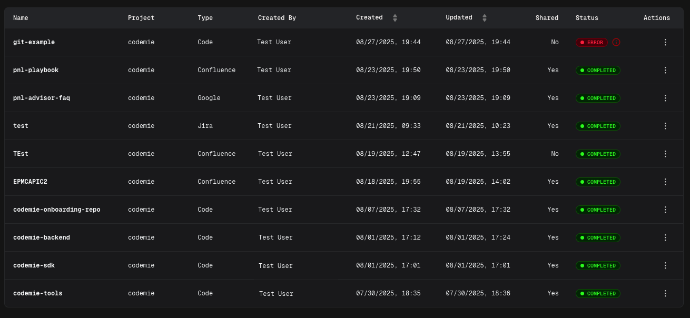
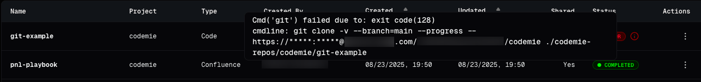

import Tabs from '@theme/Tabs';
import TabItem from '@theme/TabItem';

# Add and Index Git Data Sources

Connect and index Git repositories as data sources.

Git repositories are one of the most powerful data sources in AI/Run CodeMie, enabling assistants to analyze code, understand repository structure, and work with your codebase directly. This guide walks you through the process of adding and indexing Git repositories.

## Prerequisites

:::note Required Integration
This data source requires you to have at least one Git integration added to AI/Run CodeMie. For more details, please refer to the [Integrations Overview](../../integrations/) guidelines.
:::

Before adding a Git data source, ensure you have:

- Configured Git integration (GitHub, GitLab, or Bitbucket)
- Access to the repository you want to index
- Appropriate permissions to access repository content

:::tip Integration Setup
If you haven't configured a Git integration yet, follow the [Integrations Guide](../../integrations/) first.
:::

## Adding a Git Data Source

To index a Git repository, fill in the following fields:



### Configuration Fields

#### 4. Select Source Type

- Select Project: Select the name of the project with which you want to associate that DataSource.
- Name: Alias for file for quick search in datasource list.
- Description: Description for this datasource
- Choose Datasource Type: **Git** source type in the add new data source window.
- Choose Available indexing types:

<Tabs>
  <TabItem value="whole" label="Whole codebase" default>
    Direct indexing of raw code

    - **Best for**: Quick setup, simple code analysis
    - **Use when**: You want fast access to code without additional processing

  </TabItem>
  <TabItem value="per-file" label="Summarization per file">
    Generates summaries for each file

    - **Best for**: Documentation generation, code overview
    - **Use when**: You need high-level understanding of codebase

  </TabItem>
  <TabItem value="per-chunks" label="Summarization per chunks">
    Creates summaries for code chunks

    - **Best for**: Large codebases, detailed navigation
    - **Use when**: You need comprehensive code understanding
    - **Note**: Preferred mode, takes approximately 30-60 minutes

  </TabItem>
</Tabs>

:::info Which Indexing Type Should I Choose?

- **Whole codebase**: Fast setup, ideal for small projects (< 500 files)
- **Per file**: Best for documentation and code overview
- **Per chunks**: Recommended for production use and large codebases
  :::

- Repository Link:

<Tabs>
  <TabItem value="github" label="GitHub" default>
    ```
    https://github.com/username/repository
    ```
  </TabItem>
  <TabItem value="gitlab" label="GitLab">
    ```
    https://gitlab.com/username/repository
    ```
  </TabItem>
  <TabItem value="bitbucket" label="Bitbucket">
    ```
    https://bitbucket.org/username/repository
    ```
  </TabItem>
</Tabs>

- Branch: Specify the target branch to work with.

:::warning Branch Selection
Always use stable branches (e.g., `main`, `master`, `develop`) for indexing. Feature branches may be deleted, breaking your data source.
:::

- Files Filter: Specify relevant file extensions to index in the field.

:::tip File Filter Examples

- Python projects: `*.py`
- JavaScript/TypeScript: `*.js,*.ts,*.tsx,*.jsx`
- Java: `src/**/*.java`
- Multiple: `*.py,*.md,*.yaml`
  :::

- Model Used for Embeddings: Select model Used for Embeddings.
- Select integration for Git: Choose integration.

Click the **+ Create** button and wait for the process to finish.

:::info Indexing Time
Initial indexing may take 15-60 minutes depending on repository size. You can close the page - indexing continues in the background.
:::

**What happens next:**

1. AI/Run CodeMie validates the configuration
2. Connection to repository is established
3. Indexing process begins automatically
4. Progress can be monitored in the data source list

## Error Handling for Git Data Sources

Errors can occur in the following cases:

- **Invalid repository link**: URL format is incorrect or repository doesn't exist
- **Invalid token**: Git integration credentials are expired or incorrect
- **Incorrect branch link**: Specified branch doesn't exist in the repository

For all these cases, after the data source is added and automatic reindex is created, a general error with exit code (128) will appear:



Now your Git repository is configured as a data source and ready to enhance your assistants with codebase knowledge.

### Common Error Messages

#### Exit Code 128



**Cause**: General Git operation failure

**Common reasons:**

- Repository not found or inaccessible
- Authentication failed
- Network connectivity issues
- Invalid branch name

**Solutions:**

1. Verify repository URL is correct
2. Check Git integration credentials are valid
3. Ensure branch name exists in the repository
4. Test repository access manually
5. Review integration permissions

#### Connection Timeout

**Cause**: Cannot establish connection to Git server

**Solutions:**

- Check network connectivity
- Verify Git server is accessible
- Review firewall settings
- Try again after a few minutes

#### Permission Denied

**Cause**: Insufficient access to repository

**Solutions:**

- Verify integration has read access to repository
- Check repository visibility settings (public/private)
- Update integration credentials
- Request access from repository owner
