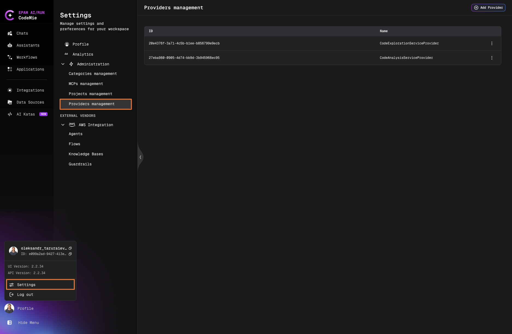
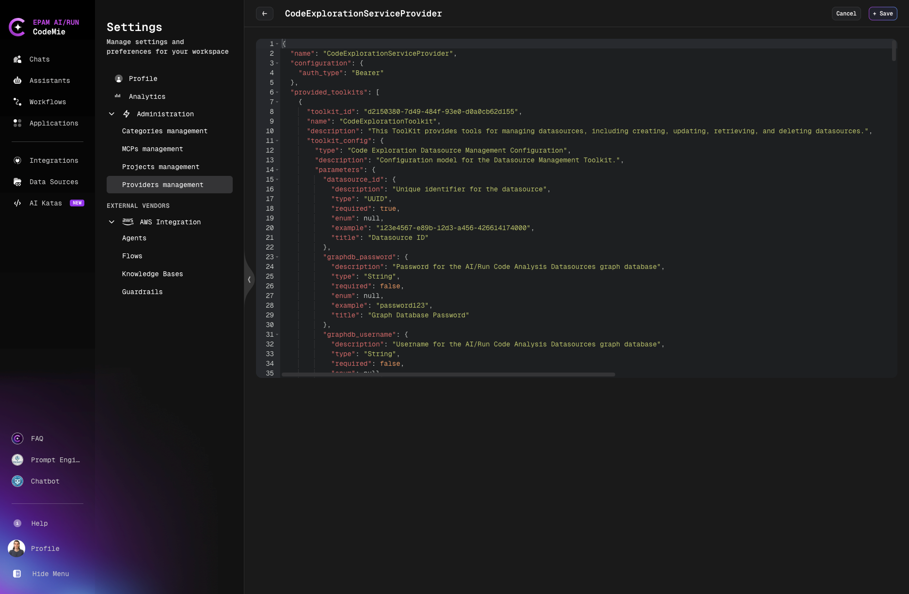
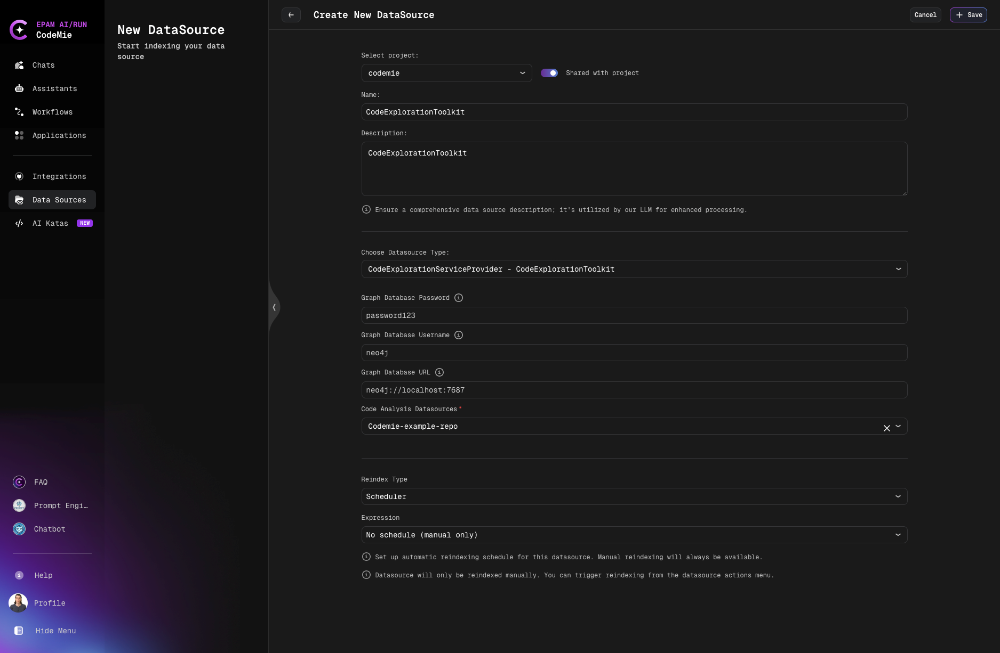
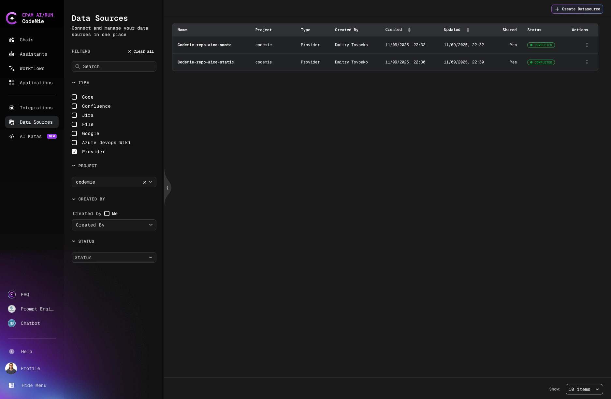
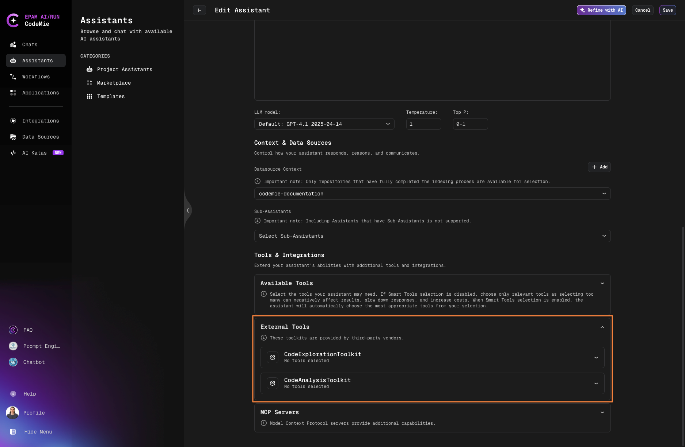

# Add and Index Provider Data Source

Index external data sources through third-party providers.

## Overview

Provider data sources enable indexing external data through registered third-party provider configurations. Once indexed, assistants can use provider-specific tools to work with this data. Additionally, some provider tools can be used independently without requiring a data source.

:::warning Access Required
This functionality is only available to users with the [isAdmin](/user-guide/getting-started/glossary#jwt-attributes) role.
:::

## Provider Capabilities

Provider capabilities depend on their configuration. External providers might enable:

- Analyze code structure and patterns
- Explore repository contents
- Extract insights from indexed data
- Perform advanced code understanding tasks

## How It Works

### 1. Register Provider Configuration

Administrators register third-party providers in Settings → Administration → Providers management:



Click **+ Add Provider**, fill configuration details, and click **Save**:



### 2. Creating Provider Data Source

### Step 1: Navigate to Data Sources

Click **Data Sources** in the left navigation bar.

### Step 2: Create New Data Source

Click **+ Create Datasource** button.

### Step 3: Fill Required Fields



**Select project**: Choose your project from dropdown

**Shared with project**: Toggle to share data source with project team members

**Name**: Provide descriptive name for the data source

**Description**: Explain data source purpose and what it will be used for

**Choose Datasource Type**: Select registered provider from dropdown

**Provider-Specific Configuration**: Depending on selected provider, fill additional fields:

- **Graph Database Password**: Password for graph database connection (if required by provider)
- **Graph Database Username**: Username for graph database (if required by provider)
- **Graph Database URL**: Connection URL for graph database (if required by provider)
- **Code Analysis Datasources**: Select existing datasources to analyze with provider tools (optional)

### 3. Index Provider Data Source

Users select **Provider** as data source type and index their data:



### 4. Use Provider Tools with Assistants

When configuring assistants, provider-specific tools become available in External Tools section:



Provider tools can be used:

- **With data source context**: Tools work with indexed provider data
- **Independently**: Some tools don't require data source and work standalone

## Workflow

```
1. Administrator registers provider configuration
   ↓
2. User selects Provider as data source type
   ↓
3. User indexes data through provider
   ↓
4. User creates assistant with provider tools enabled
   ↓
5. Assistant uses provider tools with or without data source context
```
