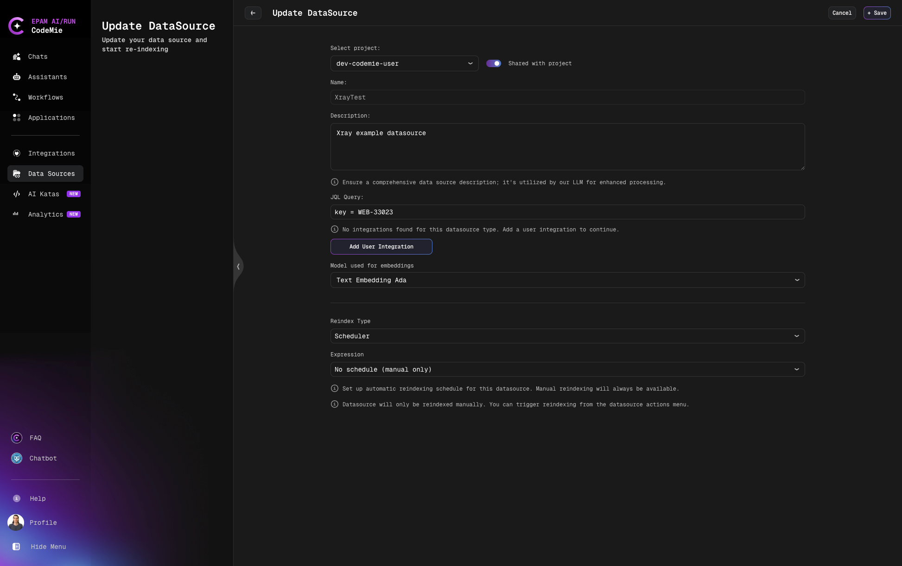
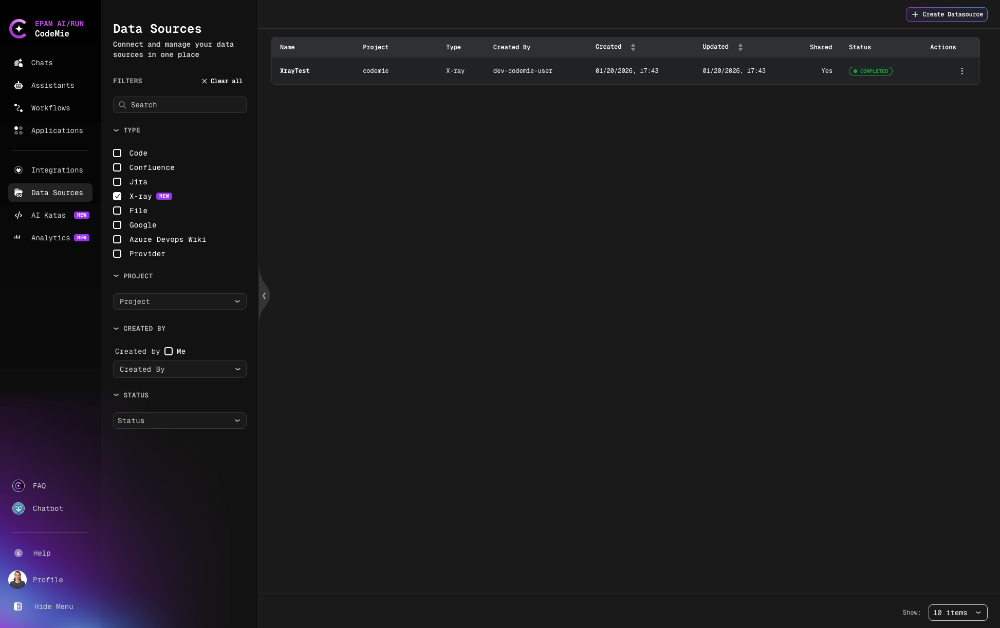

# Add and Index X-ray Data Source

Connect and index X-ray test cases as data sources.

X-ray is a comprehensive test management solution for Jira that enables AI/Run CodeMie assistants to access test cases, test plans, test executions, and test-related information. This guide walks you through the process of adding and indexing X-ray test data.

## Prerequisites

:::note Required Integration
This data source requires you to have at least one X-ray integration added to AI/Run CodeMie. For more details, please refer to the [Integrations Overview](../../tools_integrations/integrations/) guidelines.
:::

Before adding an X-ray data source, ensure you have:

- X-ray API Keys (Client ID and Client Secret) - see [Xray API Keys documentation](https://docs.getxray.app/space/XRAYCLOUD/44568019/Global+Settings+-+API+Keys)
- Configured X-ray integration with API credentials
- Access to the X-ray instance and Jira project
- Appropriate permissions to read test cases and test-related issues
- Knowledge of JQL (Jira Query Language) for filtering test data

:::danger JQL Required
X-ray data sources require a valid JQL query. Test your JQL in Jira before adding the data source to avoid indexing errors.
:::

## Adding an X-ray Data Source

To add X-ray as a data source with AI/Run CodeMie platform, follow these detailed steps:

### Step-by-Step Process

#### 1. Preparation

Before adding a new X-ray data source, you need to create an integration with X-ray on the Integrations tab.

**How to create an X-ray integration:**

1. **Generate X-ray API Keys**: Follow the [Xray API Keys documentation](https://docs.getxray.app/space/XRAYCLOUD/44568019/Global+Settings+-+API+Keys) to create API credentials in Xray Global Settings
2. Navigate to the **Integrations** section in AI/Run CodeMie
3. Select **User Integrations** or **Project Integrations** based on your needs:
   - **User Integrations**: Available only to you across all projects
   - **Project Integrations**: Shared with all members of the selected project
4. Click **+ Create**
5. Select **User** or **Project** integration scope
6. Choose **X-ray** as the Credential Type
7. Provide your X-ray instance URL, Client ID, and Client Secret
8. Save the integration for use in data sources

**Refer to the [Integrations Overview](../../tools_integrations/integrations/) guidelines for detailed integration setup instructions.**

#### 2. Navigate to Data Sources

Navigate to the **Data Sources** section in AI/Run CodeMie.

#### 3. Create New Data Source

Click the **+ Create Datasource** button and add all required data according to recommendations.

#### 4. Select Source Type and Configure



- **Select Project**: Select the project with which you want to associate this data source
- **Shared with project**: Enable to share this data source with the entire project
- **Name**: Alias for the data source for quick search in the data source list (e.g., "XrayTest")
- **Description**: Description for this data source (e.g., "XRAY example datasource")
- **Choose Datasource Type**: Select **X-ray** source type in the add new data source window
- **JQL Query**: Add **JQL expressions** to filter the test data you want to index. This field is required.

**Common JQL Examples for X-ray:**

```jql
# Index all tests from a specific project
project = "WEB" AND issuetype = "Test"

# Index manual tests only
project = "WEB" AND issuetype = "Test" AND "Test Type" = "Manual"

# Index tests from multiple projects
project IN ("WEB", "API") AND issuetype = "Test"
```

:::tip JQL Quick Start for X-ray

- Use `issuetype = "Test"` to filter Xray test issues
- Add `AND "Test Type" = "Manual"` to filter by test type
- Use `AND project = "PROJECT-KEY"` to limit to specific projects
- Add `AND key = ISSUE-KEY` to index a specific test
  :::

#### 5. Select Integration for X-ray

- **Select integration for X-ray**: Choose the X-ray integration you created earlier from the dropdown menu



#### 6. Configure Model and Indexing

- **Model used for embeddings**: Select the embedding model for indexing (e.g., "Text Embedding Ada")
  - This model converts test case text into vector embeddings for semantic search
  - Default model is usually appropriate for most use cases

#### 7. Configure Reindex Schedule (Optional)

In the **Reindex Type** section, configure automatic reindexing:

- **Scheduler**: Choose your preferred reindexing schedule
  - **No schedule (manual only)** - Default, requires manual reindexing
  - **Every hour** - Recommended for active test projects with frequent updates
  - **Daily at midnight** - For test projects with regular daily activity
  - **Weekly on Sunday at midnight** - For less active test projects
  - **Monthly on the 1st at midnight** - For archived or completed test suites
  - **Custom cron expression** - Enter custom cron expression (e.g., `0 9 * * MON-FRI` for weekdays at 9 AM)

:::info Why Schedule Reindexing?
Test cases and test plans can change frequently. Scheduled reindexing ensures your assistants always have access to the latest test information, including new test cases, updated test steps, and recent test execution results.
:::

#### 8. Create Data Source

Click the **+ Create** button to create the X-ray data source. Indexing will begin automatically based on your scheduler configuration.

## What Gets Indexed

When you create an X-ray data source, the following information is indexed:

- **Test Cases**: Test issue summaries, descriptions, and test steps
- **Test Details**: Test type (Manual, Automated, Cucumber, etc.)
- **Test Metadata**: Labels, components, priority, status
- **Custom Fields**: Any custom fields associated with test issues
- **Links and Relationships**: Links to requirements, user stories, or defects

:::info
The indexed content allows assistants to understand test coverage, analyze test scenarios, suggest similar tests, and provide insights about test cases based on natural language queries.
:::

## Error Handling for X-ray Data Sources

### Common Errors

#### Incorrect JQL Expression

**Symptom**: Error message appears at the top of the Add data source window

**Cause**: The JQL expression syntax is invalid or references non-existent projects/fields

**Solutions:**

1. Verify JQL syntax is correct
2. Check that project keys are spelled correctly
3. Ensure field names exist in your Jira/Xray instance
4. Test JQL in Jira search before using in AI/Run CodeMie
5. Simplify complex expressions to identify the issue

**Example of common JQL mistakes for X-ray:**

```jql
# ❌ Incorrect - Missing issue type filter
project = "WEB"

# ✅ Correct - Include issue type for Xray tests
project = "WEB" AND issuetype = "Test"

# ❌ Incorrect - Wrong field name for test type
project = "WEB" AND testType = Manual

# ✅ Correct - Proper field name with quotes
project = "WEB" AND "Test Type" = "Manual"

# ❌ Incorrect - Invalid operator
project = "WEB" AND issuetype EQUALS "Test"

# ✅ Correct - Correct operator
project = "WEB" AND issuetype = "Test"
```

:::info Common JQL Operators for X-ray

- `=` : equals
- `!=` : not equals
- `IN` : matches any value in a list
- `~` : contains (text search)
- `IS EMPTY` : field has no value
- `IS NOT EMPTY` : field has a value
  :::

## Using X-ray Data Source in Assistants

After successfully creating and indexing your X-ray data source, you can connect it to any assistant to provide access to test case information.

### Adding Data Source to Assistant

1. Navigate to **Assistants** section
2. Click **+ Create Assistant** or edit an existing assistant
3. In the **Data Source Context** section, click the dropdown menu
4. Select your X-ray data source from the list
5. Save the assistant configuration

Now your assistant can access and analyze test cases from the indexed X-ray data source, enabling it to:

- Answer questions about test coverage
- Suggest similar test cases
- Analyze test scenarios
- Generate test documentation
- Provide insights about test distribution and patterns

Your X-ray data source is now configured and ready to enhance your assistants with comprehensive test management knowledge.
