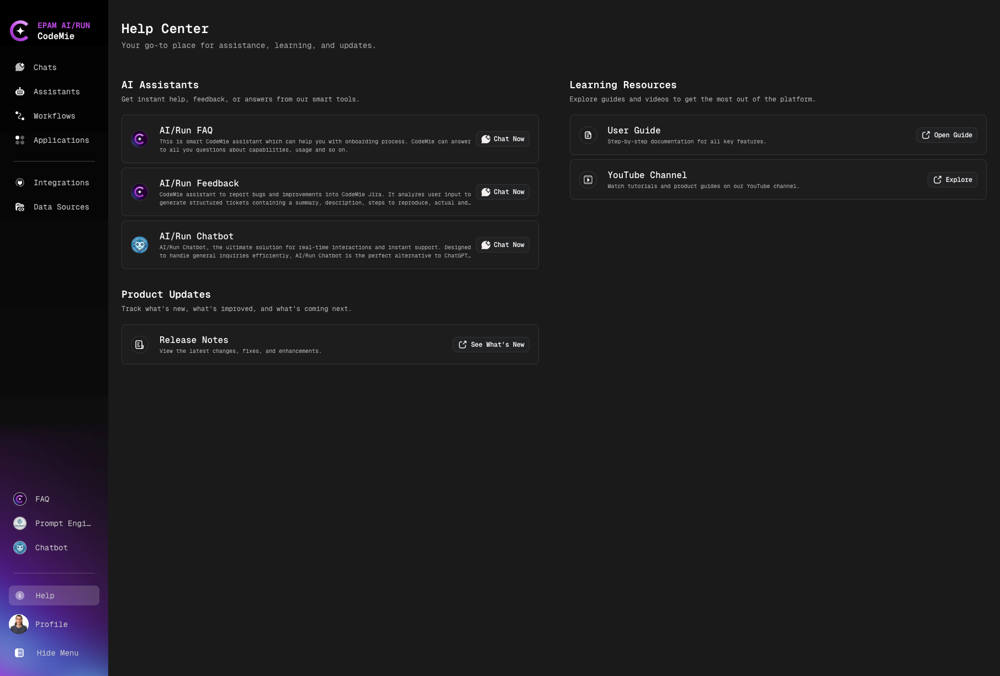
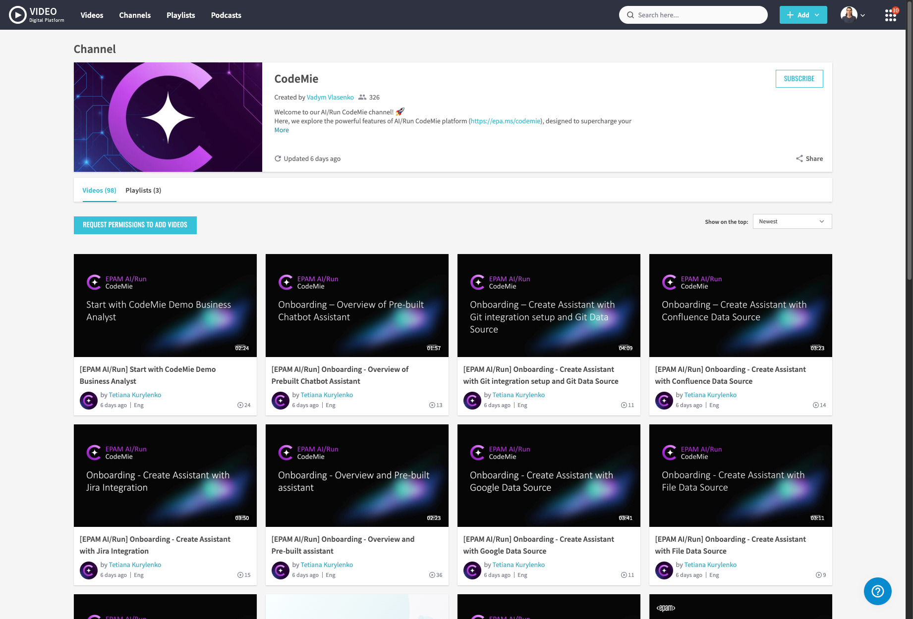
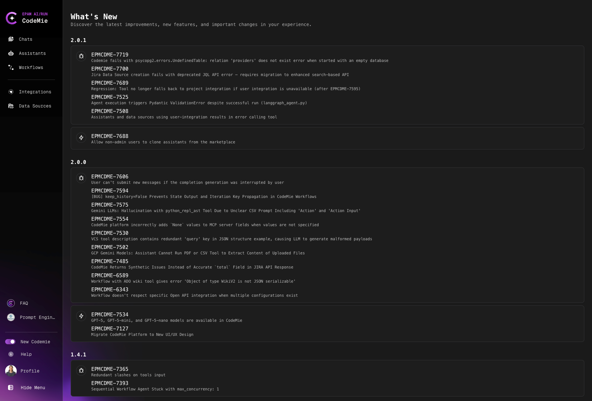

# Help Center

The Help Center page serves as a central hub for getting help, learning, and updates on the CodeMie platform. It provides users with access to various support resources and learning materials.

## AI Assistants

This section contains information about various AI assistants on the platform:

### AI/Run FAQ

Smart assistant that can help with onboarding processes. CodeMie can answer all your questions about capabilities, usage, and much more. To start chatting, simply click **Chat Now**.

### AI/Run Feedback

CodeMie assistant for reporting bugs and improvements in CodeMie Jira. The AI analyzes the bug report to create structured tickets containing summary, description of reproduction steps, actual and expected results.

### AI/Run Chatbot

The perfect solution for real-time interaction and instant support. Designed to enhance user efficiency, AI/Run Chatbot is the ideal alternative to ChatGPT.

## Learning Resources

Section for learning the platform and getting the most out of it:

### Video Portal

Short tutorials, step-by-step instructions, and product tips: [Video Portal](https://videoportal.epam.com/channel/z1Je1k9Jv5/videos)

### User Guide

Step-by-step documentation for all key features.

## Product Updates

Section for tracking new features and improvements:

### Release Notes

View the latest changes, fixes, and improvements.
