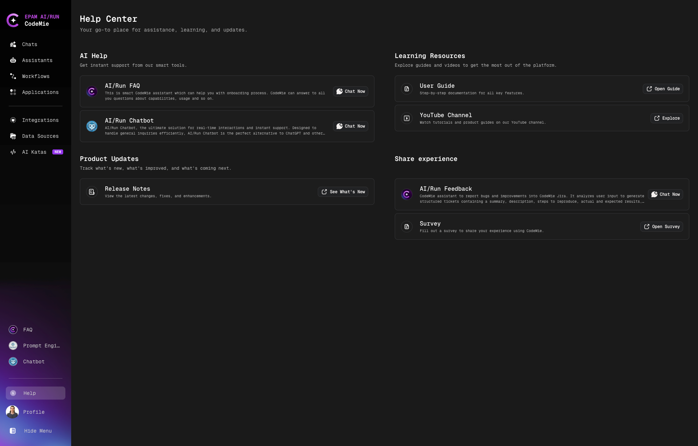

# Help Center

The Help Center page serves as a central hub for getting help, learning, and updates on the CodeMie platform. The page is organized into four main sections.

## AI Help

### AI/Run FAQ

This is smart CodeMie assistant which can help you with onboarding process. CodeMie can answer to all you questions about capabilities, usage and so on. To start chatting, simply click **Chat Now**.

### AI/Run Chatbot

The ultimate solution for real-time interactions. Designed to handle general inquiries efficiently, AI/Run Chatbot is the perfect alternative to ChatGPT. To start chatting, simply click **Chat Now**.

## Learning Resources

### User Guide

Step-by-step documentation for all key features. Click **Open Guide** to access comprehensive documentation.

### YouTube Channel

Watch tutorials and product guides on our YouTube channel. Click **Explore** to visit: [YouTube channel](https://www.youtube.com/@EPAMAIRunCodeMie)

## Product Updates

### Release Notes

View the latest changes, fixes, and enhancements. Click **See What's New** to view the latest updates.

## Share Experience

### AI/Run Feedback

CodeMie assistant to report bugs and improvements into CodeMie Jira. It analyses your input to generate structured tickets containing a summary, description, steps to reproduce, actual and expected results. Click **Chat Now** to start reporting.

### Survey

Fill out a survey to share your experience using CodeMie: [Survey](https://forms.office.com/Pages/ResponsePage.aspx?id=0HIbtJ9OJkyKaflJ82fJHR4SMJgwvBNOsejqrpALtT5UQ0c3TTNGQTMyS00wSDQwWTBMNFdOMDBWWS4u)
