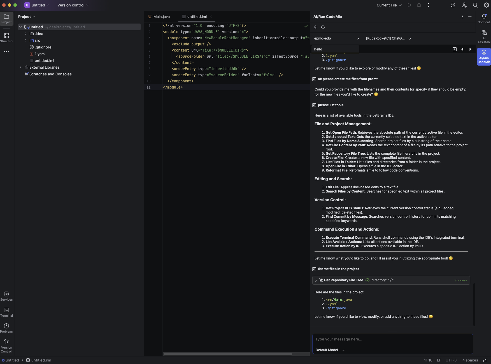

# CodeMie JetBrains IDE Plugin

The CodeMie JetBrains IDE plugin brings native CodeMie integration directly into your JetBrains development environment, including IntelliJ IDEA, WebStorm, PyCharm, and other JetBrains IDEs. This plugin provides seamless access to CodeMie assistants, project selection, and development tools without leaving your IDE.

---

## Prerequisites

- JetBrains IDE (IntelliJ IDEA, WebStorm, PyCharm, etc.)
- CodeMie Account for authentication

---

## Installation

1. Open your JetBrains IDE
2. Go to **Settings/Preferences → Plugins**
3. Search for "[AI/Run CodeMie](https://plugins.jetbrains.com/plugin/27730-ai-run-codemie)" in the marketplace
4. Click **Install** and restart your IDE

---

## Initial Setup

1. **Locate the Plugin**: Find the AI/Run CodeMie plugin icon in the right sidebar of your IDE
2. **Authentication**: Click to open and use Single Sign-On (SSO) to log in
3. **Project Selection**: Choose your active CodeMie projects from the available list
4. **Assistant Access**: Select from your available assistants

---

## Key Features

### Native IDE Integration

- **Sidebar Interface**: Access CodeMie directly from the IDE sidebar
- **Project Context**: Automatic integration with your current development context
- **Assistant Tools**: All development tools are automatically integrated when selecting assistants

### Conversation Management

- **Chat History**: Navigate through previous conversations with assistants
- **New Conversations**: Create new assistant interactions as needed
- **Web Sync**: All IDE conversations are synchronized with the CodeMie web platform

---

## Troubleshooting

### Common Issues and Solutions

#### Plugin Not Responding

1. Click the Refresh button in the plugin interface
2. Restart your JetBrains IDE
3. Check connection status

#### Authentication Problems

1. Verify connection
2. Clear plugin cache in settings
3. Reset login data through plugin settings

#### Development Tools Not Working

1. Verify connection to network
2. Check plugin settings for toolkit configurations

---

## Plugin Settings

Access plugin settings to:

- **Toggle Toolkits**: Enable/disable specific development toolkits
- **Add MCP Plugins**: Configure Model Context Protocol plugins
- **Reset Cache**: Clear cached data and login information
- **Manage Connections**: Update authentication and connection settings
