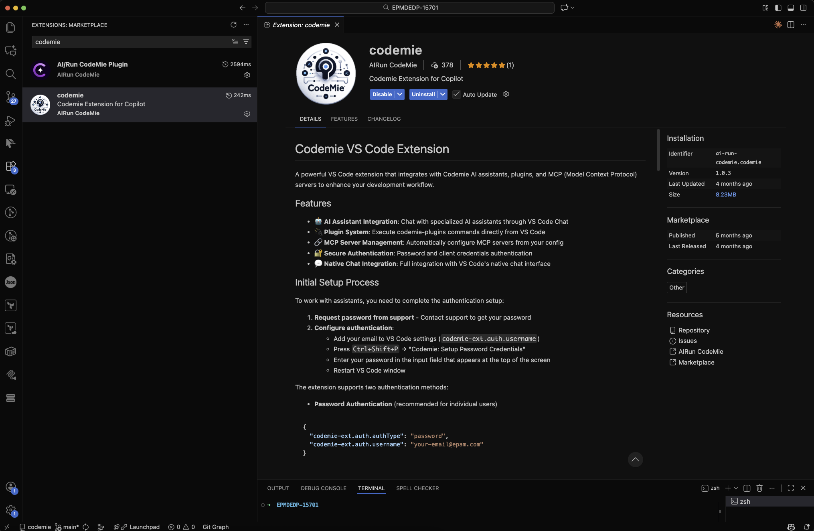
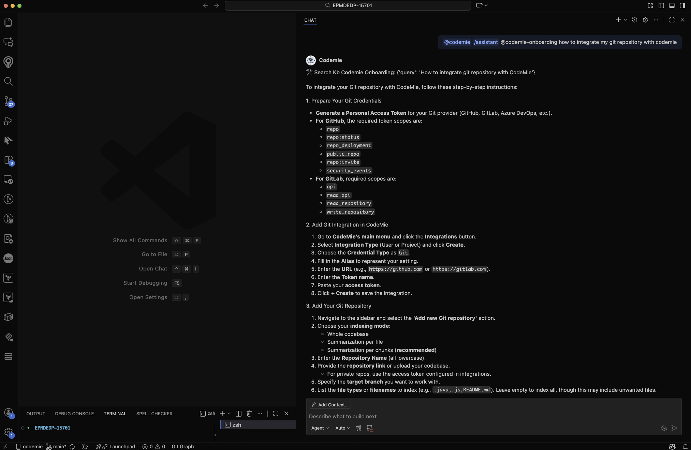

# CodeMie VS Code GitHub Copilot Extension

The CodeMie GitHub Copilot extension integrates CodeMie's AI-powered assistants directly into Visual Studio Code through the GitHub Copilot Chat interface. This extension provides seamless access to CodeMie capabilities while leveraging the familiar Copilot Chat experience.

---

## Prerequisites

- CodeMie Account for authentication

---

## Installation

1. Open Visual Studio Code
2. Click on **Extensions** button or (Ctrl+Shift+X or Cmd+Shift+X)
3. Search for "[AI/Run CodeMie](https://marketplace.visualstudio.com/items?itemName=ai-run-codemie.codemie)" in the marketplace

4. Click **Install** and follow the setup instructions provided in the extension documentation

---

### Example of usage

---

## Troubleshooting

### Common Issues and Solutions

#### Extension Not Responding

1. Click the Refresh button in the extension interface
2. Restart your Vs code IDE
3. Check connection status

#### Authentication Problems

1. Verify connection
2. Clear extension cache in settings
3. Reset login data through extension settings
