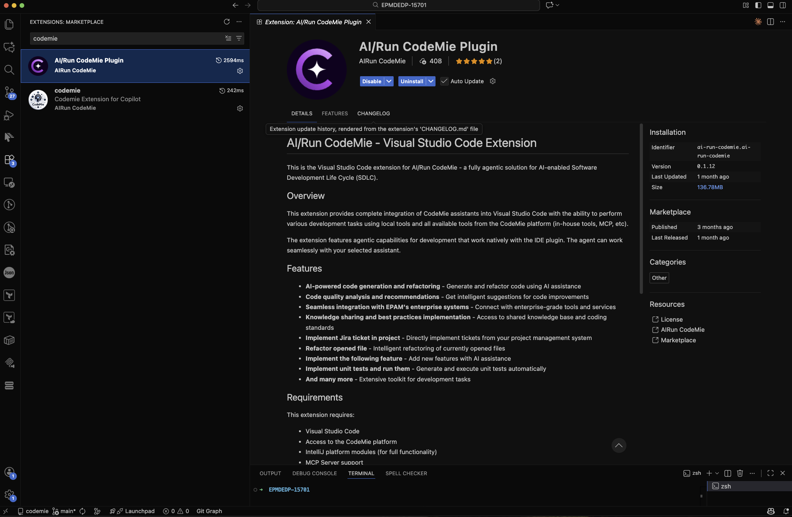
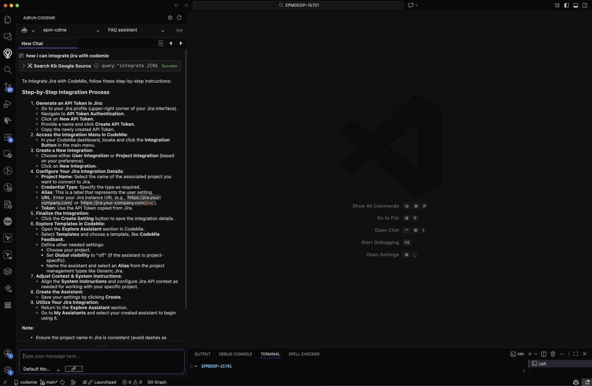

# CodeMie VS Code Native Extension

The CodeMie Native VS Code extension provides a dedicated sidebar interface for CodeMie within Visual Studio Code. This extension offers full-featured access to CodeMie assistants, conversations, and tools in a native VS Code experience.

---

## Prerequisites

- CodeMie Account for authentication

---

## Installation

1. Open your Visual Studio Code IDE
2. Click on **Extensions** button or (Ctrl+Shift+X or Cmd+Shift+X)
3. Search for "[AI/Run CodeMie](https://marketplace.visualstudio.com/items?itemName=ai-run-codemie.ai-run-codemie)" in the extensions marketplace.

4. Click **Install** and follow the setup instructions provided in the extension documentation

---

### Example of usage

---

## Troubleshooting

### Common Issues and Solutions

#### Extension Not Responding

1. Click the Refresh button in the extension interface
2. Restart your Vs code IDE
3. Check connection status

#### Authentication Problems

1. Verify connection
2. Clear extension cache in settings
3. Reset login data through extension settings
