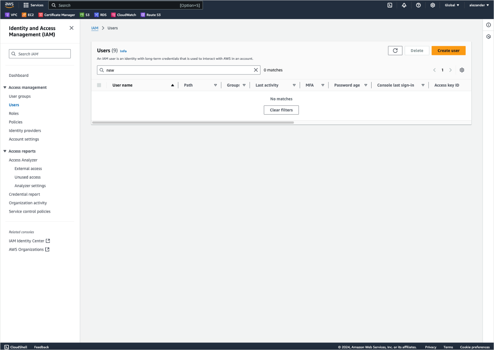
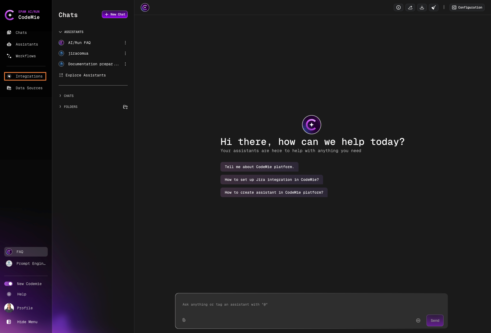
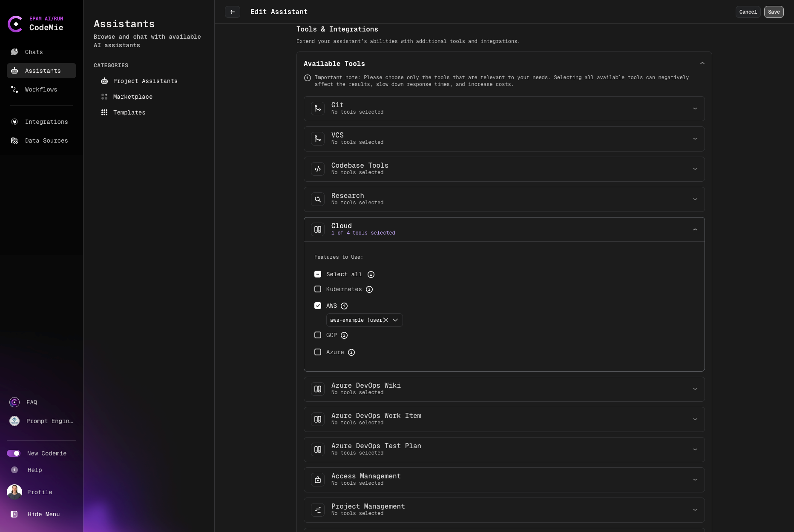

# AWS

AI/Run CodeMie can interact with various cloud providers, including Amazon Web Services (AWS). This integration enables users to view and manage cloud resources. To integrate AI/Run CodeMie with the AWS cloud provider, follow the steps below:

## 1. Configure AWS IAM User

1.1. Log into your AWS account.

1.2. In the search bar, enter **IAM**.

1.3. Navigate to **Access management → Users**. Click **Create user**:

1.4. Set permissions at your description and click **Create user**:

1.5. Click on the created user to view their management page:

1.6. Navigate to **Security credentials → Access keys** and click **Create access key**:

1.7. Copy **Access key** and **Secret access key**:

## 2. Configure Integration in AI/Run CodeMie

2.1. In the AI/Run CodeMie main menu, click the **Integrations** button.

2.2. Select **User** or **Project** and click the **+ Create** button.

2.3. Fill in the required fields and click **Create**:

- **Project Name**: Specify project name.
- **Credential Type**: AWS
- **Alias**: Specify the integration name.
- **Region**: Specify the AWS Region to work in.
- **Access Key ID**: Paste the **Access Key ID** data copied from step 1.7.
- **Secret access key**: Paste the **Secret access key** data copied from step 1.7.

(Optional) you can "Test Integration" connection before creating.

## 3. Enable AWS Tool in Assistant

3.1. Modify your assistant by enabling AWS integration or create a new assistant with this tool:

## 4. Verify Integration

4.1. Verify AWS integration by asking assistant a relevant question:

