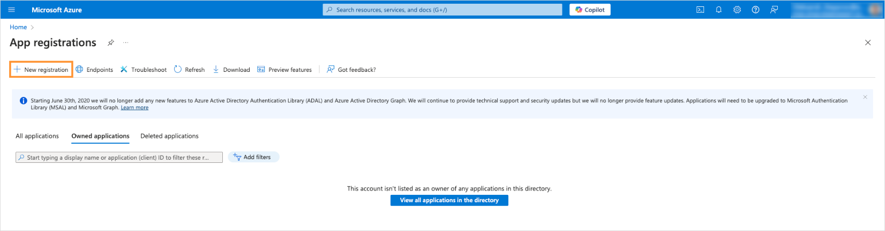
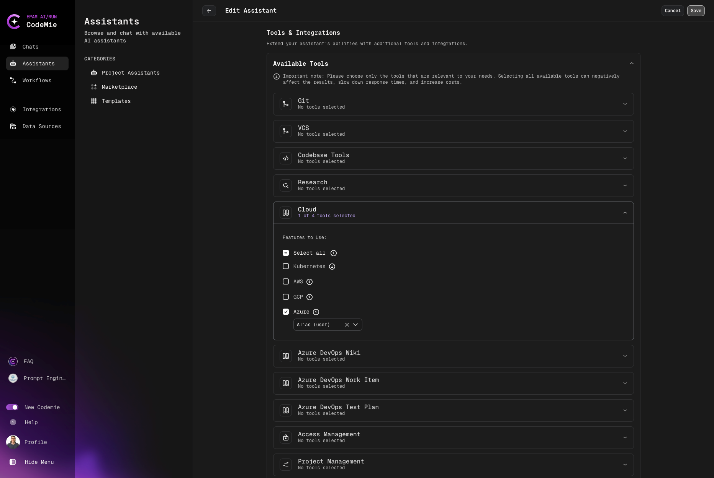

# Azure

AI/Run CodeMie can interact with various cloud providers, including Microsoft Azure. This integration allows users to view and manage cloud resources. To integrate AI/Run CodeMie with Azure cloud provider, follow the steps below:

## 1. Configure Azure

1.1. Log in to your Azure account.

1.2. In the search bar, enter **Subscriptions**:

1.3. In the **Subscriptions** page, click **+ Add** or select the **Subscription** that already exists.

1.4. Copy **Subscription ID**.

1.5. In the search bar, enter **App registration**:

1.6. Click **+ New registrations** or select the application that already exists:

1.7. Enter the application name and click **Register**:

1.8. Copy **Application Client ID**:

1.9. Navigate to **Manage → Certificates & secrets → Client secrets**:

1.10. Click **+ New client secret**. Fill in the description field and click **Add**:

1.11. Copy **Secret ID** and **Value**:

## 2. Configure Integration in AI/Run CodeMie

2.1. In the AI/Run CodeMie main menu, click the **Integrations** button.

2.2. Select **User** or **Project**, depending on your needs, and click **Create**.

2.3. Fill in the required fields and click **Create**:

- **Project Name**: Specify project name.
- **Credential Type**: Azure
- **Alias**: Specify the integration name.
- **Subscription ID**: Paste the subscription ID copied on step 1.4.
- **Tenant ID**: Paste the "Application Client ID" copied from step 1.8.
- **Client ID**: Paste the **Secret ID** data copied from step 1.10.
- **Client Secret**: Paste the **Value** data copied from step 1.11.

## 3. Enable Azure Tool in Assistant

3.1. Modify your assistant by enabling Azure integration or create a new assistant with this tool:

