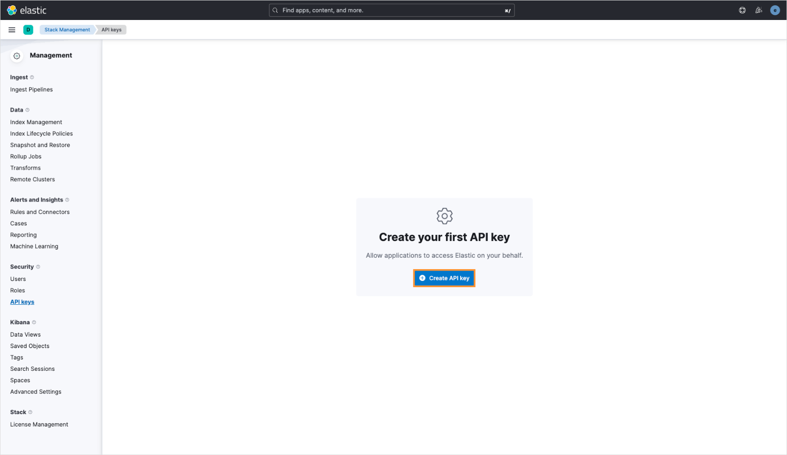

# Elastic

Elastic is a robust platform for search and data analysis, allowing seamless integration with various tools. AI/Run CodeMie assistants can connect to an Elastic endpoint to retrieve data efficiently. To set up this integration, follow these steps:

## 1. Obtain Credentials

There are two ways to obtain Elastic credentials:

- Using terminal
- Using Elastic UI

### Option 1: Using Terminal

1.1. Use command for curl below:

```bash
curl -X POST "https://<elasticsearch_url>:9200/_security/api_key" \
-H "Content-Type: application/json" \
-H "Authorization: Basic <base64-encoded-username-password>" \
-d '{
  "name": "my-api-key",
  "role_descriptors": {
    "my-role": {
      "cluster": ["all"],
      "index": [
        {
          "names": ["*"],
          "privileges": ["read"]
        }
      ]
    }
  }
}'
```

1.2. Copy the command's output. Below is an example of such an output:

```json
{
  "id": "id-of-the-api-key",
  "name": "my-api-key",
  "api_key": "your-api-key-value"
}
```

1.3. Ensure to save the `id` and `api_key` fields as they are necessary for integration with AI/Run CodeMie.

### Option 2: Using Elastic UI

2.1. Navigate **Elastic UI → Management → Stack Management**:


2.2. On the **Stack Management** page, navigate to **Security** and select **API keys**:


2.3. Click **Create API key**:



2.4. Fill in the **Name** field and click **Create API key**:


2.5. Click the format type drop-down list and choose JSON. Copy the output.

## 2. Configure Integration in AI/Run CodeMie

2.1. In AI/Run CodeMie, navigate to the **Integrations** tab and click **+ Create**.

2.2. Fill in the required fields:

- **Project**: Enter your project name.
- **Credential Tool**: Elastic
- **Alias**: Enter integration name (e.g., elastic-integration)
- **Elastic URL**: Enter your Elasticsearch endpoint URL
- **API Key ID**: Paste the `id` field from step 1
- **API Key**: Paste the `api_key` field from step 1

  2.3. Click **Create**.

## 3. Enable Elastic Tool in Assistant

3.1. Modify your assistant by enabling Elastic integration or create a new assistant with this tool.
