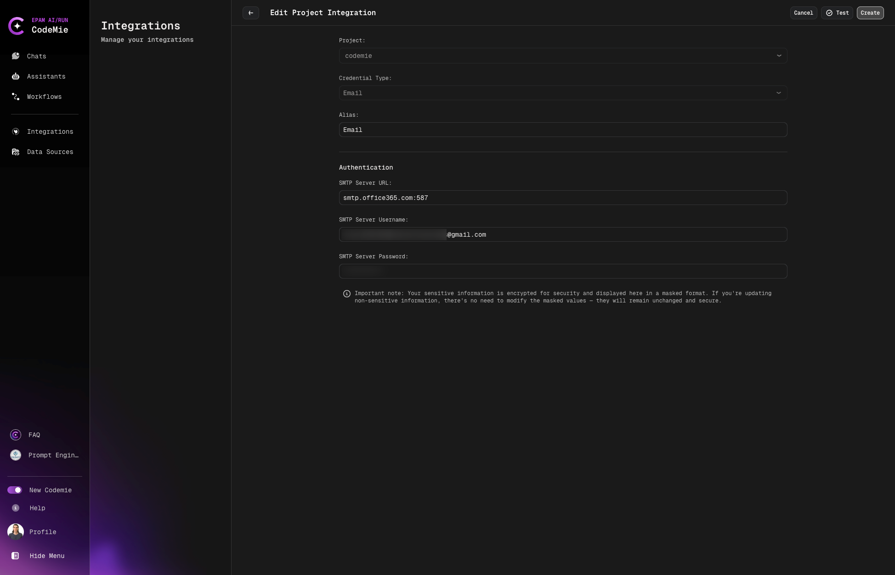
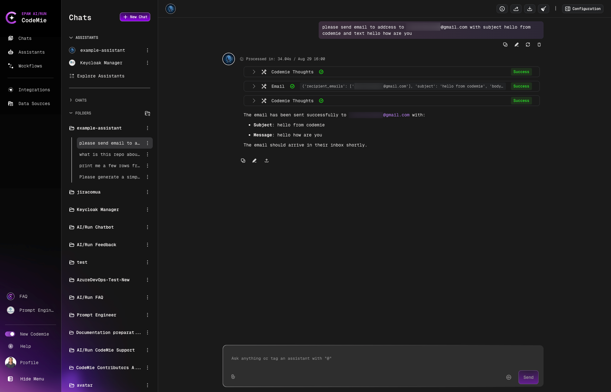

# Email Sender Tool

In AI/Run CodeMie, admins have extended functionality to send email.

## 1. Configure Email Integration

1.1. Fill in the integration details:

- **Project Name**: Specify project name.
- **Credential Type**: Email.
- **Alias**: Specify the integration name.
- **SMTP server Url**: in pattern url:port
- **SMTP Server Username**: account username
- **SMTP Server Password**: account password

(Optional) you can "Test Integration" connection before creating.

## 2. Enable Email Tool in Assistant

2.1. Open assistant or create a new one and choice in tool **Notification → Email**

## 3. Sending Emails

To send a message you need to provide the email address, subject and text of email.

## Important Notes

:::warning Multi-Factor Authentication Restriction
Email integration will not work for organization accounts that have Multi-Factor Authentication (MFA) enabled and prohibit the generation of App Tokens.
:::

### Supported Email Services

You can add any postal services such as Gmail or Outlook for integration. Please ensure you generate an App Token to enable this functionality. Below are the links to the documentation for generating App Tokens:

- [Generate an App Token for Gmail](https://support.google.com/accounts/answer/185833?hl=en)
- [Generate an App Token for Outlook](https://support.microsoft.com/en-us/account-billing/how-to-get-and-use-app-passwords-5896ed9b-4263-e681-128a-a6f2979a7944)

## Usage

### Basic Email

To send a basic email message, you need to provide:

- Email address (To field)
- Subject
- Text of email

### Using CC Field

When you need to include additional recipients without adding them to the primary recipient list, you can use the CC (Carbon Copy) field:

- **Email address (To field)**: Specify the primary recipient(s)
- **CC field**: Specify the secondary recipient(s) who should receive a copy
- **Subject**: Specify the subject of the email
- **Text**: Provide the content of the email

**Example:**

To send an email with CC recipients, include both the "To" and "CC" parameters in your request.

**Use Cases:**

- Keeping stakeholders informed without making them primary recipients
- Sending project updates to team members while CCing managers or other departments
- Ensuring multiple parties receive the same information simultaneously
