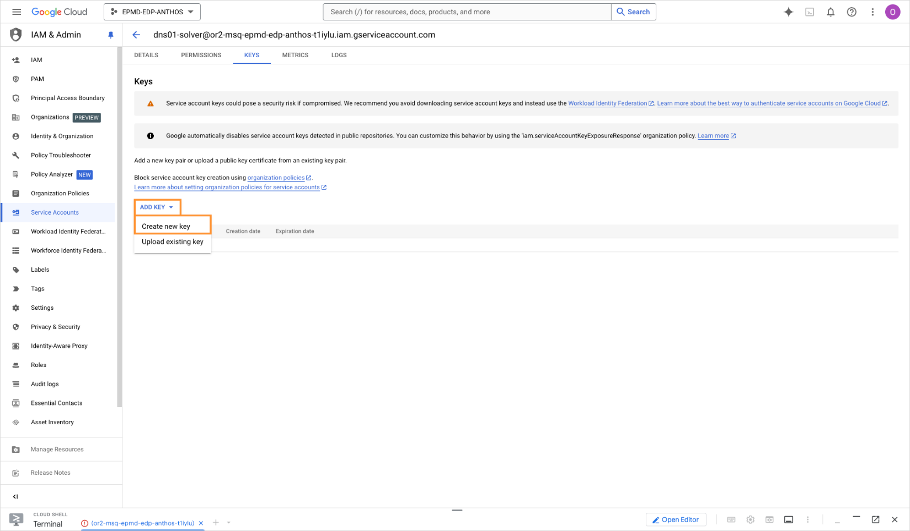
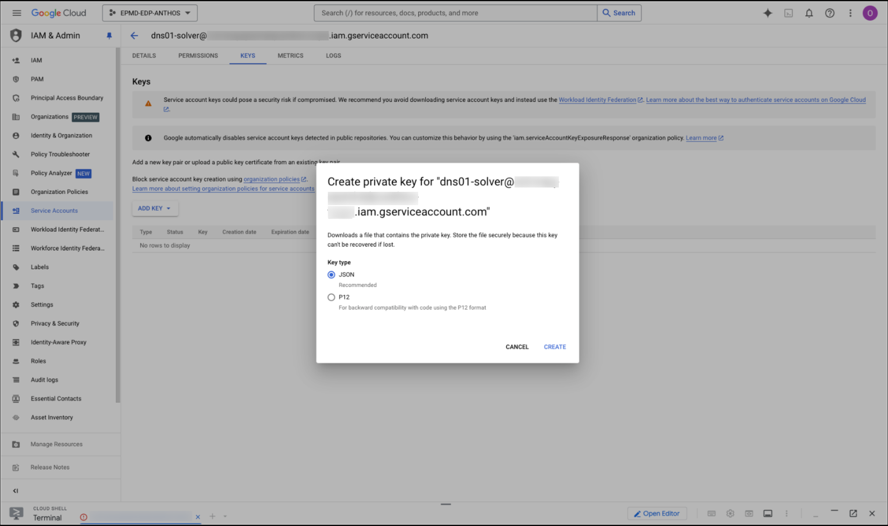

# GCP

AI/Run CodeMie can operate Google Cloud Platform (GCP) resources. Integration with GCP tools enables users to view and manage cloud resources. To integrate AI/Run CodeMie with the GCP cloud provider, follow the steps below:

## 1. Configure GCP Service Account

1.1. Log into your GCP account.

1.2. Select Project ID, if not selected yet.

1.3. In the Navigation menu, select **IAM → Service Accounts**. Create a service account or use an existing one with the permissions you want to delegate to AI/Run CodeMie. Refer to the [official documentation](https://cloud.google.com/iam/docs/service-accounts-create) for more details.

1.4. Navigate to a created/selected account. In the **Keys** tab, click **Add key → Create new key**:

1.5. On the **create private key** window, select the **JSON** format and click **Create**:

1.6. Download the .json file with the service account credentials and copy its data.

## 2. Configure Integration in AI/Run CodeMie

2.1. In the AI/Run CodeMie main menu, click the **Integrations** button.

2.2. Select **User** or **Project** and click the **+ Create** button.

2.3. Fill in the required fields and click **Create**:

- **Project Name**: Specify project name.
- **Credential Type**: GCP
- **Alias**: Specify the integration name.
- **Service Account Key in JSON format**: Paste the service account key you copied on the step 1.6.

## 3. Verify Integration

3.1. Verify **GCP** integration by asking assistant a relevant question:

