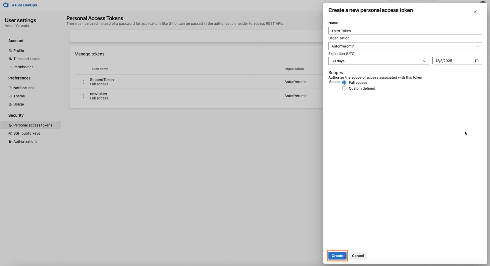

# Git AzureDevops

To integrate Version Control System Azure DevOps tool in CodeMie, follow the steps below:

## 1. Generate Access Token for Azure DevOps GIT

### 1.1 Navigate to Personal Access Tokens

- Log in to your Azure DevOps account
- Click on your **settings icon** in the top-right corner
- Click **Personal Access Tokens**

- In the right sidebar, navigate to **Security → Personal Access Tokens**

### 1.2 Create New Token

Click the **+ New Token** button. Fill in the token creation form:

- **Name**: Enter a descriptive name (e.g., "CodeMie Integration Token")
- **Organization**: Select your organization from the dropdown
- **Expiration (UTC)**: Set expiration date.
- **Scopes**: Select **Full access** for comprehensive integration
- Click the **Create** button

- **IMPORTANT**: Immediately copy the generated token from the success dialog

- Store the token securely - it will not be displayed again

## 2. Configure Integration in CodeMie

- In the CodeMie main menu, click the **integrations** button.
- Select Integration Type: **User** or **Project** and click **Create**.
- Select the Project Name.
- Select the Credential Type: **Git**.
- Fill in the **Alias** is a representation of the user setting.
- Fill in the **URL** field. For example: https://dev.azure.com.
- Fill in the **Token name** field.
- Fill in the **Token** field with the token created at step 1.
- Click **+ Create**.

## 3. Create Assistant

- Click **Explore Assistant**, select **Templates** and choose for example [Template] Coder.
- Select your Project and type Name and Datasource Context.
- In the **Available tools** section, select **Git** integration and choose your credentials from the dropdown list.
- Click **Create**.

## 4. Use Your Assistant

Click **Explore Assistant**, select **My Assistant** and choose by **Name** your assistant.

:::note
Tokens have an expiration date.
:::
