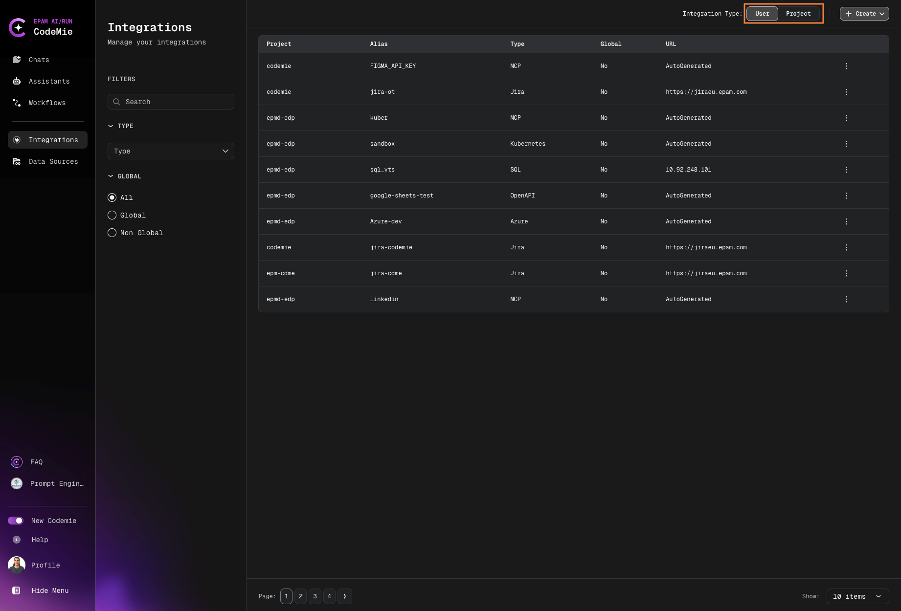

import Tabs from '@theme/Tabs';
import TabItem from '@theme/TabItem';

# GitHub/GitLab/Bitbucket

AI/Run CodeMie assistants can work with Git repositories. Apart from integrating the Git tool for such purposes, assistants must also know what repository to deal with. To connect assistant with the repository, it is required to provide the repository link or upload the codebase and specify the target branch to work with.

Integrating Version Control Systems allows assistants to navigate to the code repositories and perform various actions on your behalf, whether it is simple code analysis or creating pull requests with code that solves the problem indicated in a JIRA task. It is worth mentioning that this integration is required when adding a code repository.

To integrate Version Control System tool in AI/Run CodeMie, follow the steps below:

## 1. Generate Access Token

Generate access token for your Git platform account with the following rights:

<Tabs>
<TabItem value="github" label="GitHub" default>

- `repo`
- `repo:status`
- `repo_deployment`
- `public_repo`
- `repo:invite`
- `security_events`
- `project`
- `read:project`

</TabItem>
<TabItem value="gitlab" label="GitLab">

- `api`
- `read_api`
- `read_repository`
- `write_repository`

</TabItem>
<TabItem value="bitbucket" label="Bitbucket">

- `repository:read`
- `repository:write`
- `repo:status`
- `project:read`
- `project:write`
- `api:read`

</TabItem>
</Tabs>

:::note
Saving the token value in your secure notes place is preferable. GitHub/GitLab shows you the token value just once after generating.
:::

## 2. Configure Integration in CodeMie

- In the AI/Run CodeMie main menu, click the **Integrations** button

- Select **User Integration** or **Project Integration** (only for applications-admin, for that create request in support) and click **+ Create**

- Select the tool, specify the credentials and click **Create**

:::note
Specify this token's correct project and URL (URL ex: `https://github.com`). The project name for setting must be the same as for the indexed repository.
:::

That's it. Now you can add code repositories to your AI/Run CodeMie account.
