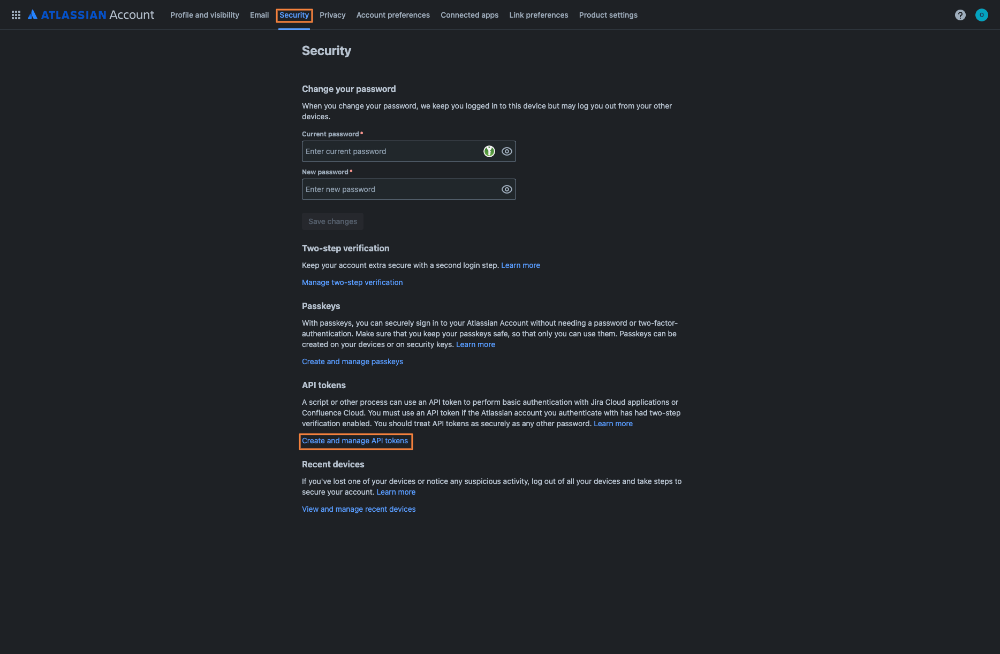
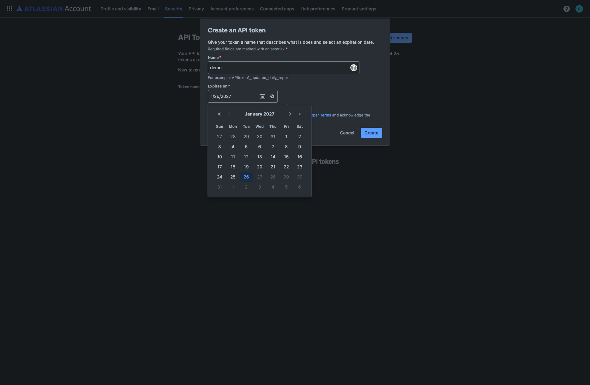
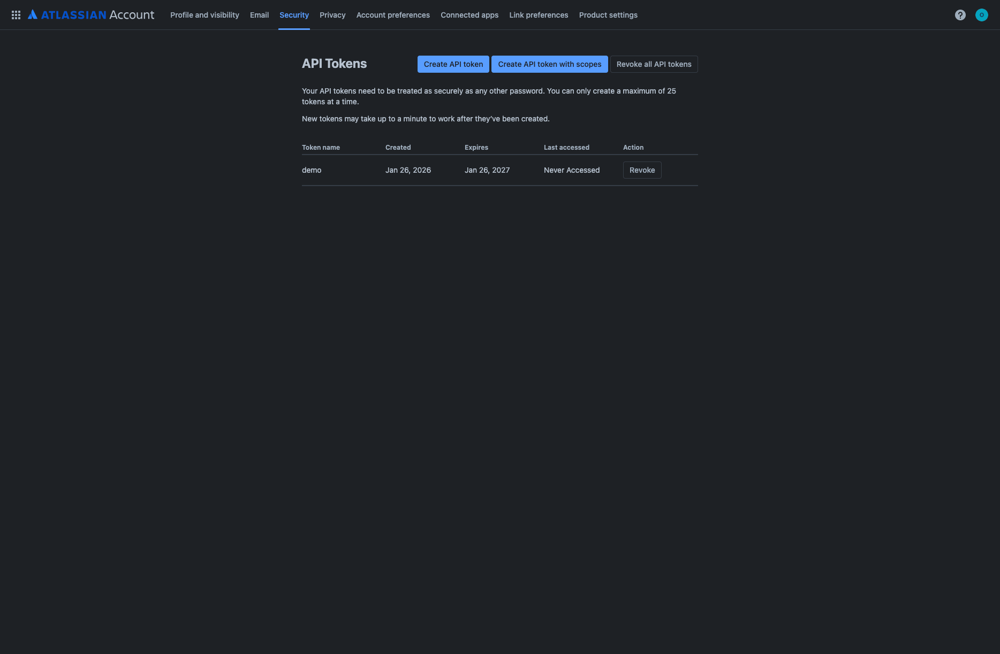
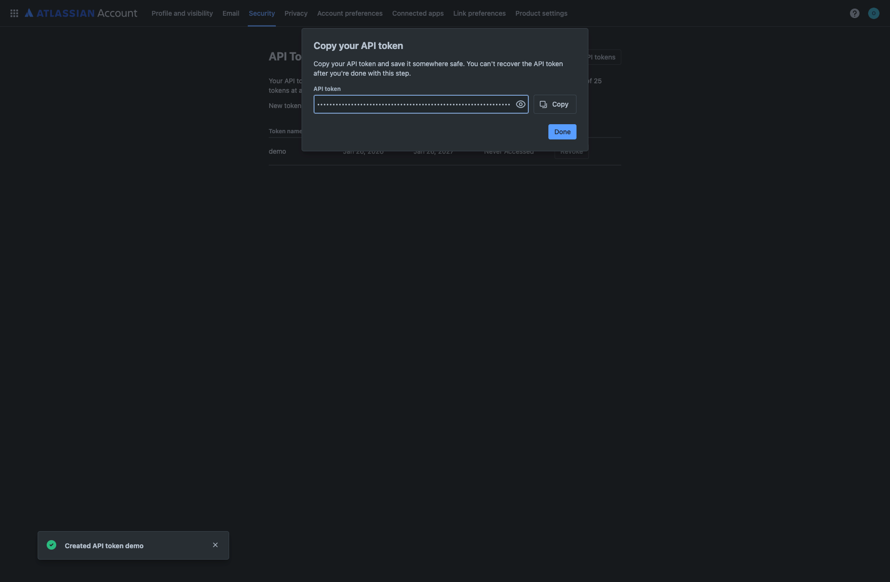
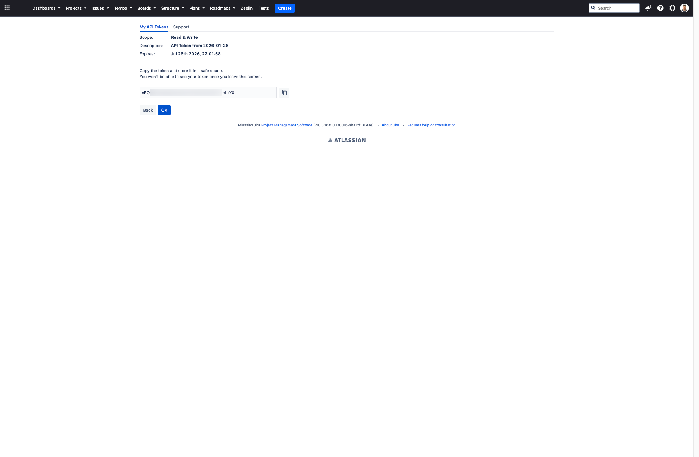
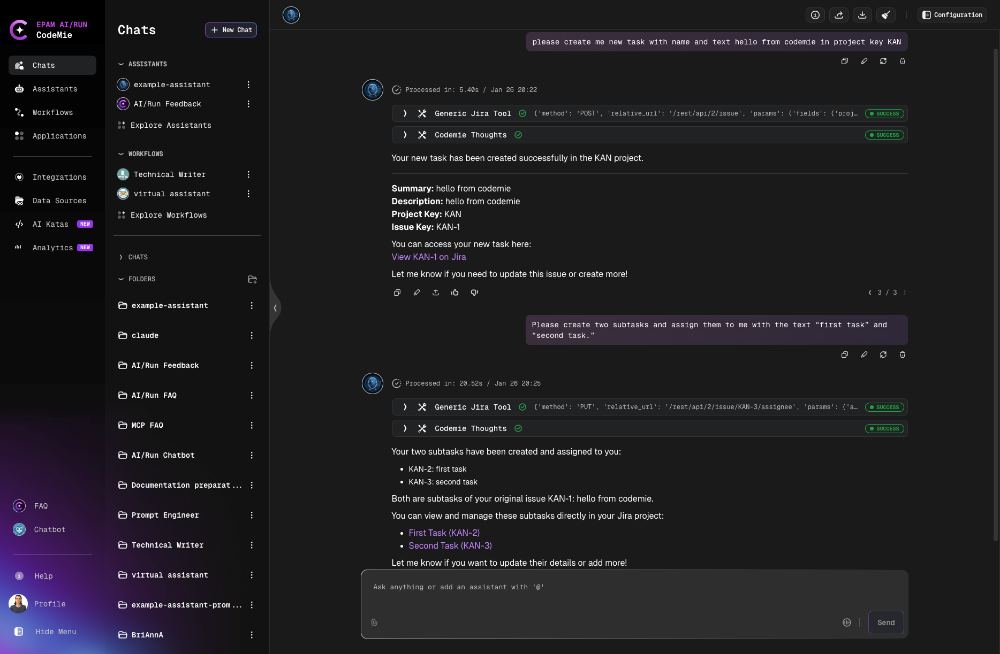

import Tabs from '@theme/Tabs';
import TabItem from '@theme/TabItem';

# Jira

AI/Run CodeMie integrates with Atlassian Jira to enable automated issue tracking, project management, and task organization within your development workflow.

## 1. Create Atlassian API Token

<Tabs groupId="jira-version">
  <TabItem value="cloud" label="Jira Cloud" default>

1.1. Go to your Atlassian Account settings and navigate to the **Security** tab.

1.2. Scroll down to the **API tokens** section and click **Create and manage API tokens**:

1.3. Click **Create API token** button and provide a name for your token. Set an expiration date for security:

1.4. Click **Create**. The system will display your newly created API token:

1.5. Copy the generated API token using the **Copy** button and store it securely:

:::warning
API tokens should be treated as passwords. Keep them secure and never share them publicly.
:::

  </TabItem>
  <TabItem value="old-ui" label="Jira Old UI">

1.1. Log in to your Jira instance and click on your profile icon in the top-right corner. Select **API Token Authentication** from the menu:

1.2. On the **My API Tokens** page, click the **New API Token** button:

1.3. Fill in the token details:

- **API Token Description**: Enter a descriptive name for your token (e.g., "API Token from 2026-01-26")
- **API Token Expiration**: Select expiration period (e.g., "6 months")
- **Token Scope**: Choose **Read & Write** for full access
- Configure **IP Restrictions** and **Header/Value Access Restrictions** if needed

Then click **Create API Token**:

1.4. Copy the generated API token from the screen. The token will be displayed in two fields (e.g., "nEO" and "mLyv0"). Copy both parts and store them securely:

:::warning
API tokens should be treated as passwords. Keep them secure and never share them publicly. You won't be able to see your token once you leave this screen.
:::

  </TabItem>
</Tabs>

## 2. Configure Integration in CodeMie

2.1. In the CodeMie main menu, click the **Integrations** button.

2.2. Select **User** or **Project** integration type and click **+ Create** button.

2.3. In the new integration settings, fill in the following parameters:

- **Project Name**: Select the name of your project.
- **Global Integration**: Toggle on if you want to use this integration across multiple projects.
- **Credential Type**: Select **Jira** from the dropdown.
- **Alias**: Alias is a representation of the integration (e.g., `jira-example`).
- **URL**: Your Jira instance URL:
  - For Jira Cloud: `https://<your-domain>.atlassian.net`
  - For Jira Old UI: `https://<your-jira-server-url>`
- **Is Jira Cloud**:
  - ✅ **Check this box** if you're using **Jira Cloud**
  - ❌ **Leave unchecked** if you're using **Jira Old UI** (self-hosted Jira)
- **Username/email for Jira**: Your Atlassian account email (e.g., `user@example.com`).
- **Token**: Paste the API token created in step 1.

2.4. (Optional) Click **Test** button to verify the connection. You should see "Integration test successful" notification.

2.5. Click **Save** to create the integration.

:::tip
You can create both User-level and Project-level integrations. User-level integrations are available across all your projects, while Project-level integrations are specific to a single project.
:::

## 3. Create Assistant with Jira Tool

3.1. Click **Explore Assistant**, then click **Create Assistant** and fill in the following parameters:

- **Project Name**: Select the name of your project.
- **Name**: Specify the assistant name (e.g., "Jira Task Manager").
- **Description**: Specify description (e.g., "Assistant for managing Jira tasks and issues").
- **System Instructions**: Specify system instructions for how the assistant should work with Jira.
- **Available tools**: Expand **Project Management** section, check **Generic Jira**, and select your Jira integration alias from the dropdown list.

3.2. Click **Create** or **Save** to finalize your assistant.

## 4. Use Your Assistant

4.1. Click **Explore Assistant**, select **My Assistant** and choose your Jira assistant by name.

4.2. You can now interact with your Jira instance through natural language:

- Create new issues and tasks
- Create subtasks and assign them
- Search and filter issues
- Update issue status and assignees
- Add comments to issues
- Link related issues
- View project boards and backlogs

Example: You can ask the assistant to create tasks with natural language commands like "create me new task with name and text hello from codemie in project key KAN":

The assistant will create the tasks in Jira and provide you with links to view them directly in your Jira workspace.

## Use Cases

### Project Management

Use the Jira integration to:

- Automatically create tasks from conversation context
- Track progress on development work
- Link code changes to Jira issues
- Update sprint planning and backlog

### Issue Tracking

Streamline issue management by:

- Quickly searching for existing issues
- Creating detailed bug reports
- Assigning tasks to team members
- Monitoring issue resolution progress

### Workflow Automation

Integrate Jira with CodeMie workflows to:

- Automatically transition issues based on events
- Generate reports from Jira data
- Synchronize status across tools
- Trigger notifications on issue updates

## Best Practices

- Use descriptive issue titles and descriptions for better AI understanding
- Configure appropriate permissions for the API token
- Regularly review and update integration credentials
- Leverage JQL (Jira Query Language) for advanced filtering
- Set up project-specific integrations for better access control
