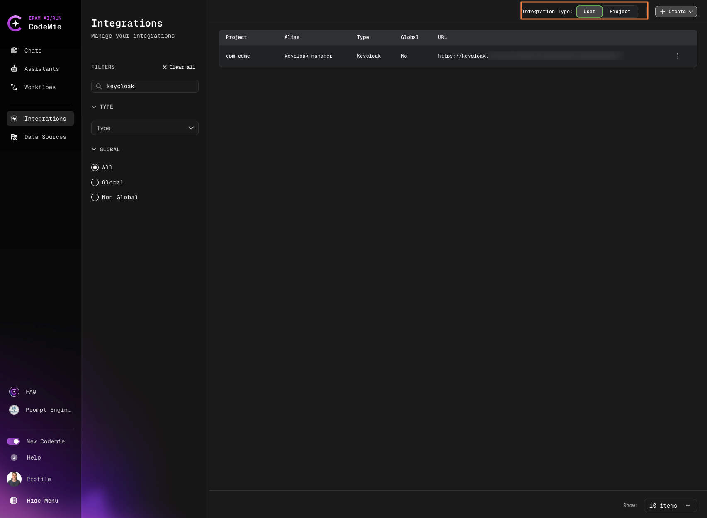

# Keycloak

To integrate Keycloak with AI/Run CodeMie, follow the steps below:

## 1. Configure Keycloak

1.1. In Keycloak select the realm which you want to manage.

1.2. Create a client or use an existing one (e.g., admin-cli).

1.3. Select the **Integrations** tab.

1.4. On the **Integrations** tab, navigate to the **Capability config** section and set the following parameters:

1.5. Select the **Service accounts roles** tab and click **assign role**, select role (e.g., admin) and click **Assign**.

1.6. Select the **Credentials** tab and copy the **Client secret**.

## 2. Configure Integration in AI/Run CodeMie

2.1. In the AI/Run CodeMie main menu, click the **Integrations** button.

2.2. Select **User** or **Project** (this functionality is available for Administrators and application admins only) and click the **+ Create** button.

2.3. In the new user setting menu, fill in the following parameters:

- **Project Name**: Select the name of your project.
- **Credential Type**: Keycloak.
- **Alias**: Alias is a representation of the user setting (e.g., Keycloak).
- **Keycloak Base URL**: Fill in the URL field (e.g., https://keycloak.example.com/auth).
- **Keycloak Realm**: Fill in the Realm from step 1.
- **Keycloak Client ID**: Fill in the Client ID from step 1.2.
- **Keycloak Client Secret**: Fill in the Token field with the token created from step 1.6.

2.4. Click **Create/Update**.

## 3. Create Assistant with Keycloak Tool

3.1. Click **Explore Assistant**, Click **Create Assistant** and fill in the following parameters:

- **Project Name**: Select the name of your project.
- **Name**: Specify the assistant name.
- **Description**: Specify description.
- **System Instructions**: Specify system instructions.
- **Available tools**: Access Management, Keycloak and select from drop down menu alias of credentials from step 2.3.

3.2. Click **Create/Save**.

## 4. Use Your Assistant

4.1. Click **Explore Assistant**, select **My Assistants** and choose by **Name** your assistant. Enjoy!

