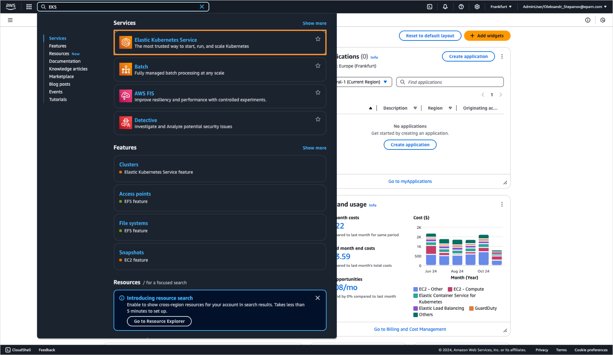
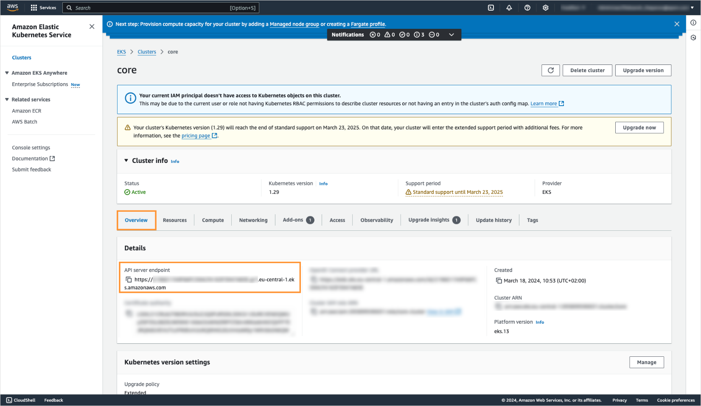
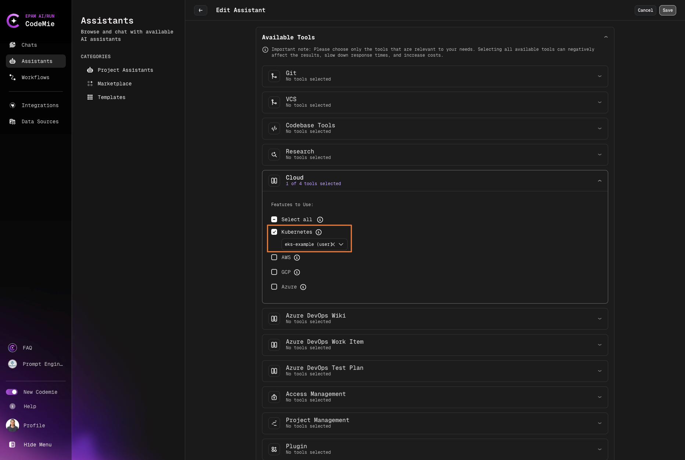
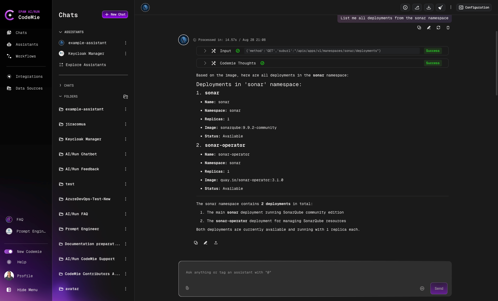

# Kubernetes

AI/Run CodeMie can assist you with managing Kubernetes clusters. Generally, you need an API server endpoint and bearer-token to integrate AI/Run CodeMie with your cluster. In our example, we will be using Amazon Web Services.

To integrate Kubernetes cluster with AI/Run CodeMie, follow the steps below:

## 1. Get API Server Endpoint from AWS EKS

1.1. In AWS cloud, in the search bar, enter **EKS** and click it.

1.2. On the EKS page, select **Clusters**:



1.3. On the EKS page, click the **Clusters** button:


1.4. Select one of your clusters you want to integrate. Navigate to **Overview → Details** and copy **API server endpoint** (https://xxxxxxxxxxxxxxxxxxxxxxxxxxxx..xxxxxxxxxx.eks.amazonaws.com):



## 2. Create Bearer Token in Kubernetes

2.1. In Kubernetes cluster use commands below from your terminal to create **bearerToken**.

2.2. Create **codemie** service account:

```bash
cat <<EOF | kubectl apply -n kube-system -f -
apiVersion: v1
kind: ServiceAccount
metadata:
  name: codemie
  namespace: kube-system
EOF
```

2.3. Create ClusterRoleBinding to grant your **codemie** user with the cluster-admin role:

```bash
cat <<EOF | kubectl apply -n kube-system -f -
apiVersion: rbac.authorization.k8s.io/v1
kind: ClusterRoleBinding
metadata:
  name: codemie-crb
subjects:
  - kind: ServiceAccount
    name: codemie
    namespace: kube-system
roleRef:
  apiGroup: rbac.authorization.k8s.io
  kind: ClusterRole
  name: cluster-admin
EOF
```

2.4. Create a secret that will store the **codemie** bearer token:

```bash
cat <<EOF | kubectl apply -n kube-system -f -
apiVersion: v1
kind: Secret
metadata:
  name: codemie-token
  namespace: kube-system
  annotations:
    kubernetes.io/service-account.name: codemie
type: kubernetes.io/service-account-token
EOF
```

2.5. Run the command below to generate a bearer token for **codemie** user:

```bash
kubectl get -n kube-system secret/codemie-token -o jsonpath='{.data.token}' | base64 --decode
```

2.6. Copy the created **bearerToken**.

## 3. Configure Integration in AI/Run CodeMie

3.1. In the AI/Run CodeMie main menu, click the **Integrations** button.

3.2. Select **User** or **Project** and click the **Create**.

3.3. Fill in the required fields and click **Create**:

- **Project Name**: Specify project name.
- **Credential Type**: Kubernetes.
- **Alias**: Specify the integration name.
- **Region**: Specify the AWS Region to work in.
- **Kubernetes URL**: Paste the **API server endpoint** data copied from step 1.4.
- **Kubernetes bearer token**: Paste the **codemie-token** data copied from step 2.6.


(Optional) you can "Test Integration" connection before creating.

## 4. Enable Kubernetes Tool in Assistant

4.1. Modify your assistant by enabling AWS integration or create a new assistant with this tool:



## 5. Verify Integration

5.1. Verify K8S integration by asking assistant a relevant question:


