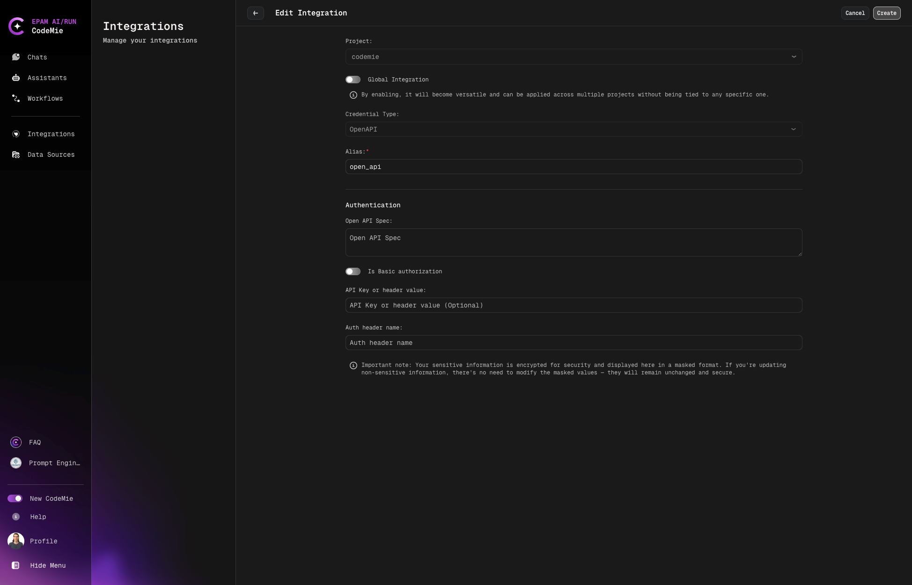
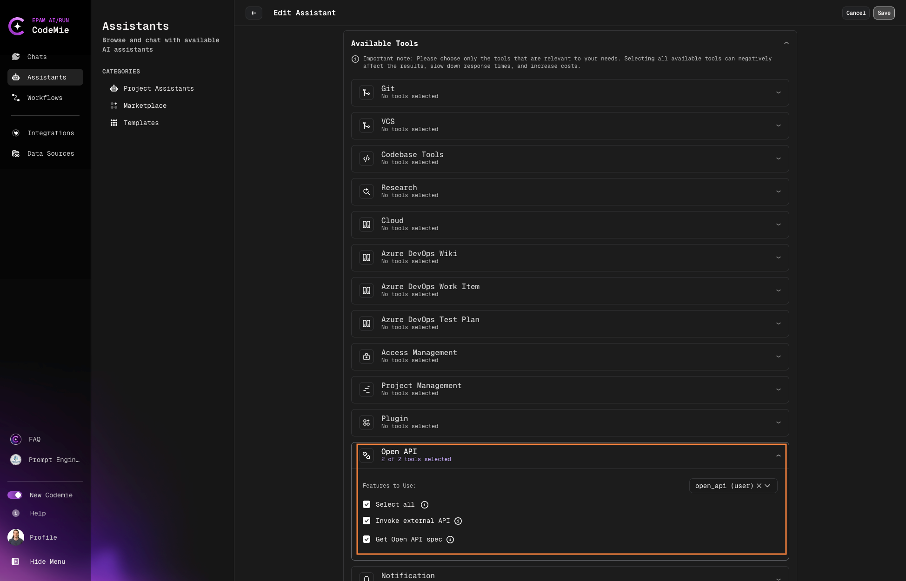

# OpenAPI Tool

In AI/Run CodeMie, admins have extended functionality to send requests by OpenAPI.

## 1. Create OpenAPI Integration

1.1. Click on **Integrations** and select the project name.

1.2. Fill in the integration details:

- **Credential type**: Choose **OpenAPI** from the drop-down list.
- **Alias**: Enter the name of the integration.
- **OpenAPI Spec**: (optional)
- **Radio button**: If a username and password are required, you can provide them here.
- **API Key**: Select this option if authorization via API key is needed.

## 2. Enable OpenAPI Tool in Assistant

2.1. Open assistant or create a new one and choice in tool **Open API → Invoke external API, Get Open API spec**

## 3. Usage Example

Example of request and answer:

