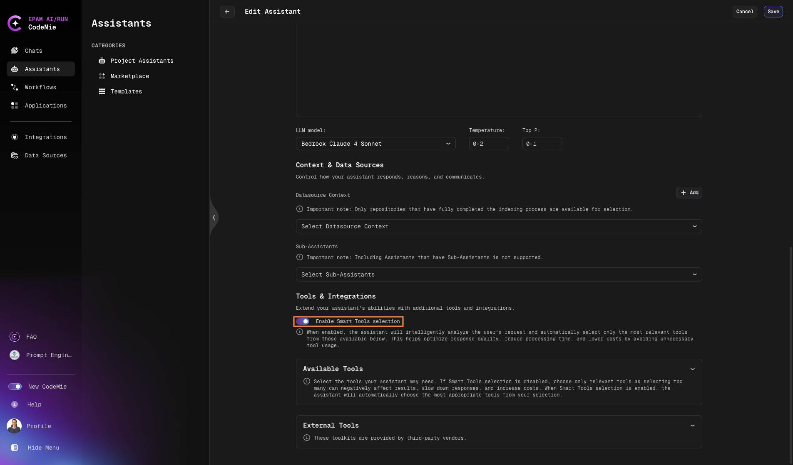

# Assistant's Tools Overview

Assistant's tools are powerful enhancements that bring completely new capabilities to AI/Run CodeMie. This page provides a comprehensive overview of all available tools.

---

## Available Tools

| Tool                                                                      | Description                                                                                                       |
| ------------------------------------------------------------------------- | ----------------------------------------------------------------------------------------------------------------- |
| **[Keycloak](./keycloak)**                                                | Access management and authentication tool that allows users to leverage AI/Run CodeMie for project access control |
| **[SonarQube](./sonarqube)**                                              | Code quality analysis and static code review tool for comprehensive codebase analysis                             |
| **[SQL](./sql)**                                                          | Database operations tool for querying and managing SQL databases                                                  |
| **[Telegram](./telegram)**                                                | Send notifications to Telegram channels and bots                                                                  |
| **[Azure](./azure)**                                                      | Microsoft Azure cloud platform integration for cloud resource management                                          |
| **[GCP](./gcp)**                                                          | Google Cloud Platform integration for GCP resource operations                                                     |
| **[AWS](./aws)**                                                          | Amazon Web Services integration for AWS cloud operations                                                          |
| **[Kubernetes](./kubernetes)**                                            | Kubernetes cluster management tool for container orchestration                                                    |
| **[Webhook](./webhook)**                                                  | HTTP webhook integrations for event-driven automatization                                                         |
| **[Elasticsearch](./elastic)**                                            | Search and data analysis platform for analytical queries and data access                                          |
| **[Codebase Tools](./codebase-tools)**                                    | Comprehensive code analysis and management with repo browsing, code search, and file operations                   |
| **[Email Sender](./email-sender-tool)**                                   | Send email notifications from assistants                                                                          |
| **[OpenAPI](./openapi-tool)**                                             | Integrate with any third-party tools supporting the OpenAPI standard                                              |
| **[Quality Assurance](./quality-assurance-with-jira-zephyr-scale-addon)** | Test management with Zephyr Scale (formerly TM4J) and Zephyr Squad for Jira environments                          |
| **[ServiceNow](./servicenow)**                                            | ITSM operations including incident management, change requests, and CMDB operations                               |
| **[Scheduler](./scheduler)**                                              | Task scheduling and automation (Admin role only)                                                                  |
| **[Plugin](./plugin)**                                                    | Custom plugin integrations for extending assistant capabilities (e.g., file system)                               |
| **[Git AzureDevOps](./git-azuredevops)**                                  | Azure DevOps integration for Wiki, Work Items, and Test Plans management                                          |
| **[Adding MCP Server](./adding-an-mcp-server)**                           | Add and configure Model Context Protocol (MCP) servers                                                            |
| **[Using MCP Tools](./using-mcp-tools-in-assistants)**                    | Use MCP tools in assistants for extended capabilities                                                             |

---

## Smart Tool Selection

**Smart Tool Selection** is an intelligent feature that automatically selects relevant tools for your assistant based on semantic similarity, configured credentials, and permissions.

### How to Enable

1. Navigate to your assistant's **Create** or **Edit** page
2. Locate the **Smart Tool Selection** toggle
3. Enable or disable based on your needs

### Behavior

#### When No Tools Are Pre-selected

The system performs semantic analysis across all registered tools and automatically selects based on:

- **Semantic relevance** to your assistant's purpose and conversations
- **Available credentials** and proper authentication
- **User permissions** and access rights

#### When Tools Are Already Selected

- Smart selection is **limited to your pre-selected tools only**
- Prevents context overload by maintaining a focused tool set
- Provides intelligent selection within your curated tool collection

### Important Considerations

:::warning Workflow Operations

- Workflows always use the legacy/traditional approach
- The Smart Tool Selection toggle **does not affect workflow behavior**
- This ensures workflow consistency and predictable execution
  :::

:::info Context Management
Smart selection prevents LLM context overload and maintains optimal performance by limiting tool scope.
:::

### When to Use Smart Tool Selection

**Enable Smart Tool Selection when:**

- You want automatic, intelligent tool discovery
- Your assistant needs dynamic tool access based on conversation context
- You prefer minimal manual tool configuration

**Keep it Disabled when:**

- You need precise control over tool availability
- You're working with sensitive tools requiring explicit selection
- You prefer the traditional manual approach

---

## Tool Integration Requirements

The table below shows which tools require integration setup and the integration name to use:

| Tool Name                                             | Integration Required | Integration Name | Requires Project Admin |
| ----------------------------------------------------- | :------------------: | :--------------: | :--------------------: |
| **Project Management => Jira**                        |        ✅ Yes        |       Jira       |         ❌ No          |
| **Git**                                               |        ✅ Yes        |       Git        |         ❌ No          |
| **VCS => GitHub / GitLab / AzureDevOps**              |        ✅ Yes        |       Git        |         ❌ No          |
| **Project Management => Confluence**                  |        ✅ Yes        |    Confluence    |         ❌ No          |
| **Cloud => Kubernetes**                               |        ✅ Yes        |    Kubernetes    |         ❌ No          |
| **Cloud => AWS**                                      |        ✅ Yes        |       AWS        |         ❌ No          |
| **Cloud => GCP**                                      |        ✅ Yes        |       GCP        |         ❌ No          |
| **Cloud => Azure**                                    |        ✅ Yes        |      Azure       |         ❌ No          |
| **Access Management => Keycloak**                     |        ✅ Yes        |     Keycloak     |         ❌ No          |
| **Cloud => AzureDevOps**                              |        ✅ Yes        |   AzureDevOps    |         ❌ No          |
| **Azure DevOps Wiki**                                 |        ✅ Yes        |   AzureDevOps    |         ❌ No          |
| **Azure DevOps Work Item**                            |        ✅ Yes        |   AzureDevOps    |         ❌ No          |
| **Azure DevOps Test Plan**                            |        ✅ Yes        |   AzureDevOps    |         ❌ No          |
| **Data Management => Elasticsearch**                  |        ✅ Yes        |     Elastic      |         ❌ No          |
| **OpenAPI**                                           |        ✅ Yes        |     OpenAPI      |         ❌ No          |
| **Plugin**                                            |        ✅ Yes        |      Plugin      |         ❌ No          |
| **FileSystem => Code Interpreter**                    |        ✅ Yes        |    FileSystem    |         ❌ No          |
| **FileSystem => Generate Image**                      |        ❌ No         |       ---        |         ❌ No          |
| **Notification => Email**                             |        ✅ Yes        |      Email       |         ❌ No          |
| **Codebase Tools => Sonar**                           |        ✅ Yes        |      Sonar       |         ❌ No          |
| **Codebase Tools => Get Repo Tree** (Experimental)    |        ❌ No         |      --- \*      |         ❌ No          |
| **Codebase Tools => Search Code** (Experimental)      |        ❌ No         |      --- \*      |         ❌ No          |
| **Codebase Tools => Read Files Content**              |        ❌ No         |      --- \*      |         ❌ No          |
| **Codebase Tools => Read Files Content with Summary** |        ❌ No         |      --- \*      |         ❌ No          |
| **Data Management => SQL**                            |        ✅ Yes        |       SQL        |         ❌ No          |
| **Notification => Telegram**                          |        ✅ Yes        |     Telegram     |         ❌ No          |
| **Webhook**                                           |        ✅ Yes        |     Webhook      |         ✅ Yes         |
| **Quality Assurance => ZephyrCloud**                  |        ✅ Yes        |   ZephyrCloud    |         ❌ No          |
| **Quality Assurance => ZephyrSquad**                  |        ✅ Yes        |   ZephyrSquad    |         ❌ No          |
| **Research => Google Search**                         |        ❌ No         |       ---        |         ❌ No          |
| **Research => Google Places**                         |        ❌ No         |       ---        |         ❌ No          |
| **Research => Wikipedia**                             |        ❌ No         |       ---        |         ❌ No          |
| **Research => Tavily Search**                         |        ❌ No         |       ---        |         ❌ No          |
| **Research => Web Scraper**                           |        ❌ No         |       ---        |         ❌ No          |
| **Scheduler**                                         |        ✅ Yes        |    Scheduler     |         ✅ Yes         |

:::note \* For these Codebase tools, Git data source should be added as additional context.
:::

:::info Git vs VCS
**By choosing Git tool only:** The operations listed above are available. Git data source must be added as additional context.

**By choosing VCS tool:** All operations are available without needing additional Git data source context.
:::

---

## MCP (Model Context Protocol)

AI/Run CodeMie supports MCP servers for extending assistant capabilities.

| Topic                                                                | Description                                       |
| -------------------------------------------------------------------- | ------------------------------------------------- |
| **[Adding an MCP Server](./adding-an-mcp-server)**                   | Learn how to add and configure MCP servers        |
| **[Using MCP Tools in Assistants](./using-mcp-tools-in-assistants)** | Learn how to use MCP tools within your assistants |

---

## Need Help?

For detailed instructions on configuring specific tools, click on the tool name links in the tables above to view the dedicated guide for each tool.
