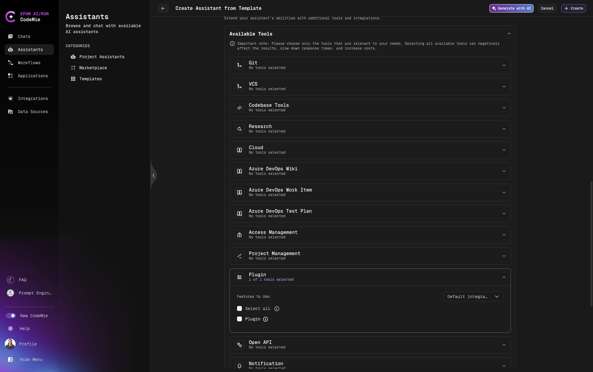
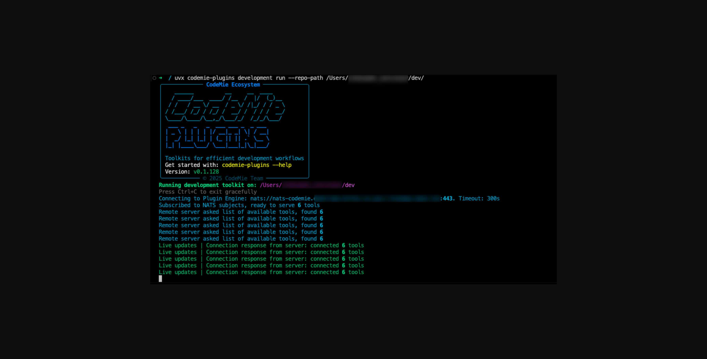

# Plugin

## Overview

This guide provides step-by-step instructions for setting up and configuring CodeMie Plugins to enhance your AI Assistant capabilities with external tools.

To start using Plugins, you'll need to:

- Install AI/Run CodeMie Plugins Client (codemie-plugin CLI)
- Configure a Plugin Integration in AI/Run CodeMie
- Create an AI Assistant with the Plugin Tool enabled

:::warning Important
Before using the created AI Assistant, run codemie-plugin CLI in your remote environment. This step is required each time you want to interact with the AI Assistant!
:::

## System Requirements

To enable the Plugin Engine in your remote runtime environment, two key components are required: Python and Node.js.

### Required Software Versions

| Software    | Minimum Version | Purpose                       |
| ----------- | --------------- | ----------------------------- |
| **Python**  | 3.12 or higher  | Core runtime environment      |
| **Node.js** | v22 or higher   | Supporting runtime components |

**Python**: Many configurations, command-line tools, and development toolkits in AI/Run CodeMie rely on Python-based scripts.

**Node.js**: Supports crucial systems within the Plugin Engine, particularly for server-side workflows and MCP server functionality.

Python and Node.js work together to power the full functionality of the Plugin Engine, enabling advanced features such as code analysis, repository management, and seamless integration with toolkits.

### Download Links

If your current versions don't meet these requirements, update to the specified versions:

- Download Python: https://python.org/downloads
- Download Node.js: https://nodejs.org/en/download

:::note
Please ensure you are connected via EPAM VPN (GlobalProtect version 6.3 or later)
:::

## Installation Steps

### Step 1: Install uv - Python Package Installer

To prepare your remote environment for running codemie-plugin CLI, install the Python package installer:

**macOS and Linux**:

Option 1 - Install via script:

```bash
curl -LsSf https://astral.sh/uv/install.sh | sh
```

Option 2 - Install via Homebrew:

```bash
brew install uv
```

**Windows**:

```powershell
powershell -ExecutionPolicy ByPass -c "irm https://astral.sh/uv/install.ps1 | iex"
```

### Step 2: Install codemie-plugins

```bash
uvx pip install codemie-plugins
```

This command installs the codemie-plugins package in an isolated Python environment using the uvx tool. This step allows you to:

- Configure your plugin with a plugin key
- Run development toolkits to manage repositories and analyze code
- List and operate MCP for custom tasks like file interactions or specific workflows

### Step 3: Generate Your Plugin Key

Run the following command in your local environment:

```bash
uvx codemie-plugins config generate-key
```

The Plugin Key helps identify your environment and validate that you have the necessary permissions to use AI/Run CodeMie plugins. Without the key, the plugins cannot communicate with AI/Run CodeMie's services or execute certain commands.

:::warning Important
Copy and save the Plugin Key that is generated, as you will need it during the integration process in AI/Run CodeMie.
:::

## Creating Plugin Integration

### Step 1: Access Integrations

Log in to the AI/Run CodeMie platform and navigate to the Integrations section and Click **+Create**:


### Step 2: Configure Plugin Integration

From the dropdown menu, choose Plugin as the type of integration and fill in the following details:


- **Integration Alias**: Give your Plugin connection a unique name
- **Plugin Key**: Paste the Plugin Key that was generated in your local environment (Step 3: Generate Your Plugin Key)

:::note
If you create a project integration (not a user integration), make sure to select the correct project where this integration will be active.
:::

## Creating AI Assistant with Plugin Tool

### Step 1: Select Template

Open AI/Run CodeMie platform and navigate to **Assistants** → **Templates**:


- Choose the **Local Developer via Plugin Engine** template
- Click **+Create Assistant**

### Step 2: Configure the Assistant

**Basic Configuration**:

- Select the same project you used when creating the Plugin integration in AI/Run CodeMie
- Assign a unique name to your Assistant (a unique and URL-friendly identifier under Slug is generated automatically)
- Keep the other instructions as-is (no need to specify data sources)


**Plugin Tool Setup**:

- Verify that the Plugin tool is enabled for the Assistant
- Choose the correct integration from the drop-down menu
- Add additional built-in tools if necessary (e.g., select a Jira integration tool for task tracking)



**Customization (Optional)**:

This template includes generic instructions and predefined tools for Plugins. However, you can customize it by specifying relevant project details, such as:

- Programming language (e.g., Python, JavaScript)
- Development stack (e.g., FastAPI, Flask)
- Any other specific details about your project

## Running AI/Run Development Plugin

To allow your AI Assistant to use pre-built external tools, run the AI/Run Development Plugin:

```bash
uvx codemie-plugins development run --repo-path /path/to/repo
```

:::warning Important
Be sure to replace /path/to/repo with the actual location of your repository.
:::



**Available Pre-built Tools**:

This enables the execution of the following external tools:

- **\_read_file_from_file_system**: Reads the contents of a file from the file system
- **\_list_files_in_directory**: Lists files and folders within a specified directory
- **write_file_to_file_system**: Writes content to a file to the file system
- **\_run_command_line_tool**: Executes shell commands that are permitted
- **parallel**: A wrapper to use multiple tools simultaneously, provided they can operate in parallel

**Verifying Connection**:

**Check NATS.io URI**:

Bidirectional communication between the remote runtime environment and The Plugin Engine is handled through the NATS.io messaging system. You should see the following URI:

```
nats://nats-codemie.epmd-edp-anthos.eu.gcp.cloudapp.epam.com:443
```

If the displayed URI is different, update it using:

```bash
codemie-plugins config set PLUGIN_ENGINE_URI nats://nats-codemie.epmd-edp-anthos.eu.gcp.cloudapp.epam.com:443
```

**Confirm Successful Registration**:

After running the command, confirm that you see output indicating successful tool registration. This indicates that the Plugin Engine is running successfully.

**Test Plugin Connection**:

Start chatting with your Assistant:

```
Ask: "What tools do you have?"
```


Verify that the plugin tools are available.

:::danger Critical
Your AI Assistant will only be able to execute the external tools when codemie-plugins CLI is actively running in the command line. You must keep the CLI session open and ensure that you see live updates (e.g., health checks or status indicators) to confirm that the Plugin Engine is operational.
:::

## Usage Example: Sarah's Container Monitoring

**Scenario**: Sarah, a DevOps engineer, struggles with managing multiple containerized applications on her laptop during development and testing. She wants an AI Assistant that will generate health reports including system performance, container uptime, resource trends, and potential issues.

**Process**:

**Run the Development Plugin**: Sarah starts by running the AI/Run Development Plugin via command line. After a successful run, the connection response confirms that 5 tools are available for use.

**Interact with AI Assistant**: Sarah moves to the chat interface and requests the Assistant to perform the task. The AI Assistant processes the request and uses the Run Command Line Tool to execute specified commands and retrieve necessary data.

**Monitor Execution**: Sarah can see logs directly in the command line to verify the tool's execution.

**Get Results**: The Assistant organizes the data and generates a structured health report summarizing system performance, container uptime, resource trends, and any detected issues.

## Troubleshooting Guide

### Problem 1: Authorization Violation

**Error Message**: `nats.errors.Error: nats: 'Authorization Violation'`

**Cause**: Your plugin's security key is either missing or doesn't match the system's records.

**Solution**:

- Ensure PLUGIN_KEY on the client side matches AI/Run CodeMie plugin integration setting
- Make sure there are no extra spaces or typos in the key

### Problem 2: Connection Failure

**Error Message**: `Could not open connection to the host, on port 443: Connect failed`

**Cause**: Your VPN software (GlobalProtect) is outdated and unable to establish a secure connection.

**Solution**:

- Update GlobalProtect to the latest version (minimum version 6.3.x)
- Restart the application after updating

## Alternative Installation Method (Windows)

There is an alternative way to install codemie-plugin CLI in your local environment for Windows -- using Windows Subsystem for Linux (WSL). This might be a better alternative if you're already familiar with Linux workflows or prefer using bash-based commands instead of PowerShell.

To use this method:

1. Ensure that WSL is enabled by running: `wsl --status`
2. Start your WSL distribution
3. For detailed instructions on setting up WSL, refer to the official Microsoft guide: How to install Linux on Windows with WSL
4. Follow the macOS/Linux installation instructions

## Conclusion

As you can see from the list of pre-built external tools in the AI/Run Development Plugin, its capabilities are quite limited and may not cover more complex or customized tasks. For these scenarios, using plugin-based MCP servers offers a better solution, which will be the focus of the next lesson.
