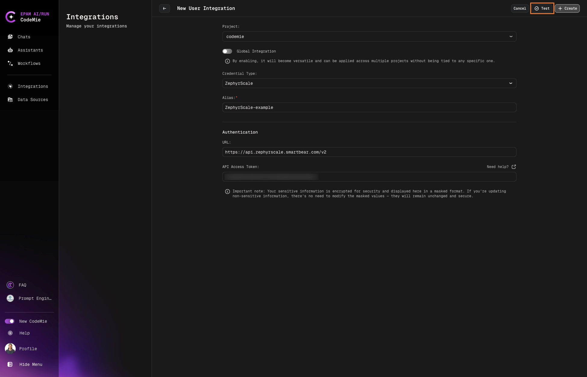

# Quality Assurance with Jira Zephyr Scale Addon

The purpose of Quality Assurance tools within AI/Run CodeMie, particularly in the context of integrating with external services like Zephyr Scale addon for Jira Cloud, is to enhance and streamline the QA processes involved in software development.

## 1. Create Zephyr Scale API Access Token

1.1. In Jira cloud click on profile icon and click **Zephyr Scale API Access Tokens**:

1.2. Click **Create access token** and click copy button:

## 2. Configure Integration in AI/Run CodeMie

2.1. Select **User** or **Project** and click the **Create**.

2.2. (optional) You can **Test integration**.

## 3. Create Assistant with Quality Assurance Tool

3.1. Click **Explore Assistant**, Click **Create Assistant** fill in the following parameters:

- **Project Name**: Select the name of your project.
- **Name**: Specify the assistant name.
- **Description**: Specify description.
- **System Instructions**: Specify system instructions.
- **Available tools**: Quality Assurance and select from drop down list **Zephyr Cloud**.

  3.2. Click **Create**.
