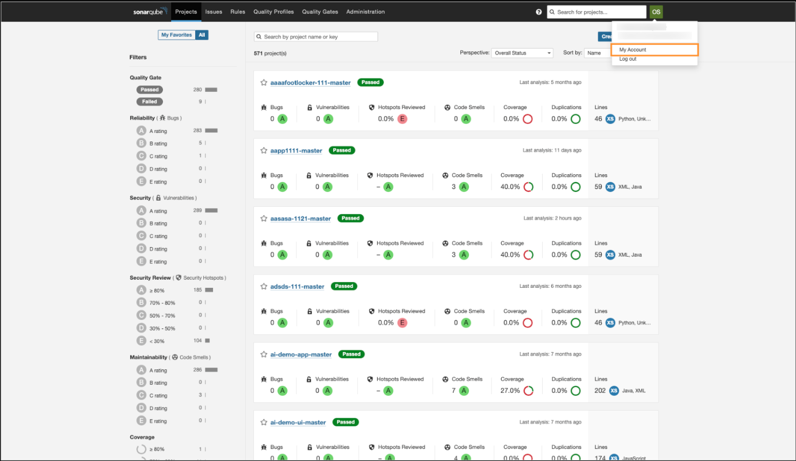
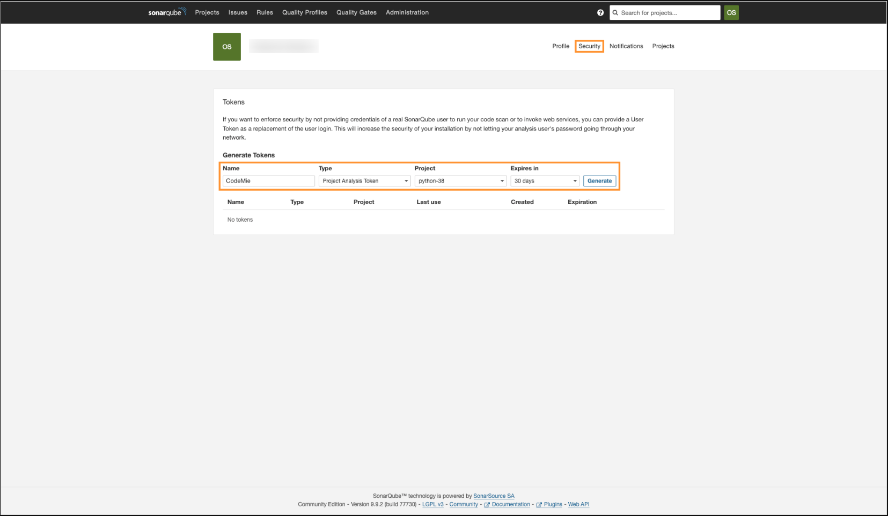

# SonarQube

AI/Run CodeMie supports SonarQube integration mainly for retrieving data through a generic approach, focusing on API requests (GET requests, specifically). This will allow users to get SonarQube projects' data directly from AI/Run CodeMie. Consider the case when you ask an AI/Run CodeMie assistant to pull information about bugs in a particular project. It displays all the bugs, code vulnerabilities, code smells and suggests solutions to remediate the issues.

To integrate SonarQube with AI/Run CodeMie, follow the steps below:

## 1. Generate SonarQube Token

1.1. Open your SonarQube instance. Click your user account icon and select **My account**:

1.2. In the account menu, select the **Security** tab. Specify token parameters and click **Generate**:

- **Name**: Specify your token's name.
- **Type**: Project Analysis Token
- **Project**: Select a SonarQube project that you want an AI assistant to analyze.
- **Expires**: Set appropriate expiry date.

1.3. Copy the generated token and navigate to the Integrations tab.

## 2. Configure Integration in AI/Run CodeMie

2.1. In the **User/Project** tab, click **+ Create**:

2.2. Specify the integration parameters and click **+ Create**:

- **Project**: enter your AI/Run CodeMie project name.
- **Credential tool**: Sonar
- **Alias**: Enter integration name
- **SonarQube Server URL**: Specify the URL of your public SonarQube endpoint.
- **Token**: Enter the token data copied earlier.
- **Project name inside Sonar**: Enter the SonarQube project name you want your assistant to analyze. Must be the same as specified when creating your SonarQube token.

## 3. Enable Sonar Tool in Assistant

3.1. Edit your assistant by enabling the Sonar tool integration and click **Create/Save**:

## 4. Verify Integration

4.1. Verify that your assistant can work with your SonarQube project:

4.2. Ask him to provide you with solutions to the detected issues.

