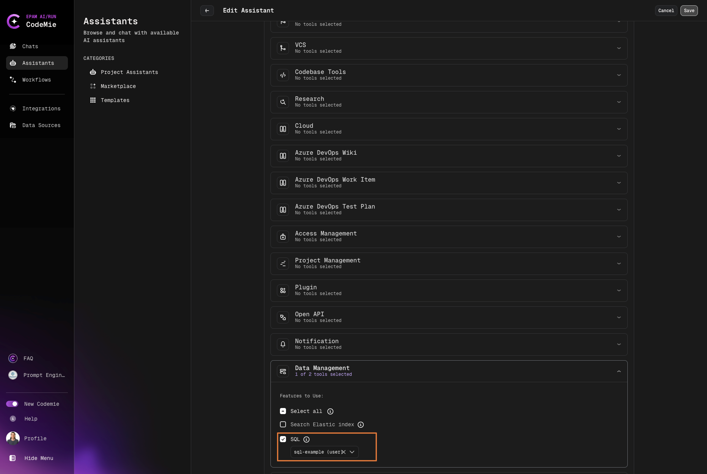

# SQL

AI/Run CodeMie is capable with SQL databases, such as MySQL and PostgreSQL. By enabling SQL integration, assistants can perform various operations like reading and modifying tables. To set up an SQL integration, follow the steps below:

## 1. Create SQL Integration

1.1. In AI/Run CodeMie, navigate to the **Integrations** tab → **User/Project** and click **+ Create**:

1.2. Add an SQL integration with the following parameters and click **Create**:

Below is a list of required fields:

- **Project**: Enter your project name. It is expected to be predefined by default.
- **Credential tool**: Select SQL.
- **Alias**: Enter the name for your integration. E.g., my-SQL-tool.
- **Database Dialect**: PostgreSQL, MSSql, MySQL or influxDB
- **Database URL**: Enter the URL of your database endpoint.
- **Port**: Specify the port your database works on.
- **Database name**: Enter your database name.
- **Username**: Enter your username.
- **Password**: Enter your user's password.

## 2. Enable SQL Tool in Assistant

2.1. Modify or Create your assistant with enabling integration:

