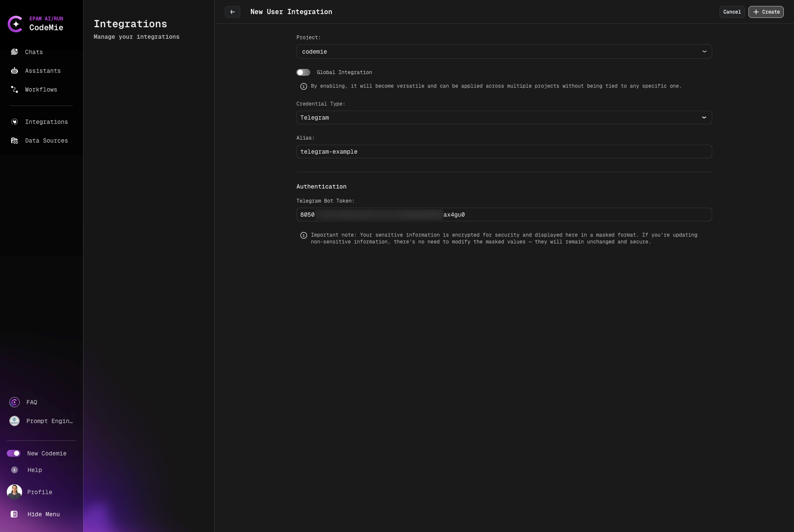
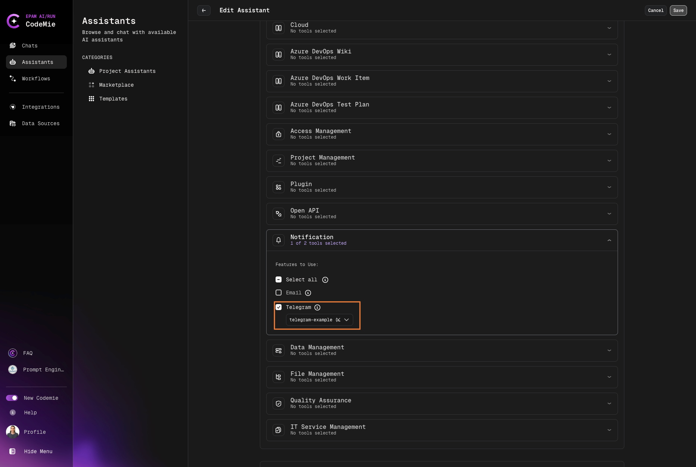
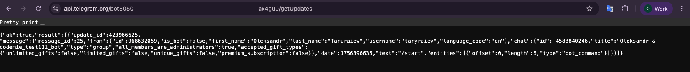

# Telegram

Since the 0.12.0 version of AI/Run CodeMie, assistants can operate with Telegram messenger. By enabling Telegram integration, assistants can directly interact with chats and Telegram bot. This integration allows users to automate Telegram bot manipulations. To set up a Telegram messenger integration, follow the instructions below:

## 1. Create Telegram Bot

1.1. Open your Telegram application. In the search bar, enter **BotFather** and select the corresponding bot in the results list:

1.2. In the chat with the **BotFather** bot, enter the following commands:

- `/start` -- starts conversation with bot
- `/newbot` -- create a new bot. **BotFather** will ask you to specify its name. Note that the name must end with "bot". E.g. "CodeMie_demo_bot".

  1.3. **BotFather** will provide you with the bot token. Copy this token as you will need it when creating a Telegram integration in AI/Run CodeMie:

## 2. Configure Telegram Integration

2.1. In AI/Run CodeMie, navigate to the **Integrations tab → User** and click **+ Create**.

2.2. Add a Telegram integration with the following parameters and click **Create**:

Below is a list of required fields:

- **Project**: Enter your project name. It is expected to be predefined by default.
- **Credential Tool**: Telegram.
- **Alias**: Enter the name for your integration. E.g., telegram-example.
- **Token**: Enter the token the **BotFather** bot provided you with when creating a new bot.

## 3. Enable Telegram Tool in Assistant

3.1. Modify your assistant by enabling SQL integration or create a new assistant with this tool:

## 4. Get Chat ID

4.1. In the Telegram application, type your bot's name in the search bar and start a conversation with it by pressing the **Start** button. Then, type something in the chat to create a conversation history.

4.2. Grab your assistant's chat ID by entering the following link in the browser:

`https://api.telegram.org/bot<bot_id>/getUpdates`

Note that the `<bot_id>` is the token you took from the chat with BotFather.

Once you substitute `<bot_id>` with your own bot ID and paste the resulting link in the browser, you are expected to see the following output with the chat ID:

The output above contains a conversation history. Copy the ID of this chat as you will need it when chatting with your assistant.

## 5. Test Integration

5.1. Return to AI/Run CodeMie, start a conversation with your chat assistant that has a Telegram tool enabled:

5.2. In the Telegram chat, you are expected to get the answer to your question:

