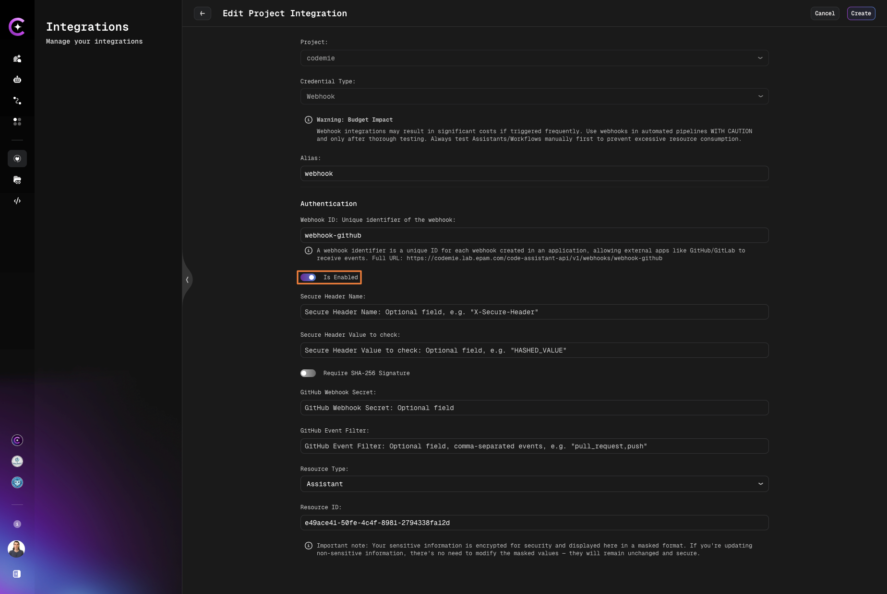

# Webhook

AI/Run CodeMie assistants and Workflows can be triggered using webhooks. It means that all the tools that support sending webhooks can be integrated with AI/Run CodeMie. Below is a list of some examples where webhooks can be beneficial:

:::note
Only users with the Project Admin role can create and manage Webhook integrations. If you are not a Project Admin, the "Webhook" option will not appear for you, and any previous user-level Webhook integrations you created will no longer function.
:::

1. You need to automatically trigger code review assistant when developers create pull requests.
2. You need to send some real-time notifications via workflow when issues are created, updated, or resolved in Jira.
3. You need to trigger a customer support assistant when a new support ticket is created in your help desk system.

## Prerequisites

- To create a webhook integration user Project Admin permissions (for project level integrations) access

## 1. Create Resource to Trigger

1.1. Create an assistant you want to react to webhooks.

1.2. In the My Assistants list, click the assistant name copy **ASSISTANT ID** and **ACCESS LINKS**:

:::note
You can also create a Workflow and Datasource as these resource types support webhooks as well.
:::

## 2. Create Webhook Integration

2.1. Navigate to **Integrations → Project** and click **+ Create**.

2.2. On the **Edit Project Integration** page, fill in the fields to create a webhook:

- **Project**: Select the project where the webhook will be created.
- **Credential Type**: Select **Webhook**.
- **Alias**: Specify the integration name for easy identification.

### Authentication

- **Webhook ID**: Unique identifier for the webhook. This ID is used in the webhook's full URL and allows external apps like GitHub/GitLab to receive events. Full URL format: `https://codemie.lab.epam.com/code-assistant-api/v1/webhooks/{webhook-id}`
- **Is Enabled**: Check this toggle to activate the webhook. If disabled, the webhook won't process incoming requests.
- **Secure Header Name (optional)**: Optional field for custom header-based authentication. Specify a header name (e.g., `X-Secure-Header`) that the webhook will check.
- **Secure Header Value to check (optional)**: Optional field. Enter the expected value for the secure header specified above.
- **Require SHA-256 Signature**: Toggle to enable SHA-256 signature verification for incoming webhook requests. When enabled, requests must include a valid signature.
- **GitHub Webhook Secret (optional)**: Optional field for GitHub webhook signature verification. Enter the secret token configured in your GitHub webhook settings to validate incoming GitHub events.
- **GitHub Event Filter (optional)**: Optional field. Specify comma-separated GitHub event types to filter (e.g., `pull_request,push`). Only events matching these types will trigger the webhook.

:::warning Important note
Make sure the **Is Enabled** toggle is turned ON. If disabled, the webhook will not process any incoming requests and will not trigger the associated resource.
:::

### Resource Configuration

- **Resource Type**: Choose the resource to be triggered when receiving the webhook (Assistant, Workflow, or Datasource).
- **Resource ID**: Enter the ID of the Assistant/Workflow/Datasource copied from step 1.2.

## 3. Copy Webhook URL

3.1. Copy the webhook URL to further paste it in the webhook settings. The URL is displayed in the Authentication section:

## 4. Configure Webhook in External Tool

4.1. Navigate to the tool where you want to create a webhook. In our example, we will use Gitlab version control system to create a webhook for a Git repository:

In the URL field, paste the Webhook URL you copied while creating the webhook integration in AI/Run CodeMie. Specify the trigger events and save the changes. In our case, we set the comment event trigger only. You can also enable additional settings, such as SSL Verification. But note that they require additional efforts to set up. In Gitlab, you can verify that webhook works properly by clicking the test button:

## 5. Test Webhook

5.1. To test that webhook, we will create a merge request and put a comment into it:

5.2. In the AI/Run CodeMie chat history, a new chat appears with a system message.
