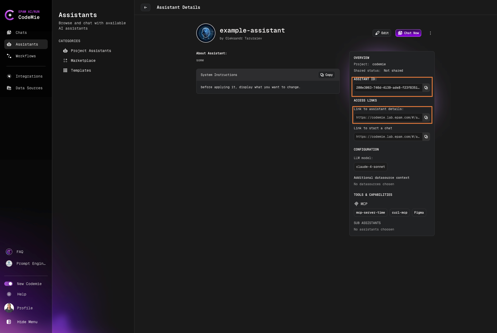
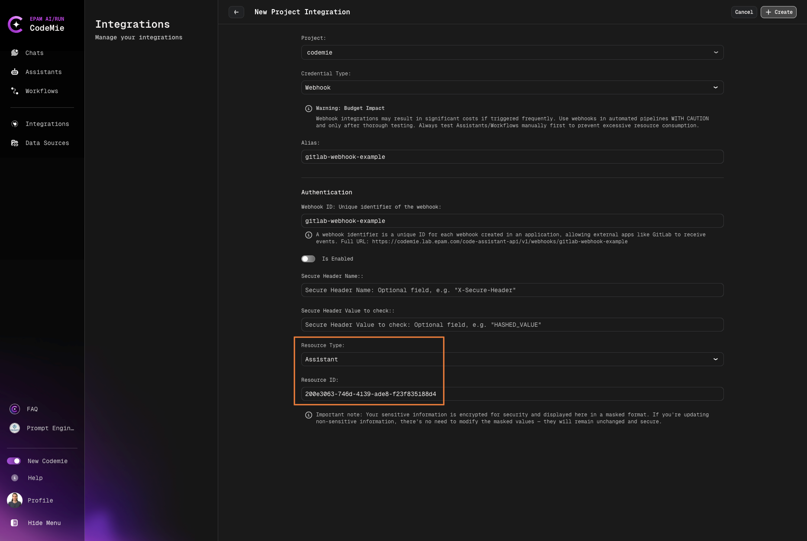
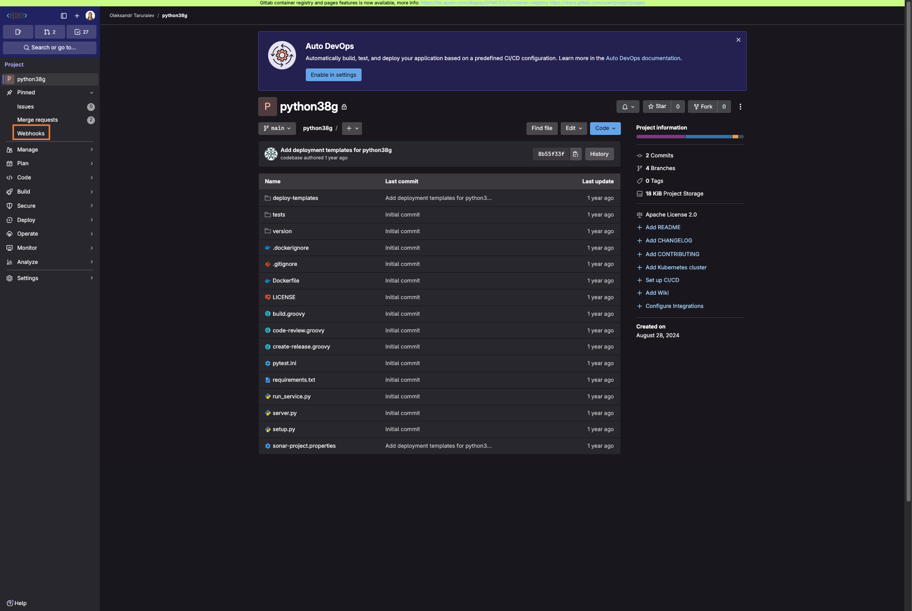
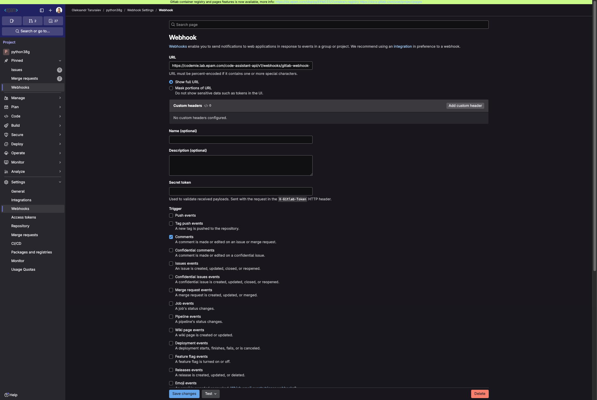

# Webhook

AI/Run CodeMie assistants and Workflows can be triggered using webhooks. It means that all the tools that support sending webhooks can be integrated with AI/Run CodeMie. Below is a list of some examples where webhooks can be beneficial:

As of version 1.1.0, only users with the Project Admin role can create and manage Webhook integrations. User-level Webhook integrations are no longer supported. If you are not a Project Admin, the "Webhook" option will not appear for you, and any previous user-level Webhook integrations you created will no longer function.

1. You need to automatically trigger code review assistant when developers create pull requests.
2. You need to send some real-time notifications via workflow when issues are created, updated, or resolved in Jira.
3. You need to trigger a customer support assistant when a new support ticket is created in your help desk system.

## Prerequisites

- To create a webhook integration user Project Admin permissions (for project level integrations) access

## 1. Create Resource to Trigger

1.1. Create an assistant you want to react to webhooks.

1.2. In the My Assistants list, click the assistant name copy **ASSISTANT ID** and **ACCESS LINKS**:

:::note
You can also create a Workflow and Datasource as these resource types support webhooks as well.
:::

## 2. Create Webhook Integration

2.1. Navigate to **Integrations → User/Project** and click **+ Create**.

2.2. On the **New User/Project Integration** page, fill in the fields to create a webhook:

- **Project Name**: Specify project name.
- **Credential Type**: Webhook.
- **Alias**: Specify the integration name.
- **Webhook ID**: Specify the Webhook ID to work in. This ID is used in Webhook's full URL.
- **Access Key ID**: Paste the **Access Key ID** data copied from step 1.4.
- **If enabled**: Check the toggler. If the option is disabled, the webhook won't be operating.
- **Secure Header Name (optional)**: This field is used as a means of verifying the webhook's eligibility.
- **Secure Header Value (optional)**: Enter the Secure Header's value.
- **Resource type**: Choose who will be triggered when receiving the webhook.
- **Resource ID**: Enter the ID of an Assistant/Workflow/Datasource data copied from step 2.

## 3. Copy Webhook URL

3.1. Copy the assistant's webhook URL to further paste it in the webhook settings:

## 4. Configure Webhook in External Tool

4.1. Navigate to the tool where you want to create a webhook. In our example, we will use Gitlab version control system to create a webhook for a Git repository:

In the URL field, paste the Webhook URL you copied while creating the webhook integration in AI/Run CodeMie. Specify the trigger events and save the changes. In our case, we set the comment event trigger only. You can also enable additional settings, such as SSL Verification. But note that they require additional efforts to set up. In Gitlab, you can verify that webhook works properly by clicking the test button:

## 5. Test Webhook

5.1. To test that webhook, we will create a merge request and put a comment into it:

5.2. In the AI/Run CodeMie chat history, a new chat appears with a system message.
