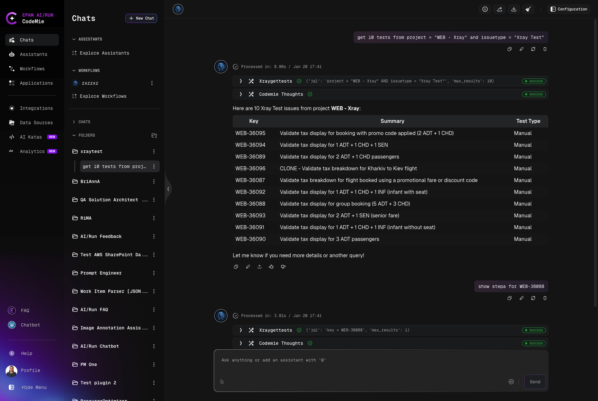

# Xray

## Overview

The Xray tool enables AI/Run CodeMie assistants to retrieve and interact with test cases from Xray Test Management for Jira. Xray is a comprehensive test management solution that helps teams plan, design, and execute tests within Jira.

With the Xray tool, assistants can:

- Query test cases using JQL-like syntax
- Retrieve test details including key, summary, and test type
- Access test information for analysis and reporting
- Support quality assurance workflows

## Prerequisites

:::note Required Integration
This tool requires you to have at least one X-ray integration configured in AI/Run CodeMie. For more details, please refer to the [Integrations Overview](../integrations/) guidelines.
:::

## Setting Up X-ray Integration

### 1. Create X-ray API Keys

Before configuring the integration in AI/Run CodeMie, you need to generate API credentials in Xray:

1. Follow the [Xray API Keys documentation](https://docs.getxray.app/space/XRAYCLOUD/44568019/Global+Settings+-+API+Keys) to create your API keys
2. Generate a new API key in Xray Global Settings
3. Copy the **Client ID** and **Client Secret** - you'll need these for the integration

### 2. Navigate to Integrations

- Go to **Integrations**
- Select **User Integrations** or **Project Integrations** based on your needs:
  - **User Integrations**: Available only to you across all projects
  - **Project Integrations**: Shared with all members of the selected project
- Click **+ Create**

### 3. Configure Integration Settings


- **Select**: Choose **User** or **Project** integration scope
- **Project**: Select your target project (if creating Project integration)
- **Global Integration**: Enable if integration should be available across multiple projects
- **Credential Type**: Select **X-ray**
- **Alias**: Provide a descriptive name (e.g., "XrayTest")

### 4. Set Up Authentication

Configure the X-ray authentication:

- **URL**: Your Xray instance URL (e.g., `https://xray.example.app`)
- **Client ID**: Your X-ray API client ID
- **Client Secret**: Your X-ray API client secret
- **Max results per query**: Maximum number of test cases to return (default: 200)

:::info Authentication Details
Your sensitive information is encrypted for security and displayed in a masked format. When updating non-sensitive information, masked values remain unchanged and secure.
:::

### 5. Save Integration

- Click **+ Save** to store the integration

## Using Xray Tool in Assistants

### 1. Create or Edit Assistant

When creating or editing an assistant:

- Navigate to **Assistants** section
- Click **+ Create Assistant** or edit an existing one
- In **Available tools**, add **Xray**
- Select your configured X-ray integration from the dropdown

### 2. Query Test Cases

Use natural language to query test cases. The assistant will translate your request into appropriate Xray queries.

**Example queries:**

```
Get 10 tests from project = "WEB - Xray" and issuetype = "Xray Test"
```

```
Show me manual tests from the API Testing project
```

```
Find all tests assigned to John Doe in the Mobile project
```

**Example result:**



### 3. JQL Syntax for Test Queries

The Xray tool supports JQL-like syntax for filtering test cases:

**Basic query structure:**

```
get [number] tests from [JQL expression]
```

**Common JQL expressions:**

```jql
# Filter by project
project = "PROJECT-KEY"

# Filter by issue type
issuetype = "Xray Test"

# Filter by test type
"Test Type" = Manual

# Combine conditions
project = "WEB" AND issuetype = "Xray Test" AND "Test Type" = "Manual"
```

:::tip JQL Resources
For more information on writing JQL expressions, refer to the [Atlassian JQL documentation](https://www.atlassian.com/software/jira/guides/jql/cheat-sheet#intro-to-jql).
:::
