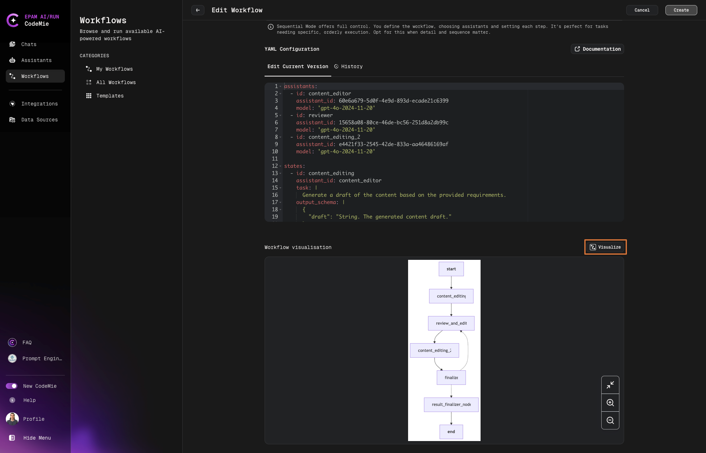

# 4.1 Workflows Overview

AI/Run CodeMie allows you to design complex logic for interactions between assistants, enabling the creation of fully functional workflows. By executing a series of actions, users can create their own low-code pipelines to handle a wide variety of tasks. Workflows can be found under the **Workflows** tab at the left of the screen:

## Workflows Categories

- **My Workflows**: Your personal workflows that you own or manage.
- **All Workflows**: A complete list of workflows available for you to use.
- **Templates**: Ready-made templates for quickly creating and customizing new workflows.

By clicking the **Actions** button, you can copy link, clone, delete, edit, or view workflow's details:

To create a new chat with the workflow, click the **Start Execution** button:

Once the **Start Execution** button is clicked, specify the prompt in the New Workflow Execution window and click **Create**:

Once the new workflow execution is initiated, you will be redirected to a Workflow Execution page, where you will be able to see the Workflow overview:

The **States** tab displays the progress of the selected workflow execution.

You can also abort or rerun the execution by clicking the corresponding button:

:::note
You can abort the workflow execution only when it's being executed.
:::

All the workflow executions will be written to the workflow execution history. You can switch between executions by clicking on them:

