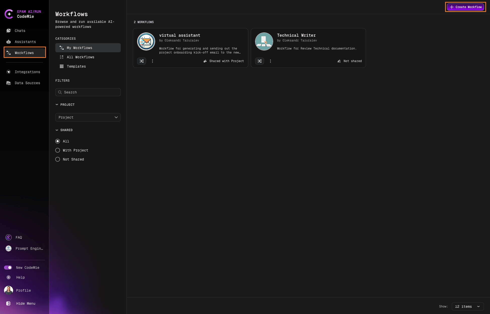

# 4.2 Create Workflow

Before creating a workflow, ensure that you have a clear vision of its purpose. Additionally, you should set up and configure the assistants that will be involved. Once these prerequisites are met, follow these steps:

1. Navigate to Workflows and click the **+ Create Workflow** button:

   

2. In the Create Workflow page, specify all the fields, including YAML configuration, and click **Update**:

   
   - **Project**: Specify your AI/Run CodeMie project. Should be pre-populated by default.

   - **Shared with Project Team**: Choose whether you want your teammates to see and use the workflow or not.

   - **Name**: Enter the Workflow name.

   - **Description**: Enter a brief description that describes Workflow's features and purpose.

   - **Icon URL**: The icon you specified in this field will be put in the Workflow avatar.

   - **Workflow Mode**: Choose one of two workflow modes:
     - **Sequential Mode**: Offers full control. You define the workflow, choosing assistants and setting each step. It's perfect for tasks needing specific, orderly execution. Opt for this when detail and sequence matter.
     - **Autonomous Mode**: Simplifies your workflow. No need to choose assistants or set states; our AI handles it, adapting to your needs for a seamless experience. Ideal for when you want efficiency without the setup.

   - **Supervisor prompt**: Use this field to specify the context that is general for all the assistants in the workflow. Besides, this field also serves as a place to set variables for assistants, such as date, time, etc.

## YAML Configuration Structure

YAML configuration structure breakdown is the following:

1. **Assistants Section**:
   - `assistants`: This is a list of assistant configurations.
   - `id`: A unique identifier for the assistant within this configuration.
   - `assistant_id`: The unique identifier provided by AI/Run CodeMie for the assistant.
   - `model` (optional): The model to be used by the assistant. If not specified, a default model will be used.

2. **States Section**:
   - `states`: This is a list of state configurations.
   - `id`: A unique identifier for the state within this configuration.
   - `assistant_id`: The identifier of the assistant (from the assistants section) that will handle this state.
   - `task`: A multi-line string specifying the task that the assistant needs to perform.
   - `output_schema` (optional): JSON schema defining the expected output of the task.
   - `next`: Defines what the next state will be.
     - `state_id`: The identifier of the next state. If a condition is used, this field is not required.
     - `iter_key` (optional): Key from `output_schema` for iterating over items.
     - `condition`: Conditional logic to determine the next state.
       - `expression`: The condition to evaluate. Uses the output of the current state.
       - `then`: The next state if the condition is true.
       - `otherwise`: The next state if the condition is false.

To create a workflow configuration with two assistants and two states, copy and paste the YAML example below into your configuration file. Customize the `id`, `assistant_id`, `task`, and other fields according to your requirements.

## Additional Information

- The `output_schema` should be a valid JSON schema that describes the structure of the output.
- Make sure that all `id` fields are unique within their respective sections.
- Use the `condition` in the `next` field to handle branching logic based on the output of the current state.
- Make sure that `iter_key` is the same as in `output_schema` to correctly iterate over results with assistant.

By following these guidelines, you can effectively create and manage workflow configurations using YAML.

### YAML Configuration Example:

```yaml
assistants:
  - id: lister # Unique identifier for the assistant in this configuration
    assistant_id: 18125c76-a67d-4fd9-b849-5c44277e302c # AI/Run CodeMie assistant ID
    model: 'gpt-4o' # Optional model override

  - id: scraper
    assistant_id: d61a51e5-b8e5-4ce8-977d-c1364fcd5b1a
    model: 'gpt-4o' # Optional model override

states:
  - id: scraper # Unique identifier for the state in this configuration
    assistant_id: scraper
    task: |
      Show me all the tickets for the current sprint in the EPMDEDP project. Must be at least 20 items large.
    next:
      state_id: lister # Unique identifier for the next state

  - id: lister # Unique identifier for the state in this configuration
    assistant_id: lister
    task: |
      Of all the tickets provided, list me those that are assigned to <Name> <Surname>
    output_schema: |
      {
        "success": "If you receive a list of tickets, return count, otherwise return false",
        "comment_body": "Return the answer of the assistant"
      }
    next:
      state_id: end
```

3. You can also see the workflow visualization view by clicking the **Visualize** button:

   
