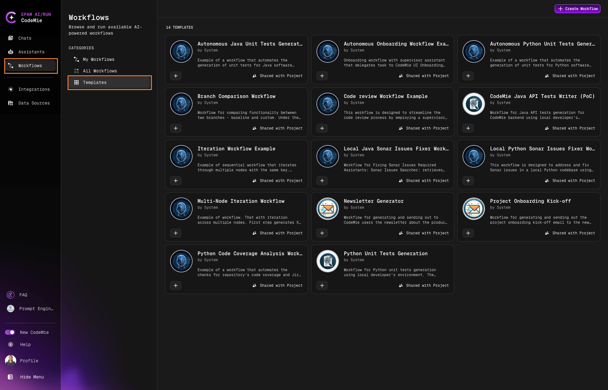
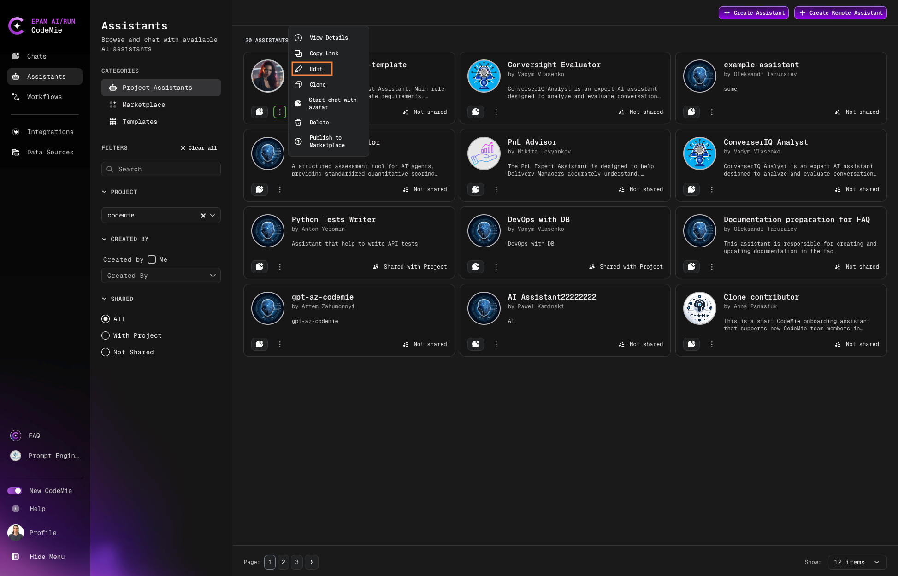

# 4.3 Create a Workflow from a Template

Creating an assistant from scratch might be too difficult, especially for the first time. To address this issue, the AI/Run CodeMie team has created a bunch of predefined templates that can perform various tasks. To create such an assistant, follow the steps below:

1. In the AI/Run CodeMie main page, select the **Workflows** tab.

2. In the Workflows page, select the **Templates** tab:

   

3. To view the assistant and its settings, click on the tab with its name. Select the appropriate assistant from the assistant's list and click on the **+** button. Once the assistant is selected, a Create Workflow from Template menu will appear:

   

4. Fill in the workflow details and click **Create**:
   - **Project**: Specify your AI/Run CodeMie project. Should be pre-populated by default.

   - **Shared with Project Team**: Choose whether you want your teammates to see and use the workflow or not.

   - **Name**: Enter the Workflow name.

   - **Description**: Enter a brief description that describes Workflow's features and purpose.

   - **Icon URL**: The icon you specified in this field will be put in the Workflow avatar.

   - **Workflow Mode**: Choose one of two workflow modes:
     - **Sequential Mode**: Offers full control. You define the workflow, choosing assistants and setting each step. It's perfect for tasks needing specific, orderly execution. Opt for this when detail and sequence matter.

     - **Autonomous Mode**: Simplifies your workflow. No need to choose assistants or set states; our AI handles it, adapting to your needs for a seamless experience. Ideal for when you want efficiency without the setup.

   - **Supervisor prompt**: Use this field to specify the context that is general for all the assistants in the workflow. Besides, this field also serves as a place to set variables for assistants, such as date, time, etc.

:::note
Ensure the assistants are set properly. For instance, the workflow above requires your "scraper" assistant to have permissions to access your Jira instance.
:::
