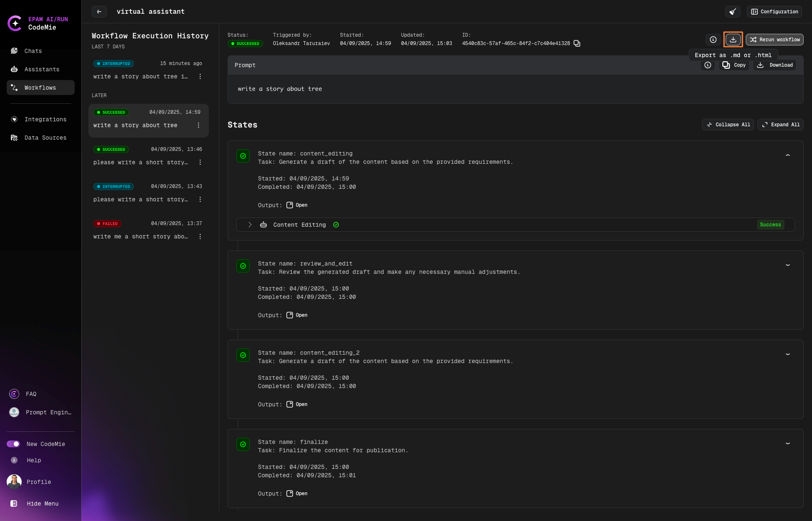
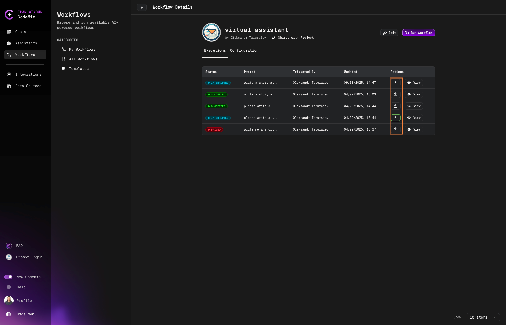
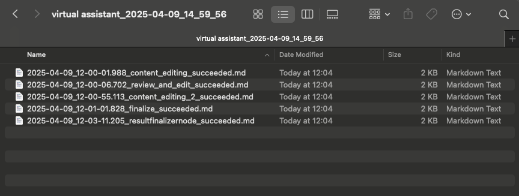

# 4.7 Exporting Workflow Execution

This functionality allows you to export information about the execution steps of a workflow as a zip archive containing Markdown or HTML files. Each file includes details about a specific step and its status.

## Steps for Exporting Data

1. **Run the Workflow**: Ensure that the workflow has been executed. Once the process is complete, you can proceed to the next step.

2. **Export Execution Button**: After the workflow execution has finished, locate and click the **Export as** button on the execution page. The button will be available once the workflow execution is complete.

   

   

:::note
You can combine all results into a single file, and when you unzip it, you will get a single file instead of a folder with multiple files. To do this, you need to check the **Combine results into a single file** checkbox.
:::

## Exporting Previous Executions

You can export previous executions by following these steps:

1. Click on the plate of your necessary workflow.

2. Find the desired execution and click the **Download** button.

3. Select format and click **Export** button

   

## Archive Generation

Upon clicking the export button, the system will automatically generate a zip archive containing Markdown files for each execution step.

## Expected Archive Structure

Inside the zip archive, you will find the following files:

1. Each execution step will be represented by a separate Markdown file, named according to the pattern: `step_name_status.md`, where:
   - `step_name` is the name of the step
   - `status` is the execution status (e.g., "success" or "failed")

2. If a step repeats, the file name will include the iteration number: `step_name_iteration_number_status.md`, e.g., `ProcessData_1_success.md` or `ProcessData_2_failed.md`.

## Archive Naming Convention

The zip archive will be named according to the pattern:
`workflow_name_execution_datetime_execution_id.zip`, where:

1. `workflow_name` is the name of the workflow

2. `execution_datetime` is the date and time of execution

3. `execution_id` is the unique identifier for the execution

Download the Archive: Once the archive is generated, you can download it to your computer for further use or analysis.

### Example:

## Important Notes:

- Ensure that the workflow execution has been completed before exporting.

- The archive will be available for download immediately after it is generated.

- File and archive names strictly follow the defined naming conventions to simplify analysis and archiving.
