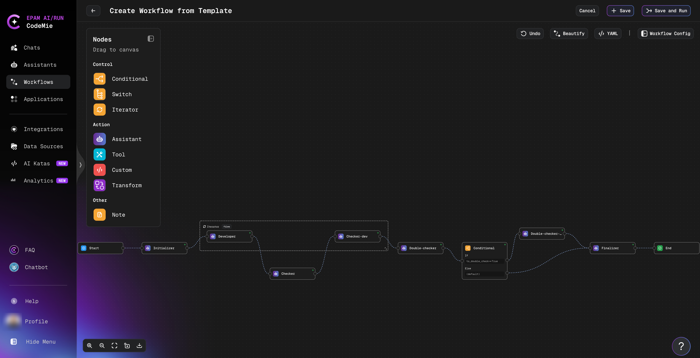

# Create a Workflow from a Template

Creating a workflow from scratch can be complex, especially for first-time users. AI/Run CodeMie provides predefined templates that can perform various tasks out of the box, making it easy to get started quickly.

## Steps to Create from Template

1. Navigate to the **Workflows** section in the main navigation.

2. Select the **Templates** tab:

   

3. Browse available templates and click on a template card to view its details and configuration.

4. Click the **+** button to create a workflow from the selected template.

5. Configure the workflow settings:

### Workflow Configuration

| Field                        | Description                                                                              |
| ---------------------------- | ---------------------------------------------------------------------------------------- |
| **Project**                  | Your AI/Run CodeMie project (pre-populated by default)                                   |
| **Shared with Project Team** | Enable to allow teammates to view and use the workflow                                   |
| **Name**                     | Unique name for the workflow                                                             |
| **Description**              | Brief description of the workflow's features and purpose                                 |
| **Icon URL**                 | URL to an icon image for the workflow avatar                                             |
| **Supervisor Prompt**        | Global context shared across all assistants; can include variables like date, time, etc. |

6. Click **Create** to save your workflow.

## Customizing Your Workflow Template

After creating a workflow from a template, you can customize it using the **Visual Workflow Editor**. The template provides a solid foundation, and you can modify it to match your specific needs.

### Using the Visual Workflow Editor

The Visual Workflow Editor provides an intuitive drag-and-drop interface for customizing your template. You can add, remove, and configure workflow states visually without writing YAML code.

:::tip Learn More
For detailed information about the Visual Workflow Editor interface and features, see the [Create Workflow](./create-workflow#building-workflows-with-the-visual-editor) guide.
:::

### Editing the Template

To customize the template workflow:

1. **Add Nodes**: Drag nodes from the left palette to the canvas
2. **Remove Nodes**: Select a node and delete it
3. **Edit Nodes**: Click any node to configure its properties:
   - Assistant selection
   - Task prompt
   - Output schema
   - Integration settings

4. **Connect Nodes**: Drag from one node's output to another node's input
5. **Rearrange Layout**: Drag nodes to reposition, or click **Beautify** for auto-layout
6. **Add Branching**: Use Conditional or Switch nodes for decision logic
7. **Configure Loops**: Use Iterator nodes to process collections

### Switching Between Editor Modes

You can switch between Visual Editor and YAML editing by clicking **Yaml** button in the top right corner

:::tip Best Practice
Start with the Visual Editor for initial design, then switch to YAML only if you need fine-grained control over advanced features like Jinja templating or complex conditional logic.
:::

### Saving Your Changes

After customizing the template:

1. Click **Save** to preserve your changes
2. Or click **Save and Run** to immediately test the workflow
3. Use **Cancel** to discard changes and return to the previous version

:::warning Assistant Configuration
Ensure that assistants have the necessary permissions for their tasks. For example, if a workflow includes a Jira integration, the assistant must have access permissions to your Jira instance.
:::
