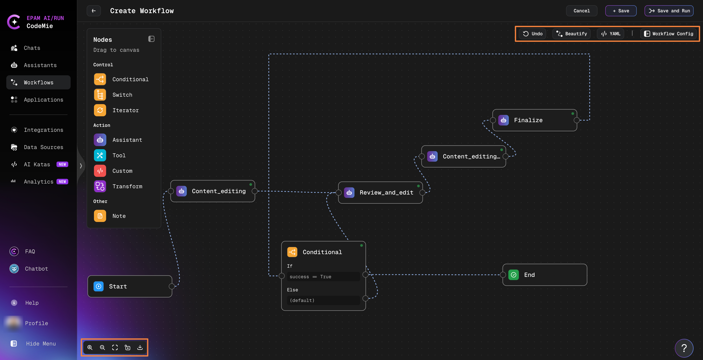
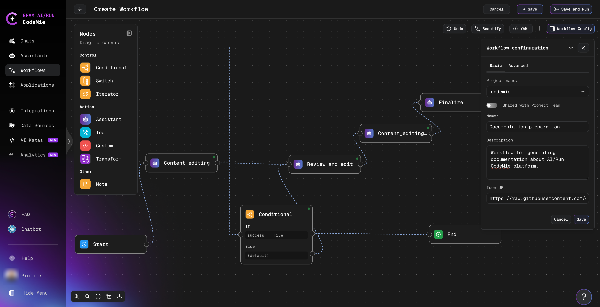
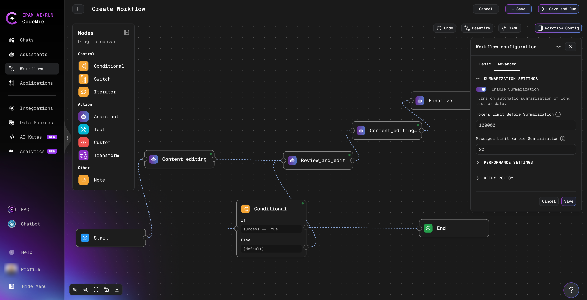
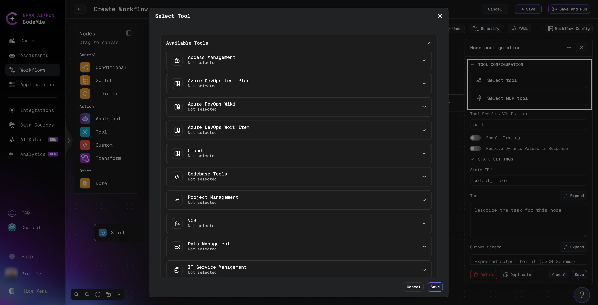
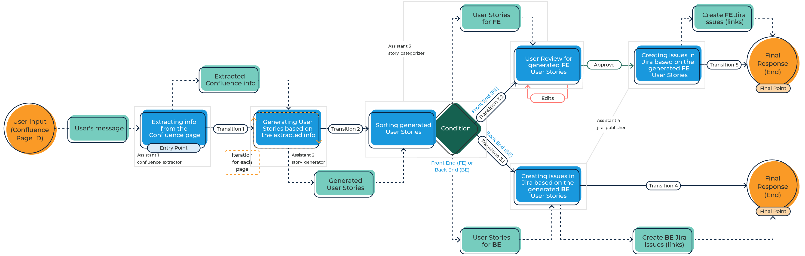

# Create Workflow

This guide shows you how to create workflows in AI/Run CodeMie using the Visual Workflow Editor—the easiest and fastest way to build automated processes.

## Prerequisites

Before creating a workflow, ensure you have:

- A clear understanding of the workflow's purpose and desired outcome
- Assistants configured for the tasks your workflow will perform
- Any required integrations set up (Jira, Confluence, Git, etc.)

## Creating a New Workflow

1. Go to the **Workflows** section in the left sidebar
2. Click **+ Create Workflow**:

   

## Building Workflows with the Visual Editor

The **Visual Workflow Editor** is a drag-and-drop interface that makes building workflows intuitive and visual. Instead of writing YAML code, you design workflows graphically.

:::tip Learn by Watching
Watch this [video walkthrough of the Visual Workflow Editor](https://youtu.be/zacMZpM5MNU?si=dML07SgqFmL56TjQ) to see all features in action.
:::

## Visual Editor Interface

The Visual Workflow Editor consists of three main areas that help you design and manage workflows efficiently.

### Left Sidebar: Nodes Palette

The left sidebar contains all available node types organized by category:

**Control Nodes:**

- **Conditional**: Branching logic with if/else conditions
- **Switch**: Multi-path routing based on values
- **Iterator**: Loop through collections of data

**Action Nodes:**

- **Assistant**: AI-powered processing with assistants
- **Tool**: External system integrations (Jira, Confluence, etc.)
- **Custom**: Execute custom code or scripts
- **Transform**: Transform data structures between states

**Other:**

- **Note**: Add documentation and comments to your workflow

To add a node, simply click on it in the sidebar or drag-and-drop it directly onto the canvas.

### Bottom Left: View Controls

Visual controls for managing your workflow view:

- **Zoom In/Out**: Adjust the canvas zoom level
- **Fit View**: Automatically fit the entire workflow in the viewport
- **Lock/Unlock**: Lock the canvas to prevent accidental changes
- **Download Schema**: Export the workflow schema as an image

### Upper Right: Workflow Actions & Configuration

This section provides essential tools for managing your workflow:

**Action Buttons:**

- **Cancel**: Discard changes and exit without saving
- **Save**: Save the current workflow configuration
- **Save & Run**: Save and immediately execute the workflow

**Workflow Tools:**

- **Load Example**: Load a pre-built example workflow as a starting point
- **Beautify**: Automatically organize and align nodes for better visual layout
- **Undo**: Revert to the previous state (appears after making changes)
- **YAML**: Switch to YAML editor to view or edit the configuration code
- **Workflow Config**: Access Basic and Advanced configuration settings

### Workflow Configuration Menu

Click the **Workflow Config** button to access configuration options:

**Basic Tab:**

Configure essential workflow settings:

- **Project name**: Select the project where you want to add the workflow
- **Shared with Project Team**: Enable to make your workflow visible to your project team
- **Name\*** (Required): Unique identifier for your workflow
- **Description**: Brief explanation of the workflow's purpose and features
- **Icon URL**: Link to an image (.png or .svg) for the workflow avatar

:::info Required Fields
Fields marked with an asterisk (\*) are required and must be filled in before saving the workflow.
:::

**Advanced Tab:**

- **Summarization Settings**: Token and message limits for automatic summarization
- **Performance Settings**: Parallel task execution and recursion depth limits
- **Retry Policy**: Configure retry attempts and backoff strategy for failed operations

:::info Configuration Sync
Changes made in the Visual Editor are automatically reflected in the YAML configuration, and vice versa. Both views stay synchronized in real-time.
:::

## Working with Nodes

### Adding and Configuring Nodes

1. **Add a Node**: Click a node type in the sidebar or drag it to the canvas
2. **Configure the Node**: Click the node to open its configuration window
3. **Set Parameters**: Customize the node's behavior (assistant selection, task prompts, conditions, etc.)
4. **Save Configuration**: Click **Save** to apply your changes

#### Smart Configuration Validation

The Visual Editor provides intelligent configuration assistance for Tool and Custom nodes. When you configure a node, the editor dynamically displays input fields that match the argument schema and type requirements of the selected tool or custom function. As you fill in the configuration, the editor visually alerts you to any missing required fields or type mismatches, helping you catch errors before execution.

The configuration panel prevents you from saving incomplete or invalid node settings, ensuring that your workflow is ready to run without configuration errors. While the editor generates and updates the YAML configuration automatically in the background, you work primarily with a structured, user-friendly interface that guides you through the setup process. If you need direct control over the configuration, the YAML editor view remains available.

### Duplicating Nodes

Quickly duplicate existing nodes with their configuration:

- **Windows/Linux**: Select a node and press `Ctrl+D`
- **macOS**: Select a node and press `Cmd+D`

This creates a copy of the selected node with all its settings, which you can then modify as needed.

### Connecting Nodes

Connect nodes by dragging from one node's output to another node's input. The editor validates connections in real-time with visual indicators:

- **Green connections**: Valid and properly configured
- **Red connections**: Incomplete or incorrect (needs fixing)

#### Connection Rules

Follow these rules to maintain logical consistency:

- **Start node**: Can connect only to action nodes (Assistant, Tool, Custom, Transform)
- **Conditional and Switch nodes**: Must connect to at least one execution node
- **Iterator nodes**: Act as containers for child execution nodes
- **Action nodes**: Can route to any other node type
- **End node**: Can be connected from any node to mark workflow completion

The system automatically organizes the node layout, validates links, and generates the corresponding YAML configuration in the background.

### Deleting Nodes and Connections

Remove nodes or connections through their configuration windows:

1. Click on the node or connection
2. In the configuration window, click the **Delete** button
3. Confirm the deletion

### Assistant State

Uses an AI assistant to process or generate content. Assistant nodes handle reasoning, decision-making, and content generation tasks.

**Why use Assistant nodes:**

- Clear, understandable steps with AI-powered processing
- Swap or tune assistants independently without changing workflow structure
- Accurate tracking of intermediate logic and outputs via context store

### Tool State

Calls external APIs or integrations (Jira, Confluence, GitHub, etc.) for fast, reliable data access.

**Why use Tool nodes:**

- Fast, reliable, automation-friendly access to external systems and data
- Separates "data gathering" from "reasoning/decision-making" (handled by assistants)
- Secure use of API credentials via `integration_alias`

#### Selecting Tools

When you add a Tool node to your workflow, the configuration panel displays two selection options:

1. **Select Tool** - Shows all previously connected integrations organized by category (Access Management, Azure DevOps, Cloud, Codebase Tools, Project Management, VCS, Data Management, IT Service Management). Your connected tools appear in the "Available Tools" list for quick selection.

2. **Select MCP Tool** - Shows all configured MCP (Model Context Protocol) servers that you've added. MCP servers enable AI agents to access live data sources like file systems, databases, and APIs.

Both connected tools and MCP servers are immediately available in the selection list - no additional configuration needed for already set up integrations.

### Custom State

Executes custom code, scripts, or specialized logic for complex data processing.

**Why use Custom nodes:**

- Highest flexibility for specialized business logic
- Implement algorithms or transformations not available in standard nodes
- Bridge gaps between different systems or data formats

### Transform State

Transforms data structures and formats between workflow states using predefined mappings.

**Why use Transform nodes:**

- Fast, deterministic data manipulation
- Reshape data without AI processing overhead
- Reliable, predictable transformations

### Node Type Comparison

| Type      | Flexibility | Speed  | Best For                    | Example Use         |
| --------- | ----------- | ------ | --------------------------- | ------------------- |
| Assistant | High        | Medium | Text, analysis, reasoning   | Generate summaries  |
| Tool      | Low         | High   | API calls, data transfer    | Post to Jira        |
| Custom    | Highest     | Varies | Specialized logic/scripts   | Data transformation |
| Transform | Medium      | High   | Data structure manipulation | Format conversion   |

### Complete Workflow Example

Here's a real-world workflow that demonstrates multiple patterns working together:

This workflow shows:

1. **Linear Flow**: Start → Extract pages → Generate story
2. **Iteration**: Loops through all extracted pages using an Iterator
3. **Processing**: Each story is categorized
4. **Conditional Branching**: Based on `be_found` condition, routes to different Jira creation paths
5. **Parallel Paths**: Backend (Be) and Frontend (Fe) story creation
6. **Convergence**: Both paths lead to End state

This pattern is common for:

- Processing collections of data (pages, tickets, documents)
- Classifying items and routing them appropriately
- Creating tasks in project management systems based on analysis
- Multi-step approval or validation workflows

:::tip Build Similar Workflows
Use the Visual Editor to recreate this pattern for your own use cases. The drag-and-drop interface makes it easy to add iteration, conditionals, and multiple execution paths.
:::

## Viewing Your Workflow

The Visual Editor provides multiple ways to view and edit your workflow:

### Visual workflow view

The main canvas shows your workflow as a connected graph of nodes. Use the view controls to:

- **Zoom**: Adjust the zoom level to see details or get an overview
- **Fit View**: Automatically fit the entire workflow in the viewport
- **Pan**: Drag the canvas to navigate large workflows

### YAML configuration view

Click the **YAML** button to see the generated YAML configuration. This view shows how your visual design translates to code.

If you need direct control over the workflow configuration, you can switch to YAML editing mode:

1. Click the **YAML** button in the upper right corner
2. Edit the YAML configuration directly
3. Check YAML history and restore previous versions if needed

:::info Configuration Sync
The Visual Editor and YAML editor are synchronized. Changes made in one view are automatically reflected in the other.
:::

:::tip When to Use YAML
Switch to YAML editing when you need features like Jinja templating, complex conditional expressions, or when you want to copy/paste configuration blocks. For most workflow creation tasks, the Visual Editor is faster and easier.

For detailed YAML configuration syntax and features, see the [Workflow YAML Configuration Guide](./configuration/introduction).
:::

## Saving and Running Workflows

### Save Options

- **Save**: Save the workflow configuration without executing
- **Save & Run**: Save and immediately execute the workflow to test it
- **Cancel**: Discard all changes and exit

### Testing Your Workflow

After creating your workflow:

1. Click **Save & Run** to test immediately
2. Enter required input parameters in the execution dialog
3. Monitor the execution progress
4. Review the results and debug if needed
5. Iterate and improve based on test results

### Accessing Your Workflows

After saving, your workflow appears in:

- **My Workflows**: Shows workflows you created
- **All Workflows**: Shows all workflows available to you (including shared ones)

Click the **Start Execution** button on any workflow card to run it.

## Best Practices

### Start Simple

Begin with 2-3 nodes and test thoroughly before adding complexity. Use the **Load Example** feature to see a working workflow as a starting point.

### Use Descriptive Names

Name nodes and workflows clearly:

- ✅ `fetch-jira-tickets`, `analyze-requirements`, `generate-report`
- ❌ `node1`, `step2`, `process`

### Organize with Beautify

Use the **Beautify** button regularly to keep your workflow visually organized and easy to understand.

### Test Incrementally

Test each node configuration individually before connecting the complete workflow. Use **Save & Run** frequently during development.

### Use the Undo Feature

The **Undo** button appears after making changes. Use it to quickly revert mistakes without starting over.

## Real-World Workflow Example

Below is a realistic example workflow that extracts, analyzes, and publishes requirements:

This workflow demonstrates key patterns in action:

- **Multiple Assistants**: Four specialized assistants working together (confluence_extractor, story_generator, story_categorizer, jira_publisher)
- **Iteration**: Processing multiple pages in a loop to generate user stories
- **Conditional Logic**: Routing to different paths based on story type (Frontend vs Backend)
- **Human-in-the-Loop**: User review and approval checkpoint before creating Jira issues
- **External Integrations**: Extracting from Confluence and creating issues in Jira
- **Parallel Paths**: Processing Frontend and Backend stories simultaneously

Workflows enable you to build sophisticated automation that adapts to your data, involves human decision-making when needed, and integrates with your existing tools.

## Next Steps

Now that you understand the Visual Workflow Editor interface and controls, explore these topics:

- **[Create from Template](./create-workflow-from-template)**: Start with pre-built templates and customize them
- **[LLM Model Configuration](./llm-model-name-in-workflow)**: Configure AI models for workflow states
- **[Workflow Templates](./workflow-templates)**: Browse available templates for common use cases
- **[YAML Configuration Guide](./configuration/introduction)**: Deep dive into advanced YAML features
- **[Advanced Features](./configuration/advanced-features)**: Learn about templating, interruptions, and complex patterns

:::tip Practice Makes Perfect
Try the [AI Katas workflow series](/user-guide/ai-katas/) for hands-on practice building workflows with guided challenges.
:::

:::info Video Tutorial
Watch the [complete video walkthrough](https://youtu.be/zacMZpM5MNU?si=dML07SgqFmL56TjQ) to see the Visual Workflow Editor in action with real examples.
:::
