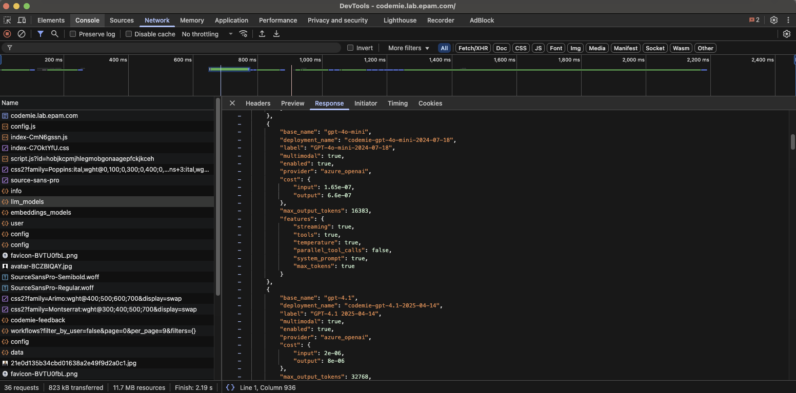

# LLM Model Name in Workflow

Use browser Developer Tools to identify the LLM model being used in your workflow execution.

## Steps to Find Model Name

1. **Open AI/Run CodeMie** in your browser.

2. **Open Developer Tools**:
   - Press **F12**, or
   - Right-click on the page and select **Inspect**

3. **Navigate to Network Tab**:

   The Network tab displays all HTTP requests made by the application.

4. **Refresh the Page**:

   Press **F5** to capture network activity, including LLM model requests.

5. **Locate the LLM Models Request**:

   Search or filter for `llm_models` in the Name column:

   

6. **View Response Data**:

   Click on the request, then select the **Response** tab to see the JSON response.

7. **Find the Model Name**:

   Locate the `base_name` field in the JSON response - this indicates the LLM model name used in the workflow.

## Example Response Structure

```json
{
  "model_id": "...",
  "base_name": "gpt-4o",
  "provider": "..."
}
```

The `base_name` field contains the model identifier (e.g., `gpt-4o`, `claude-3-sonnet`, etc.).
