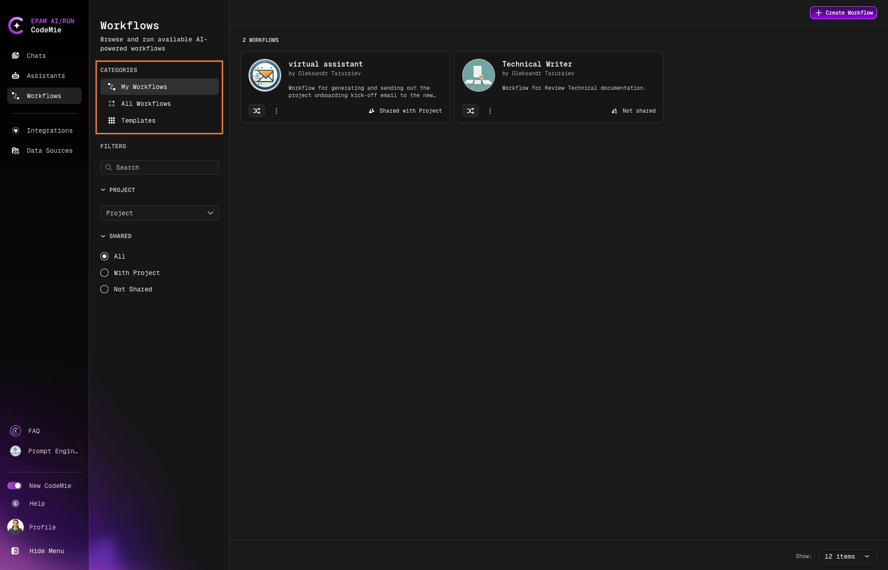

# Workflows Overview

AI/Run CodeMie allows you to design complex logic for interactions between assistants, enabling the creation of fully functional workflows. By executing a series of actions, users can create their own low-code pipelines to handle a wide variety of tasks.

## Accessing Workflows

Navigate to the **Workflows** tab in the left sidebar:

## Workflow Categories

Workflows are organized into three main categories:

| Category          | Description                                                         |
| ----------------- | ------------------------------------------------------------------- |
| **My Workflows**  | Your personal workflows that you own or manage                      |
| **All Workflows** | A complete list of workflows available for you to use               |
| **Templates**     | Ready-made templates for quickly creating and customizing workflows |

## Managing Workflows

### Workflow Actions

Click the **Actions** button on any workflow card to:

- Copy workflow link
- Clone the workflow
- Delete the workflow
- Edit workflow configuration
- View workflow details

### Starting a Workflow Execution

1. Click the **Start Execution** button on the workflow card:

   

2. Enter your prompt in the New Workflow Execution window:

   

3. Click **Create** to initiate the execution.

## Monitoring Execution

After starting an execution, you'll be redirected to the Workflow Execution page:

### Execution Controls

During execution, you can:

- **View Progress**: Monitor execution status in the **States** tab
- **Rerun**: Restart the workflow execution
- **Abort**: Stop a running execution

:::info
The abort button is only available while the workflow is actively executing.
:::

### Execution History

All workflow executions are saved in the execution history. Switch between past executions by clicking on them in the history panel:

