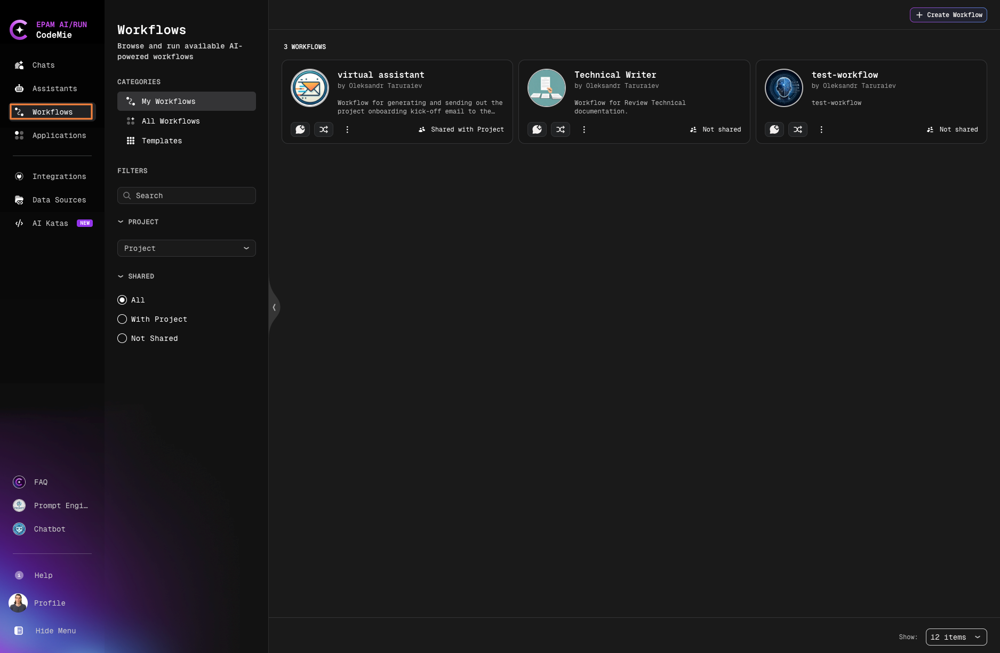
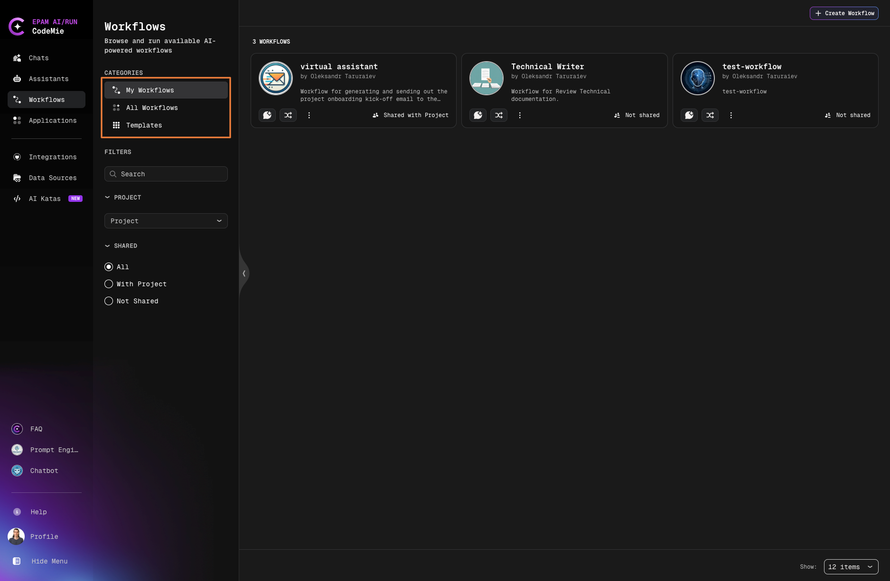
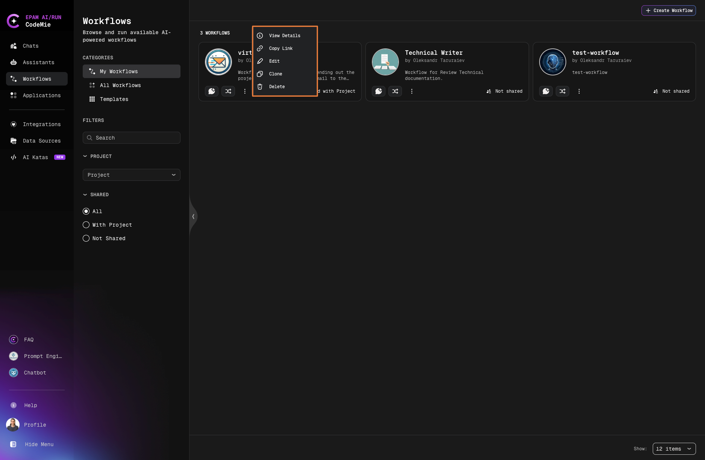
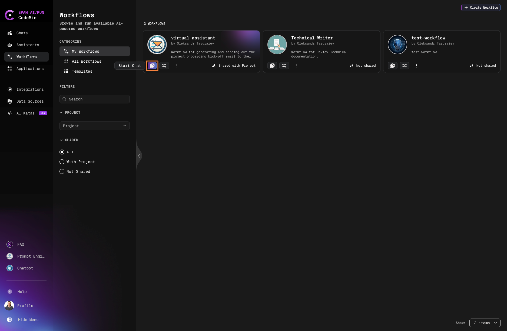
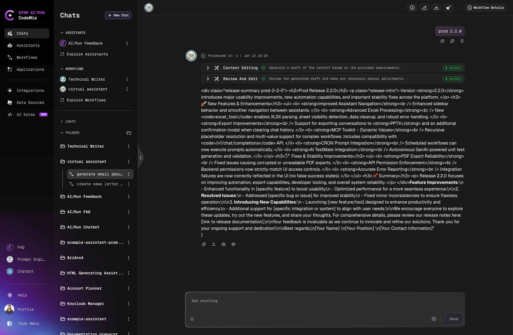
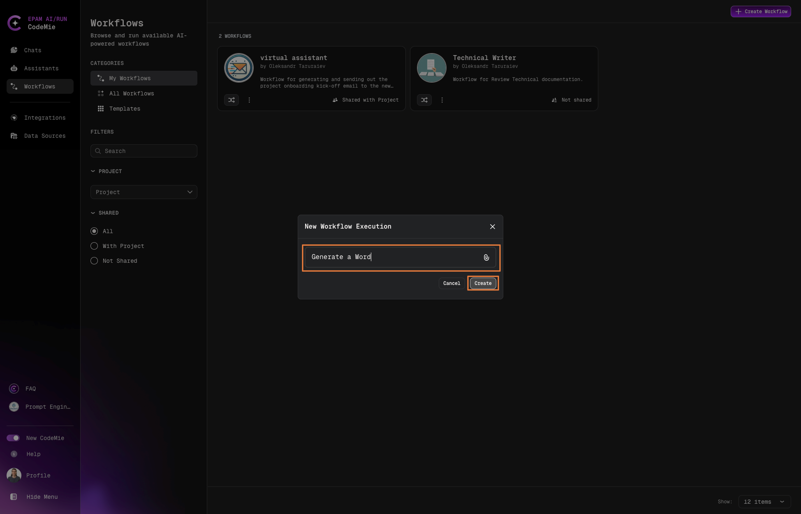
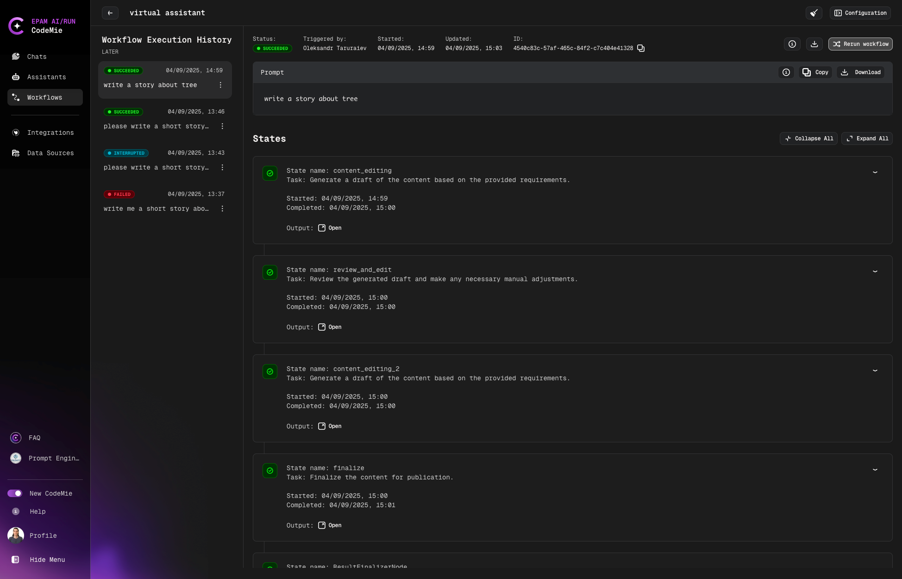
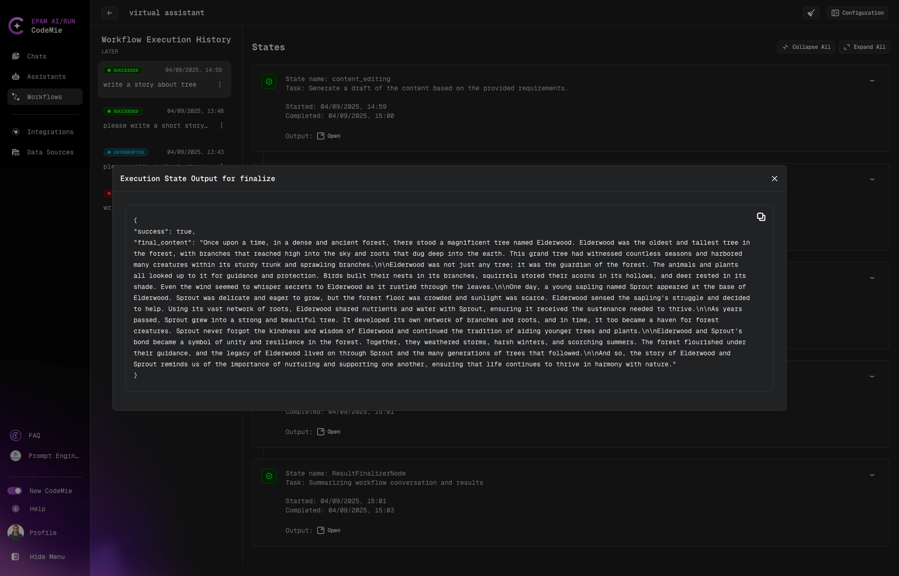
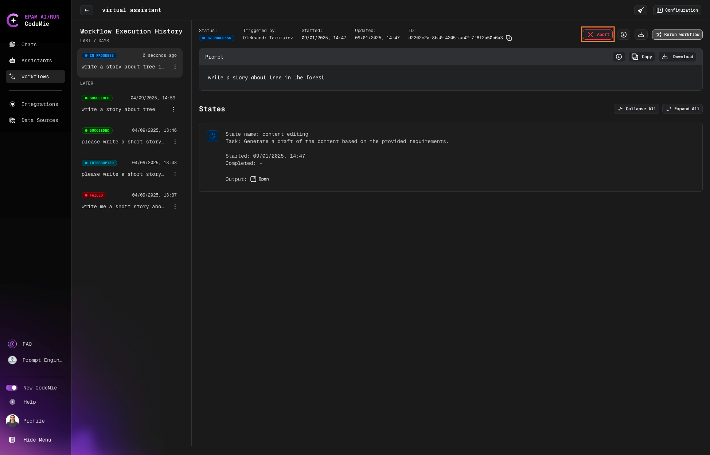
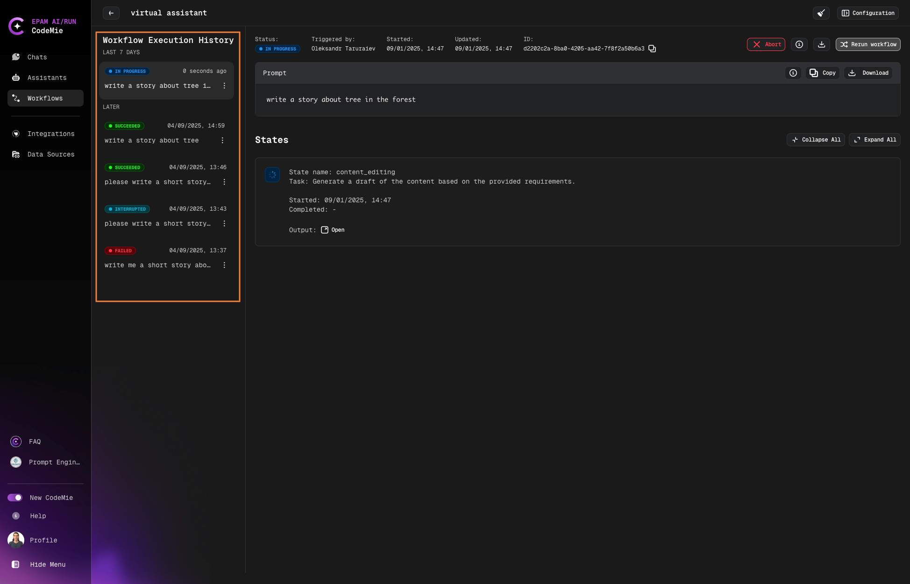

# Workflows Overview

AI/Run CodeMie allows you to design complex logic for interactions between assistants, enabling the creation of fully functional workflows. By executing a series of actions, users can create their own low-code pipelines to handle a wide variety of tasks.

## Accessing Workflows

Navigate to the **Workflows** tab in the left sidebar:

## Workflow Categories

Workflows are organized into three main categories:

| Category          | Description                                                         |
| ----------------- | ------------------------------------------------------------------- |
| **My Workflows**  | Your personal workflows that you own or manage                      |
| **All Workflows** | A complete list of workflows available for you to use               |
| **Templates**     | Ready-made templates for quickly creating and customizing workflows |

## Managing Workflows

### Workflow Actions

Click the **Actions** button on any workflow card to:

- Copy workflow link
- Clone the workflow
- Delete the workflow
- Edit workflow configuration
- View workflow details

## Starting Workflow in Chat Mode

Launch workflows within a chat interface, preserving conversational context and minimizing context switching. Your chat prompt serves as the initial input for the workflow.

1. Click the **Start Chat** button on the workflow card

   

2. Enter your prompt in the chat interface

   

3. The workflow executes with your message as the initial input

4. Monitor progress and view results in the chat

:::note Workflow Interruption Limitation
[Workflow Interruption](./configuration/advanced-features#74-workflow-interruption) is currently not available in chat mode. This feature is only supported when running workflows in execution mode.
:::

### Chat History

Workflow chat history works the same way as with regular assistants. You can always review your workflow conversations in the Chats tab that started in a chat mode, where you'll find:

- Recently used workflows
- Recently used assistants

## Starting Workflow in Execution Mode

The standard way to launch a workflow with a dedicated execution interface.

1. Click the **Start Execution** button on the workflow card:

   

2. Enter your prompt in the New Workflow Execution window:

   

3. Click **Create** to initiate the execution.

### Monitoring Execution

After starting an execution, you'll be redirected to the Workflow Execution page:

### Execution Controls

During execution, you can:

- **View Progress**: Monitor execution status in the **States** tab
- **Rerun**: Restart the workflow execution
- **Abort**: Stop a running execution

:::info
The abort button is only available while the workflow is actively executing.
:::

### Execution History

All workflow executions are saved in the execution history. Switch between past executions by clicking on them in the history panel:

